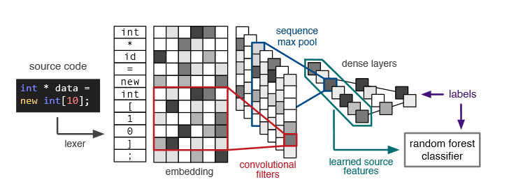

:slug: vulnerabilities-in-deep/
:date: 2019-09-23
:category: machine-learning
:subtitle: Deep Learning for vulnerability disclosure
:tags: machine learning, detect, software
:image: cover.png
:alt: Data Has A Better Idea. Photo by Stefan Steinbauer on Unsplash: https://unsplash.com/photos/1K6IQsQbizI
:description: This blog discusses an article from Boston University presenting new applications of Artificial Intelligence in the security field. We will discuss their approach for discovering vulnerabilities in source code, and finally, future work that is being developed in the security field.
:keywords: Machine Learning, Deep Learning, Detection, Vulnerability, Code, AI
:author: Oscar Uribe
:writer: oscardjuribe
:name: Oscar Uribe
:about1: Software and Computer Engineering undergrad student
:about2: "Behind every successful Coder there is an even more successful De-coder to understand that code." Anonymous
:source: https://unsplash.com/photos/1K6IQsQbizI

= Vulnerabilities in Deep Learning

Currently, data scientists have begun using +AI+
(Artificial Intelligence) algorithms
to solve problems from the data perspective.
Data scientists have been working on problems related
to areas like medicine, data mining, robotics, etc.

Some researches have been exploring how Artificial Intelligence
can be used in cybersecurity.
For example, how we can use Artificial Intelligence
for vulnerability detection inside source code.

Most vulnerabilities are a result of using bad practices
at the time of programming.
When these vulnerabilities are not detected in a timely manner,
they can later be discovered and exploited by attackers.
So, it is important to detect vulnerabilities
in the early stages of a system's development.

There are tools that can perform static analysis of the source code.
These tools check the source code for problems
without the need for compiling and executing it.
There are also dynamic analysis tools
that send information to the system inputs
with presets or random values
in order to check for failures or improper exceptions handling.

== Initial Thoughts

In a Boston University link:https://arxiv.org/pdf/1807.04320.pdf[article],
the authors discuss the possibility of using Artificial Intelligence
and algorithms for Deep and Machine Learning
to automatically detect source code vulnerabilities.
The idea stems from the fact that there is a large amount
of open-source code available to be analyzed.
After all, code is just text
and it is possible to use data mining algorithms
on source code to extract training data.

Static and dynamic code analyzers
do not get the most out of source code.
The algorithms that they use are based on preset rules
that do not take into account small variations in the original rule.
The result is that some vulnerabilities
and failures may remain undiscovered.

The purpose of this exercise was to use data mining,
and deep and machine learning techniques
to automate a process frequently susceptible to human errors,
which can then result in unnoticed vulnerabilities
in applications or within operating systems.
These unnoticed vulnerabilities may then be exploited by hackers.

== Data

For data, they used +C+ and `C++` codes from different sources,
such as +SATE IV Juliet Test Suite+,
a code recompilation used for test cases
that contains some known vulnerabilities,
code from +Debian+ distributions,
and some +GitHub+ public repositories.

.Vulnerable code distribution link:https://arxiv.org/pdf/1807.04320.pdf[[1\]].
image::code-distribution.png[Vulnerable code distribution.]

== Labeling

In labeling, a custom lexer was created
to capture only the important information and label the rest as generic.
The labels already provided by the test database were used.
For the +Debian+ and +GitHub+ codes,
they used dynamic analyzers in order to search outputs
that later could be interpreted by security professionals
as one of the known vulnerabilities
from the Common Weakness Enumeration (+CWE+) list.
Also in the +GitHub+ repositories,
they searched inside the commits,
words like _“buggy”_, _“error”_, _“fixed”_, _“broken”_,
and others, in order to classify each block of source code
as vulnerable or non-vulnerable.

.Statistics CWE vulnerabilities detected link:https://arxiv.org/pdf/1807.04320.pdf[[1\]].

== Feature Extraction

In the feature extraction step,
two types of [inner]#link:../crash-course-machine-learning/#artificial-neural-networks-and-deep-learning[Neural Networks]# were tried,
link:https://towardsdatascience.com/a-comprehensive-guide-to-convolutional-neural-networks-the-eli5-way-3bd2b1164a53[+CNN+] (Convolutional Neural Network)
and link:https://towardsdatascience.com/recurrent-neural-networks-d4642c9bc7ce[+RNN+] (Recurrent Neural Network).

Despite the neural network working fine
for the data extraction used by the model,
classification was not the best.
To solve that, after the Neural Networks feature extraction was made,
they passed the output through a link:https://towardsdatascience.com/understanding-random-forest-58381e0602d2[Random Forest] classifier.
They then obtained better results and avoided overfitting.

.Convolutional Neural Network Model and Random Forest link:https://arxiv.org/pdf/1807.04320.pdf[[1\]].

== Results

Vulnerability detection using Data mining,
and [inner]#link:../deep-hacking/[Deep and Machine Learning]#
added some advantages compared with lexical analyzers
since they do not need to be compiled to work,
and they can be adjusted to obtain the desired precision.

Static analyzers have a limited number of findings
because of preset rules and the fact that they do not take into account
the variations of the rules.
Static analyzers only identify a small portion
of the real vulnerabilities present in the source code.

.Detection of vulnerabilities link:https://arxiv.org/pdf/1807.04320.pdf[[1\]].
image::detections.png[Detections]

This algorithm can underline
code blocks that might introduce a vulnerability.
This allows suggestions that can be used to solve problems.
It can also simply notify the person in charge
to determine whether there is a vulnerability present or not.

== Conclusions

[inner]#link:../deep-hacking/[Deep and Machine Learning]# techniques
are used to problem-solve from a different perspective,
the perspective of the data.
The previous article illustrates several functions
where using Artificial Intelligence in security
is helping to automate functions previously done by humans.
Using Artificial Intelligence allows humans
to focus on the analysis of problems
rather than their detection.

Before these tools can be widely used within the industry,
they need some improvement.
However, they demonstrate the potential
this type of tool has during the process of vulnerability disclosure.
It is also important to evaluate the possibility
of integrating them
into continuous software development
via [inner]#link:../../products/asserts/[continuous integrations]#
to detect vulnerabilities in
[inner]#link:../../services/continuous-hacking/[early stages]#
and avoid the spread of known security issues
on latter versions of the system.

== References

. [[r1]] link:https://arxiv.org/pdf/1807.04320.pdf[Automated Vulnerability Detection in Source
Code Using Deep Representation Learning].
. [[r2]] link:https://towardsdatascience.com/a-comprehensive-guide-to-convolutional-neural-networks-the-eli5-way-3bd2b1164a53[A Comprehensive Guide to Convolutional Neural Networks
-- the ELI5 way].
. [[r3]] link:https://towardsdatascience.com/recurrent-neural-networks-d4642c9bc7ce[Recurrent Neural Networks].
. [[r4]] link:https://towardsdatascience.com/understanding-random-forest-58381e0602d2[Random Forest].
