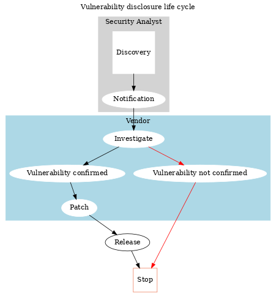

:slug: vulnerability-disclosure/
:date: 2018-10-25
:category: hacking
:subtitle: Responsible vulnerability disclosure
:tags: security, bug, vulnerability, pentesting
:image: cover.png
:alt: Vulnerability disclosure
:description: When an information security analyst finds a new vulnerability in a system or application, either intentionally or randomly, how should he report it for further remediation? Here we are going to explain some good practices of vulnerability disclosure.
:keywords: Security, CVE, Vulnerability, Pentesting, Disclosure, Policies.
:author: Jonathan Armas
:writer: johna
:name: Jonathan Armas
:about1: Systems Engineer, Security+
:about2: "Be formless, shapeless like water" Bruce Lee
:source: https://unsplash.com/photos/qAjJk-un3BI

= Vulnerability disclosure ecosystem

An information security vulnerability
is a flaw or a weakness in a system or application
that a malicious attacker could exploit,
and could result in a compromise of the confidentiality,
integrity or availability
of both software and hardware systems.

We, as `Security Testers`
(or pentesters, white hat hackers),
every day find new vulnerabilities
in our clients' software, systems, and procedures.
If someone discloses these, before they're fixed,
the result could be as great a problem
for the users as it is for the company.

Identifying and fixing vulnerabilities is crucial,
and the process of disclosure of vulnerabilities is a part of this ecosystem.
However, performing security tests on systems
that we do not have the authorization for,
could result in legal issues for the researcher.
This risk might be reduced if we apply good practices
when we are going to disclose a vulnerability.

To understand how we should disclose vulnerabilities,
we need to know who the actors are
who participate in this process:

Discoverers::
Individuals or organizations who find vulnerabilities.
They could be researchers, security companies, users, as well as others.

Vendors::
They develop and maintain information system products that may be vulnerable.
This includes both large vendors of software
and small open-software development groups.

Coordinators::
They manage the vendor’s response to vulnerabilities.
They serve as unbiased, independent evaluators of severity
and may act as an intermediary for communicating with the public.

Users::
Anyone using a vendor's product
that could be affected by the vulnerability.

== Responsible vulnerability disclosure

To avoid legal issues
and to have a successful resolution of the vulnerabilities,
we need to follow a structured plan.
The life cycle of a vulnerability disclosure is as follows:

.Vulnerability Cycle

A security researcher, organization or individual
tries to find new vulnerabilities on a system or application.
They test and validate the vulnerability
by developing a repeatable process to verify its effects.

Then, they communicate what they have found to the software vendor.
This could be direct communication to the vendor,
or through a coordinator
like a `CSIRT`-Computer Security Incident Response Team.

Later, the vendor investigates the vulnerability.
If it's validated, they start to work in a patch or countermeasure.
When finished, they release the new fix
and the information about the vulnerability.

Reporting the vulnerability is the most important part of the process.
In this step, the expertise
of both vendor and researcher are put to the test.
Here, we can establish some good practices
a security tester can use when reporting a vulnerability:

* Alert the company
* If alerting the company fails,
try contacting multiple people from the company's chain of command,
several different times.
* If altering the vendor fails, try contacting the national `CSIRT`.
* If all else fails, contact the `CSIRT` with a full disclosure.

Each step has a time interval.
There are multiple methodologies that have different waiting times.
Some have a `45`-day disclosure policy,
others `90` days since the notification, which is what we recommend.
In any case, you need to be flexible, as these times might change.
Communication is key when managing these events.

The vendor should provide status updates about the vulnerability
and try to resolve it within the stated timeframe.
They can ask for a grace period during which the finder
and the coordinator won’t release the details of the vulnerability;
it all depends on the severity of the flaw
or the difficulty involved with resolving it.

When the vulnerability is fixed,
the vendor has to credit the finder.
Usually, this is done by putting the finder on the patch notes.
Some vendors have bug bounty rewards
where they give money to the finders.

Vulnerability disclosure is a delicate process,
but also a very rewarding one for all parties.
It is well known that nowadays there are multiple security vulnerabilities
and customer/company information disclosure
can be exploited by malicious attackers.
A benign environment where security researchers and vendors
can team-up together to find and fix critical vulnerabilities
before they can affect someone is a win-win situation.

== Resources

* link:https://tools.ietf.org/html/draft-christey-wysopal-vuln-disclosure-00#section-3.3[IETF Responsible Vulnerability Disclosure Process]
* link:https://googleprojectzero.blogspot.com/2015/02/feedback-and-data-driven-updates-to.html[Google Project Zero]
* link:https://www.microsoft.com/en-us/msrc/cvd?rtc=1[Microsoft Coordinated Vulnerability Disclosure]
* link:https://vuls.cert.org/confluence/display/Wiki/Vulnerability`Disclosure`Policy[US CERT Vulnerability Disclosure Policy]
* link:https://www.owasp.org/index.php/Vulnerability_Disclosure_Cheat_Sheet[OWASP Vulnerability Disclosure Cheat Sheet]
* link:https://www.enisa.europa.eu/publications/vulnerability-disclosure[ENISA Guide on Vulnerability Disclosure]
* link:https://www.rapid7.com/security/disclosure/[Rapid7 Vulnerability Disclosure Policy]
