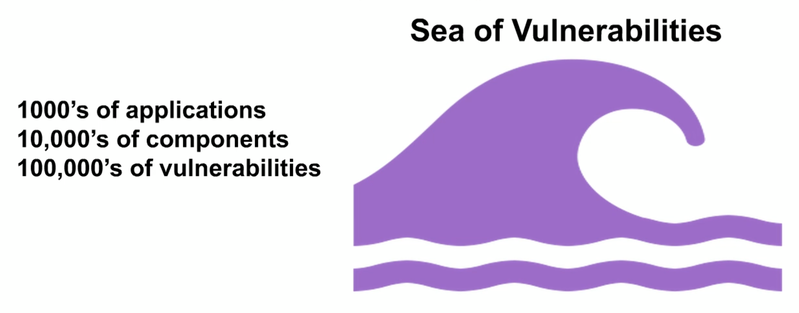
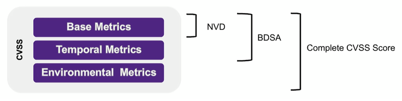
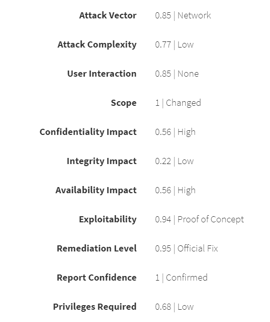

:slug: vulns-triage-synopsys/
:date: 2020-04-21
:subtitle: BDSA and various data points for prioritization
:category: opinions
:tags: cybersecurity, vulnerability, standard, information, software, application
:image: cover.png
:alt: Photo by Jeremy Thomas on Unsplash
:description: This blog post is based on the information given on March 12th by Jeff Michael, Senior Product Manager, and Chris Fearon, Director Research Engineering at Synopsys in their webinar: Effective Vulnerability Remediation Requires More than One Data Point.
:keywords: Cybersecurity, Vulnerability, Standard, Information, Software, Application
:author: Felipe Ruiz
:writer: fruiz
:name: Felipe Ruiz
:about1: Technical writer
:source: https://unsplash.com/photos/FO7bKvgETgQ

= Effective Vulnerability Triage

Here at the beginning, we give you link:https://www.brighttalk.com/webcast/13983/382758[the link for the Synopsys' webinar].

As link:https://www.gartner.com/doc/reprints?id=1-1Y59O2ZQ&ct=200115&st=sb[Dale Gardner pointed out in November of last year]:
"Open-source software is increasingly used
by development teams to support their applications."
Also, Gardner expressed later:
"In most modern `DevOps` development projects,
the majority of code used in an application is made up of open source
—with the remaining code largely serving as 'glue'
to assemble and invoke the various functions."

The presence of open source components in modern apps has grown enormously.
Thus, the number of customers
and the number of developers using Open Source Software (`OSS`) has increased.
However, these increases have gone hand in hand
with the growth of certain concerns.
The more `OSS` is used, the more vulnerabilities are discovered and reported.

The reported vulnerabilities, as Jeff Michael told us,
have increased dramatically, especially in the last three years.
As link:https://www.synopsys.com/blogs/software-security/prioritize-open-source-vulnerabilities/?cmp=em-sig-brighttalk&utm_medium=webinar&utm_source=brighttalk[Shandra Gemmiti, also from Synopsys], share with us,
there are "more than *16,000* open source vulnerabilities disclosed each year
(that's more than *40* per day!)."

.taken from the link:https://www.brighttalk.com/webcast/13983/382758[webinar] slides

There are hundreds of thousands of vulnerabilities,
according to the authors of the webinar,
which today constitute what they call a "Sea of Vulnerabilities."

It is in the face of this sea of vulnerabilities
that many of us who are interested in `OSS`
have to cope in the best possible way.
It becomes essential that we understand
what open source components we are using in our infrastructures and apps.
It is crucial, therefore, that we are clear about
the potential risks with the vulnerabilities that are present,
and that we know how to manage them effectively.

A decisive aspect in the effective management of vulnerabilities
is prioritization or link:https://en.wikipedia.org/wiki/Triage[triage] —concept, the latter, borrowed from medicine.
Thus, as with medical treatment of patients
according to the severity of their condition,
the promptness of remediation of vulnerabilities
will depend on the severity of those vulnerabilities.
Vulnerabilities have to be rated and classified,
or instead defined as more or less important.

Thus, many can be guided by the methodology of focusing first
on vulnerabilities classified as critical.
This method can sometimes be an effective way of handling the situation.
But as the authors of the webinar suggest,
the act of understanding vulnerabilities
and their different attributes and impact is fundamental.

The severity of software vulnerabilities
is usually calculated with the Common Vulnerability Scoring System (link:https://www.first.org/cvss/[`CVSS`]).
`CVSS` is an international standard
that delivers quantitative measures from *0* to *10*
according to the qualitative characteristics of the vulnerabilities.
*0* corresponds to the lowest level of severity and risk
while *10* is the highest and most critical level.
The latest version of the `CVSS` is *3.1*,
which does not introduce major changes in relation to the previous version.

The open framework `CVSS` contains three specific metric groups
that build an overall or complete severity report:
Base, Temporal, and Environmental.

.taken from the link:https://www.brighttalk.com/webcast/13983/382758[webinar] slides

When we visit link:https://nvd.nist.gov/[the `NVD` website]
(which we had already mentioned within [inner]#link:../rules-new-standard/[the Rules standards]#),
precisely link:https://nvd.nist.gov/vuln-metrics/cvss[where they talk about CVSS],
we find some relevant information to deal with.
It turns out that the score ranging from *0* to *10*
produced by the Base metrics
can be later modified by the scores of the other metrics.

As they tell us right there,
`NVD` "provides `CVSS` scores for almost all known vulnerabilities."
And according to what we see in *Figure 2*,
`NVD` delivers Base scores and not Temporal or Environmental scores.
The Temporal metrics are described
as "metrics that change over time due to events external to the vulnerability."
The Environmental metrics, meanwhile,
are understood as "scores customized to reflect
the impact of the vulnerability on your organization."

As the authors share with us in the webinar,
using only the Base metrics of `NVD`, as some vendors do,
may not be the best,
as only a small portion of the entire framework is being used.

At Synopsys, specifically for Black Duck —their `SCA` product—,
they do their scoring.
That scoring is the `BDSA` we see in *Figure 2*.
`BDSA`, which means Black Duck Security Advisories,
delivers Temporal metrics in addition to the Base metrics.
These Temporal metrics consider,
for the vulnerability in analysis, for example,
if this vulnerability itself is confirmed, if an exploit is accessible,
and if there is an official fix available.

These are important additional data points
that can modify the severity scores of the vulnerabilities.
Jeff and Chris tell us that "BDSA Scoring is based on facts."
Environmental metrics then add to those data points
and provide some understanding of the apps
in which the vulnerabilities are identified.
They also offer comprehension about the contexts
in which those apps are running.

.taken from link:https://www.1zoom.me/big2/55/179203-Sepik.jpg[1zoom.me]

`CVSS` can sometimes be quite controversial
as it depends on the analyst's interpretations.
Thus, at Black Duck, they report,
they have robust internal processes
and manual checks of available information on vulnerabilities.
Their team conducts in-depth analysis and research
for the accurate representation of vulnerabilities,
their attributes, and their severity in certain apps.

In addition, their scoring decisions are supported by:

- "Peer Review and comprehensive onboarding processes."

- "Scoring policies that provide clarification
where ambiguities exist in link:https://www.first.org/[first.org] guidelines."

- "Decision-making flowcharts that assist with scoring common vulnerabilities."

Moreover, the customer has the possibility
to create within Black Duck some "policy rules."
These serve as a guide for her to define the specific conditions
she wants to flag when there are particular vulnerabilities in certain apps.
With all this, it is expected that
the customer will have enough relevant information
for the optimization of the remediation efforts.

The aforementioned is clear to us at `Fluid Attacks`.
We use those same link:https://www.first.org/cvss/calculator/3.1[Temporal metrics of `CVSSv3.1`] in our company
and present them in our [inner]#link:../../products/integrates/[Integrates]# platform (see Figure 4).

.an example of (Base and Temporal) metrics in Integrates

If you want to know more about it, we invite you to [inner]#link:../../contact-us/[contact us]#.
