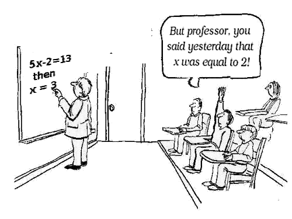

:slug: why-we-go-functional/
:date: 2018-07-23
:category: programming
:subtitle: Functional vs Imperative
:tags: application, functional, imperative, stateless
:image: cover.png
:alt: Piece of code with a function
:description: An analysis of why it is necessary to go functional even with non-functional languages. Benefits of functional programming. A comparison between the imperative and the functional. How Fluid Attacks migrate from object-oriented to functional in a non-traumatic way.
:keywords: Functional paradigm, Object-oriented, Stateless, Multiparadigm application, Laziness, Programming revolution.
:author: Oswaldo Parada
:writer: oparada
:name: Oswaldo José Parada Cuadros
:about1: Mechanical Engineer
:about2: Family, friends and little details. There is the answer.
:source: https://unsplash.com/photos/gnyA8vd3Otc

= Why We Go Functional?

In 1848, Karl Marx released into public opinion
a controversial document called The Communist Manifesto.
From then until today, for better or worse,
this document has influenced societies.
If you have ever thought that the government is not doing its job well,
that they are draining your life on taxes
or that the state should not exist,
you should probably read the manifesto.
But my dear comrade, this article is not a communist declaration.
We just want to rescue an idea of the bearded Marx:
_The state should not exist_.<<r1 ,^[1]^>>

With the motivation of developing a programming revolution,
the functional paradigm has been strengthened in developer communities
and in large technology companies.
Of course, `Fluid Attacks` is not the exception.

.Your face until this point.

Maybe you are wondering what are we talking about? What is functional?
In a nutshell, functional programming aims to solve the question
_What are you doing?_ instead of _How are you doing?_
proposed by object-oriented programming.
For this, functional programming has a special feature:
it is stateless, meaning that,
programs does not save or share information through data structures,
forcing functions to not modify that information.
Functions use inputs just to create new information in the output.
You can look at the following example
showing a difference between functional and imperative:

.Javascript function for multiply 2 integers, imperative and functional approximation.
[source, javascript]
----
// Multiply function in an imperative way.
class Integer {
  constructor (number = 0) {
    this.number = number;
  }
  multiply (x) {
    this.number = this.number * x;
  }
}
const myInteger = new Integer (2);
myInteger.multiply (6);
console.log (myInteger.number); //12

// Multiply function in a functional way.
const multiply = a => b => a * b;
console.log (multiply (2) (6)); // 12
----

== More benefits, less problems

At `Fluid Attacks` we made some investigation,
to discover that true benefits of functional programming
lie where imperative programming has flaws.
The first advantage is the possibility of using laziness,
which allows to delay the evaluation of an expression as much as possible,
usually until the result is strictly required.
This brings out another important benefit.
The functions cease to be _imperative_,
now the runtime has more control over what is executed
and when it will take the shortest route.

If you have programmed in C language,
you probably remember that for each variable,
you had to assign, through the `malloc` function, the number of bytes
the variable would occupy in the computer memory.
This was a complete headache, bringing you almost down to machine level.
The functional language seeks to separate the developer
from all these trivialities of execution,
so she/he can concentrate completely on solving the problem.

For us, the jewel in the declarative crown
is the improvement of code structure and understandability.
Now, any new developer who joins our team,
can understand more easily what is being done.
This is a great time saver both for analyzing and debugging.

Another important benefit is related to the correlation
between the mutable state and the tests:
more of the first requires more of the latter.
The mutable state brings with it side effects that are generally unexpected,
leading in the need to create more tests to avoid surprises,
so we can infer that a functional code allows to generate fewer tests
to cover more functionalities.

A stateless world also gives the benefit of referential transparency,
defined as the capacity to replace an operation with its result
and achieve the same effect.
This can be achieved only if the operation is deterministic
(for same inputs same outputs),
isolated from the rest of the environment and obviously being stateless.

.Main problem with imperative languages.

== Why now?

In the 50’s, LISP was born,
the first language with functional characteristics,
since then, many languages with similar characteristics have emerged:
Clojure, Haskell, Scala, etc. <<r2 ,^[2]^>>
But why is it just in recent years that this paradigm is resonating so much?

The functional language was overshadowed
by the existence of object-oriented languages such as Java and Python,
which propose a greater facility to code for the general public.
During the 20th century,
functional languages ran slower than object-oriented languages,
a problem related to the low capacity of the processors at that time.

.Probably the situation of all functional languages in the nineties.
image::haskell-back-then.png["Two people talking about functional language"]

Today, the hardware barrier was overcome.
The biggest motivation to use functional is that
currently the applications are too complex and huge,
with user flow exceeding millions per hour,
so deficient functions which do not allow flexibility,
concurrency, and parallelism in their execution are no longer profitable.
Functional approximation brings us an immense scalability,
a fast maintenance and robust expressions with long useful life.

== Why us?

Why a company in the information security business
is worried about being functional?
The answer is simple:
We want to do it right at the first time,
we want our code to be an image of the quality
and good practices on which `Fluid Attacks` stands.
We are sure that the code will be excellent from the beginning
because we think functional, there is no room for ambiguity or side effects.
Something does what it says and nothing else, period.
All this on a clean and understandable code
even for the freshmen in the deep waters of coding.
Don't you believe us?
Check it out for yourself in one of our flagship products:
[button]#link:https://fluidattacks.com/asserts/[Asserts]#.

== Functional in non-functionals

Maybe you're thinking that the benefits are really good,
but you are an OOO (Object-Oriented Obsessive)
and all your code is in an imperative language.
It's normal, it's okay to be a little reluctant but don't worry.
Here at `Fluid Attacks`, we are like you, we use object-oriented languages
and that doesn't stop us from being functional.
All languages can be functional.
In general there are some keys that you must follow to be functional
in a non-functional language:

. Avoid the use of classes and classes attributes.
. Create granular functions that only do ONE thing.
. Functions must be deterministic.
. Minimize the amount of data structure.
. Understand a list as the _first item_
and the _rest of the list_ and not as indexed values.
. Store for later.
. Use recursion and primitive functions instead of loops.
. Don't use global variables.

== Change your way of thinking instead of your code syntax!

Migrate from imperative to functional is not easy.
You can see and analyze thousands of lines of functional code
and still not understand, it is not because the syntax is more difficult,
it is because you just keep thinking in an imperative solution!
Before you even start thinking about reading the documentation
of the functional module of your favourite programming language,
first stop going directly to apply a very specific implementation
for a particular problem,
better take the time to learn
where you can apply high level abstractions in your problem. <<r3 ,^[3]^>>

== Conclusions

In addition to discovering
that Karl Marx would have been a functional programming genius,
we now know that functional programming is not a matter of fashion,
it is a matter of survival:

[quote,Charles Darwin]
It is not the strongest of the species that survives,
nor the most intelligent that survives.
It is the one that is most adaptable to change.

Surely you are thinking that it is a lot of time analyzing and
less on the keyboard,
that you have the pressure of your boss on your shoulders,
that there are deadlines to be met,
however, think ahead, how much time your imperative code will start to rust?
Probably, you will have performance problems
thanks to the endless tangle of methods and classes,
code will eventually rot and end up being devoured by scavengers.
so, think ahead, go functional.

== References

. [[r1]] link:https://en.wikipedia.org/wiki/Marx%27s_theory_of_the_state[Marx's theory of the state]
. [[r2]] link:https://en.wikipedia.org/wiki/Functional_programming[Functional Programming]
. [[r3]] _Functional Thinking: paradigm over syntax_, Neal Ford, book, 2014
