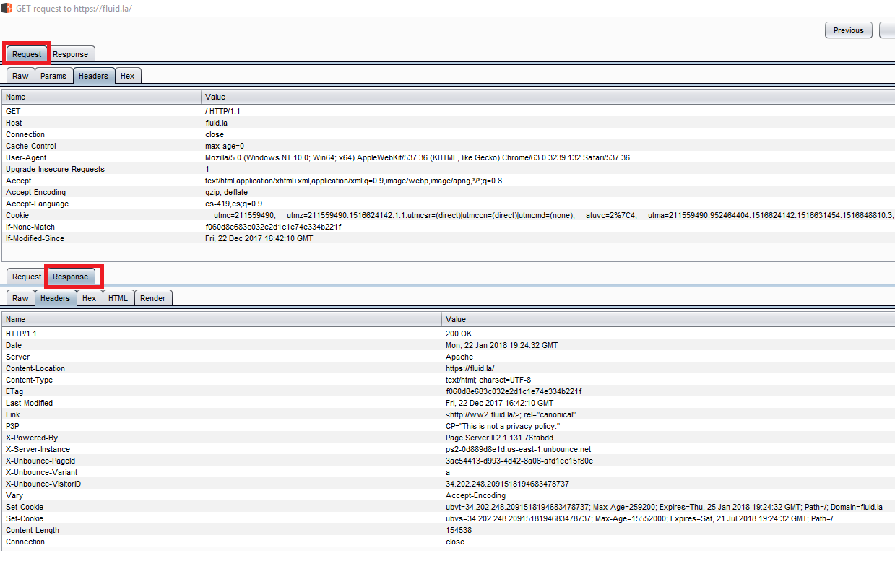

:slug: defends/apache/habilitar-headers-seguridad/
:category: apache
:description: Nuestros ethical hackers explican cómo evitar vulnerabilidades de seguridad mediante la configuración segura en Apache habilitando los headers de seguridad. Los headers proporcionan información del cliente y/o servidor, además de proporcionar protección contra ataques comúnes, como los XSS.
:keywords: Apache, Seguridad, Headers, Configuración, XSS, Cabeceras.
:defends: yes

= Habilitar Headers de seguridad

== Necesidad

Se desea habilitar los +headers+ recomendados de seguridad

== Contexto

A continuación se describen las circunstancias
bajo las cuales la siguiente solución tiene sentido:

. Se cuenta con acceso a la consola
de linea de comandos del servidor afectado.
. Se cuenta con un usuario privilegiado en el servidor afectado.
. Se cuenta con acceso a un servidor +Apache+.

== Solución

Los headers o cabeceras +HTTP+ son los parámetros
que se envían en una petición o respuesta +HTTP+
al cliente o al servidor para proporcionar información esencial
sobre la transacción en curso.
Estas cabeceras proporcionan información
mediante la sintaxis +'HEADER: Valor'+
y son enviadas automáticamente por el navegador o el servidor Web.

En la imagen se puede apreciar tanto los +headers+ de la petición
hecha a la página principal de +Fluid Attacks+,
como los +headers+ de la respuesta enviada por el servidor.

Pero, los +headers+ no solo proporcionan
información del cliente y/o el servidor,
sino que tambien permiten añadir
una capa de seguridad extra a nuestras aplicaciones web.
Es decir, existen varias cabeceras de respuesta +HTTP+
que han sido diseñadas para evitar ciertos ataques muy comunes
contra las páginas web, como puede ser un ataque +XSS+.

. Si se está en un +host+ virtual de +Apache+,
se pueden implementar los headers
añadiendo al archivo +.htaccess+ o al archivo +httpd.conf+
cualquiera de las siguientes opciones:
+
.htaccess.shell
[source, shell, linenums]
----
Header always set x-Frame-Options "DENY"
Header always set X-Xss-Protection "1; mode=block"
Header always set X-Content-Type-Options "nosniff"
Header always set X-Content-Security-Policy "default-src 'self'; img-src 'self';
  style-src 'self' 'unsafe-inline'; font-src 'self'; script-src 'self'
  'unsafe-inline';  connect-src 'self';"
Header always set Strict-Transport-Security "max-age=31536000; includeSubDomains"
Header always set X-Permitted-Cross-Domain-Policies "none"
Header always unset X-Powered-By
----

. +X-Frame-Options+ puede ser usado para indicar
si debería permitírsele a un buscador renderizar una página
en un +<frame>+, +<iframe>+ o +<object>+.
Los sitios web pueden usarlo para evitar ataques de +clickjacking+.

. +X-XSS-Protection+ impide que las páginas se carguen
cuando detectan ataques reflejados de +cross-site scripting+ (+XSS+).

. +X-Content-Type-Options+ indica que los tipos +MIME+ ^<<r3,[3]>>^
anunciados en los encabezados +Content-Type+ no se deben cambiar ni seguir.

. +X-Content-Security-Policy+ permite a los administradores de sitios web
controlar los recursos que el +user-agent+
(aplicación que tiene la función de ser
cliente en un protocolo de red)
puede cargar para una página determinada.

. +Strict-Transport-Security+ permite a un sitio web
indicar a los navegadores que sólo se debe comunicar
con +HTTPS+ en lugar de usar +HTTP+.

. +X-Permitted-Cross-Domain-Policies+ proporciona a los clientes Web
permiso para administrar datos entre dominios.

. +X-Powered-by+ se usa para especificar con que +software+
se ha generado la respuesta por parte del servidor.

== Referencias

. [[r1]] link:https://es.wikipedia.org/wiki/Anexo:Cabeceras_HTTP[Anexo:Cabeceras HTTP]
. [[r2]] link:https://developer.mozilla.org/es/docs/Web/HTTP/Headers[HTTP headers]
. [[r3]] link:https://developer.mozilla.org/en-US/docs/Web/HTTP/Basics_of_HTTP/MIME_types[MIME types]
. [[r4]] link:https://www.owasp.org/index.php/OWASP_Secure_Headers_Project[OWASP Secure Headers Project]
