:slug: defends/cifrado/solicitar-certificados-web/
:category: cifrado
:description: Nuestros ethical hackers explican cómo evitar vulnerabilidades de seguridad mediante la generación de certificados SSL utilizando IIS. El protocolo SSL permite que la comunicación entre servidor y cliente esté cifrada, garantizando que los datos viajen de forma segura.
:keywords: Cifrado, Certificación, SSL, IIS, Web, Firma Digital
:defends: yes

= Solicitar Certificados SSL IIS Certicámara

== Necesidad

. Se necesita generar una solicitud de un certificado digital
para un servidor Web en la plataforma
de +Microsoft Internet Information Services+ (+IIS+).

. Se necesita configurar dicho certificado
para que el servidor establezca comunicaciones seguras
por medio del protocolo +SSL+.

== Contexto

A continuación se describen las circunstancias
bajo las cuales la siguiente solución tiene sentido:

. Se esta utilizando un servidor web
+Microsoft Internet Information Services+ (+IIS+).

. Se desea utilizar el protocolo +SSL+ como medio de comunicación seguro.

== Solución

En este artículo mostraremos cómo generar certificados +SSL+
utilizando  +Microsoft Internet Information Services+ (+IIS+),
a través de un procedimiento detallado, el cual se presenta a continuación:

=== Generación de la solicitud y Certificado

Para generar la solicitud y el certificado
debemos seguir los siguientes pasos:

. Ingrese a la aplicación de Servicios de +Internet Information Server+
de su Sistema Operativo.
Vaya a +Inicio+, +Herramientas administrativas+,
+Administrador de Internet Information Server+, +Services+,
como se muestra en la figura +1+.
+
.Ruta de acceso a IIS Manager
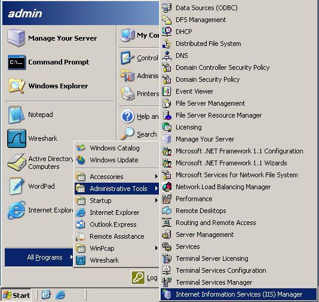

. A continuación se despliega la ventana de aplicación
del +Internet Information Server+.
En el árbol que se en encuentra en la parte izquierda de la ventana
abra la carpeta +Sitios Web+ y de clic sobre el sitio Web de su servidor.
La figura +2+ ilustra este procedimiento:
+
.Acceso al sitio web desde el árbol
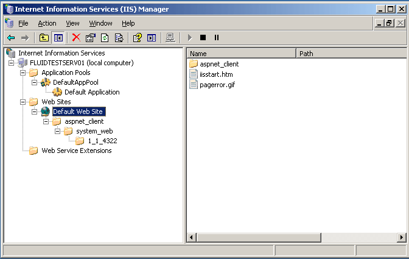

. De clic derecho sobre el sitio Web del servidor y seleccione +Propiedades+
en la ventana deslizante que se encuentra desplegada.
+
.Propiedades del Sitio Web
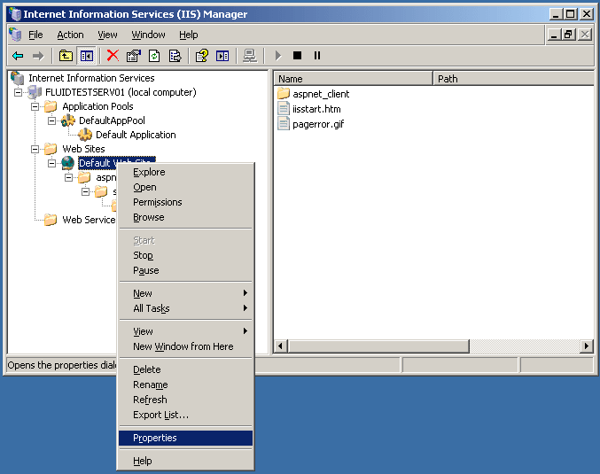

. En la ventana de propiedades del sitio Web,
de clic sobre la pestaña +Seguridad de directorios+
+
.Pestaña Comunicación segura
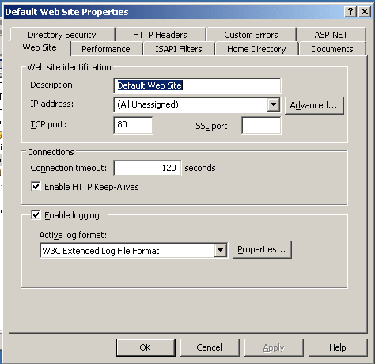

. En el panel +Comunicaciones seguras+
presione el botón +Certificado de servidor+
para iniciar el +Asistente de certificado de servidor Web+.
+
.Panel de Comunicaciones seguras
image::step4p1.png[".Panel de Comunicaciones seguras"]

. En la ventana que despliega el +Asistente de certificado de servidor Web+
presione el botón +Siguiente+ para continuar con el proceso.
+
.Asistente de certificado de servidor Web
image::step5.png["Asistente de certificado de servidor Web"]

. Seleccione la opción +Crear un certificado nuevo+
y de clic en el botón +Siguiente+.
+
.Creación de Certificado
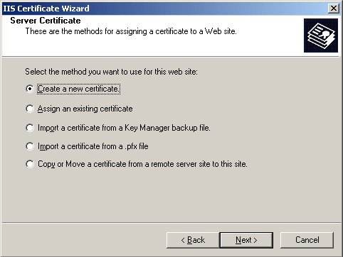

. Verifique que se encuentra seleccionada la opción por defecto
+Prepara la petición ahora pero enviarla más tarde+,
y de clic en botón +Siguiente+.
+
.Configuración de Creación de Certificados
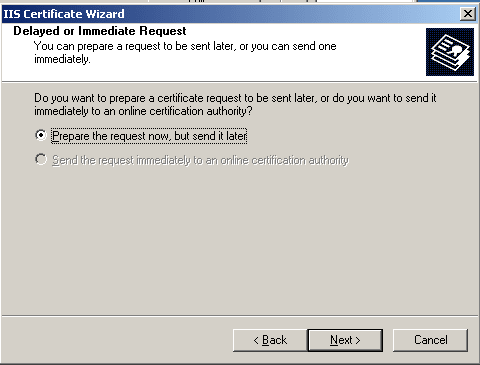

. Escriba el nombre para el certificado digital
y seleccione una longitud de clave de +2048+ bits.
De clic en el botón +Siguiente+.
+
.Nombre de certificado Digital
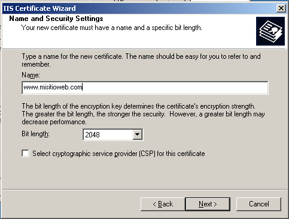

. Digite el nombre de la organización y el departamento.
De clic en +Siguiente+.
+
.Datos Organización
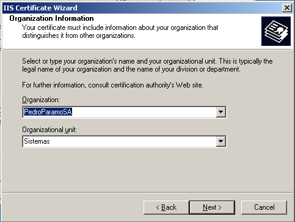

. Digite el nombre común de su sitio Web.
De clic en el botón +Siguiente+.
+
.Nombre del Sitio Web
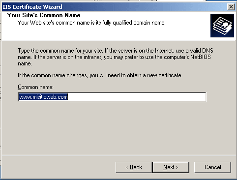

. Complete los siguientes datos correspondientes
a la información de la región en la que se encuentra.
+
.Información sobre el País y la Región
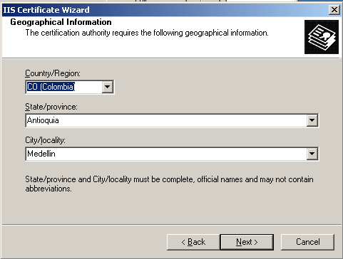

. Nombre el archivo que contendrá la petición de certificado
y seleccione su ubicación dentro de la máquina.
El asistente asigna un nombre y una ubicación por defecto,
pero usted puede modificarla.
De clic en el botón +Siguiente+.
+
.Archivo de petición de Certificado
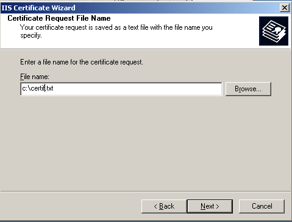

. Verifique los datos que se incluirán en la petición
y si son correctos de clic en botón +Siguiente+.
+
.Verificación de datos
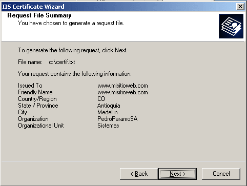

. De clic en el botón +Finalizar+
para terminar la generación de la petición.
+
.Configuración de generación de petición
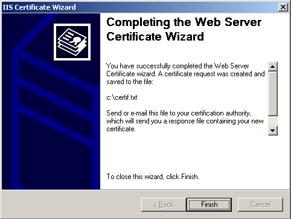

=== Envío de la solicitud

La solicitud se puede enviar por E-Mail
adjuntando el archivo de la solicitud
(recordar el archivo que fue generado en el paso anterior p. Ej. +certif.csr+)
a las cuentas de correo +soporte@certicamara.com+ o +info@certicamara.com+ .

O bien puede hacer llegar la solicitud en medio magnético (disquete)
a las instalaciones de Certicámara:
Avenida El Dorado No. 68D – 35 Piso 5,
dirigido a la Dirección Comercial.

Una vez hecho el envío de la solicitud,
Certicámara le entregara posteriormente el certificado que habrá de instalar.

=== Instalación del certificado

. Abra el servicio de +Internet Information Server+,
seleccione el sitio Web de su servidor y de clic derecho sobre él.
En la ventana deslizante que aparece seleccione +Propiedades+
acceda a la pestaña +Seguridad+ de directorios
(pasos +1+ a +5+ de la sección +Generación+ de la solicitud y Certificado).
+
.Servicio IIS
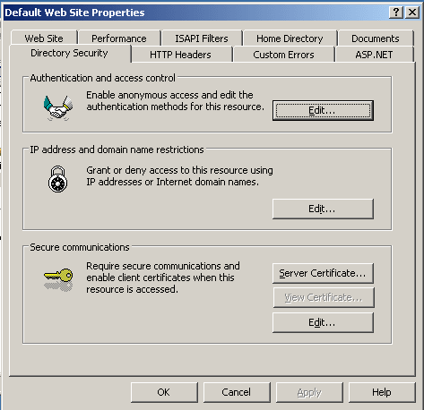

. Presione el botón +Certificado de servidor+.

. En la ventana del +Asistente de certificados+
de clic en el botón +Siguiente+ para continuar la instalación.
+
.Asistente de Certificados
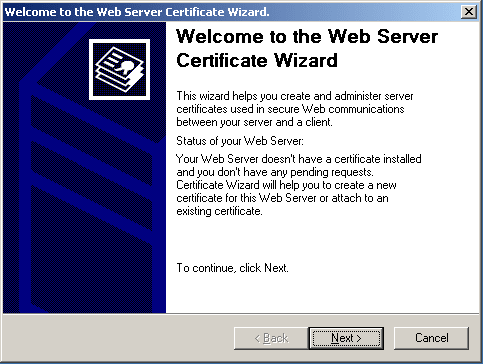

. Seleccione la opción
+Procesar la petición pendiente e instalar certificado+
y de clic en el botón +Siguiente+.
+
.Solicitud de Certificado
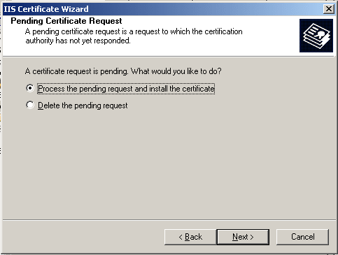

. En la ventana de proceso de petición escriba la ubicación
del archivo de respuesta del certificado y a continuación,
presione el botón +Siguiente+.
Si desea puede hacer clic en el botón +Examinar+
y buscar el archivo dentro de los directorios de su máquina.
+
.Ruta del archivo de respuesta
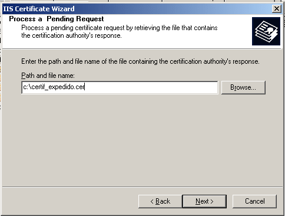

. Lea la información de la ventana de resumen
y verifique que los datos correspondientes son correctos
y que se encuentra procesando el certificado indicado,
y de clic en el botón +Siguiente+.
+
.Verificación de Información
image::step19.png["Verificación de Información"]

. De clic en el botón +Finalizar+
para concluir el proceso de instalación
del certificado de servidor seguro.

. En la ventana de propiedades del sitio Web,
presione el botón +Modificar+
y verifique que se encuentra seleccionada la casilla de verificación
+Requerir canal seguro+ (+SSL+).
+
.Ventana de Comunicación Segura
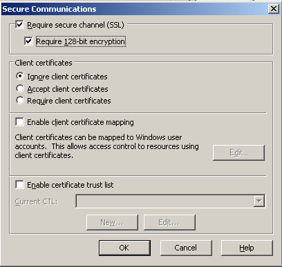

. Presione +Aceptar+.

. Con esto ejecutado ya se encuentra instalado
un certificado de servidor seguro.

== Referencias

. [[r1]] link:https://web.certicamara.com/soporte_tecnico[Manuales de soporte Certicámara].
. [[r2]] link:../../../rules/092/[REQ.092 Utilizar certificados firmados externos].
