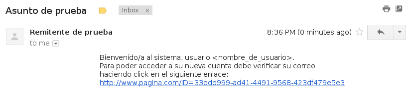

:slug: defends/csharp/validar-propietario-correo/
:category: csharp
:description: Nuestros ethical hackers explican cómo verificar la propiedad de un correo electrónico mediante el uso de identificadores únicos aleatorios para la verificación de propiedad de un correo electrónico en aplicaciones que utilicen registro de usuarios.
:keywords: C Sharp, Buenas Prácticas, Autenticación, Correo, Propietario, Validación.
:defends: yes

= Validar Propietario de Cuenta de Correo

== Necesidad

Garantizar que un usuario es realmente el poseedor de una cuenta de correo

== Contexto

A continuación se describen las circunstancias
bajo las cuales la siguiente solución tiene sentido:

. Se está usando el lenguaje de programación +C#+.
. Se está desarrollando una aplicación que soporta registro de usuarios.
. Se conoce previamente como generar códigos aleatorios universalmente únicos.
. De lo contrario, ver Generar Identificador Universalmente Único

== Solución

. Una vez un usuario se registra en la aplicación,
se debe comprobar que el correo electrónico que ingresó
en realidad es de su propiedad
antes de proceder a activar su cuenta.
Para lograrlo, se envía a esa dirección un código aleatorio
que el usuario deberá ingresar en la aplicación.
Un mecanismo común en aplicaciones +web+
es incluir un enlace que contiene el código
para evitar que el usuario tenga que ingresarlo manualmente.
A continuación se muestra como implementar el mecanismo.
Primero se utilizarán los espacios de nombre +System.Net+ y +System.Net.Mail+
que contienen las clases para el envío de correos.
+
.ejemplo.cs
[source, csharp, linenums]
----
using System;
using System.Net;
using System.Net.Mail;
----

. Se inicializan los datos básicos del mensaje a enviar
+
[source, csharp, linenums]
----
namespace LineaBase {
  class Program {
    static void Main(string[] args) {
      try {
        var direccionOrigen = new MailAddress("origen@gmail.com", "Remitente de prueba");
        var direccionDestino = new MailAddress("destino@gmail.com", "Destinatario de prueba");
        const string clave = "miclave";
        const string asunto = "Asunto de prueba";
----

. Se crea el mensaje a enviar,
generando el código aleatorio
mediante el método +NewGuid+ de la clase +System.Guid+.
El símbolo +@+ se utiliza para crear fácilmente una cadena de texto multilínea,
como lo es el caso del mensaje.
+
[source, csharp, linenums]
----
        string cuerpo = @"
        Bienvenido/a al sistema, usuario <nombre_de_usuario>.
        Para poder acceder a su nueva cuenta debe verificar su correo
        haciendo click en el siguiente enlace:
        http://www.pagina.com/ID=" + System.Guid.NewGuid().ToString();
----

. Se crea una nueva instancia de +MailMessage+
con los valores definidos anteriormente.
Se utiliza +using+ para el liberado automático de recursos.
+
[source, csharp, linenums]
----
        using (MailMessage mensaje = new MailMessage(direccionOrigen, direccionDestino) {
          Subject = asunto,
          Body = cuerpo
        })
----

. Se crea una instancia de la clase +SmtpClient+
inicializando esta con los datos requeridos por el servidor de correos,
incluyendo las credenciales de acceso.
En este caso se utilizará el servidor +SMTP+ de +Gmail+.
+
[source, csharp, linenums]
----
        {
          using (var smtp = new SmtpClient() {
            Host = "smtp.gmail.com",
            Port = 587,
            EnableSsl = true,
            DeliveryMethod = SmtpDeliveryMethod.Network,
            Credentials = new NetworkCredential(direccionOrigen.Address, clave),
            Timeout = 18000
          })
----

. Se envía el mensaje ya construido utilizando el cliente recién creado.
+
[source, csharp, linenums]
----
          {
            smtp.Send(mensaje);
          }
        }
----

. Finalmente se hace un manejo de excepciones básico.
+
[source, csharp, linenums]
----
      } catch (SmtpException) {
          Console.WriteLine("El mensaje no ha podido ser enviado");
      }
    }
  }
}
----
. Se observa el mensaje una vez llega al usuario:
+

. En este caso el modo de ingresar el código a la aplicación
es mediante el método +GET+ de +HTTP+,
por lo cual se incluye directamente en la +URL+.
Para finalizar, la parte de la aplicación encargada del registro
deberá validar que dicho código se introduzca
antes de cierto límite de tiempo para proceder a activar el usuario.

== Descargas

Puedes descargar el código fuente
pulsando en el siguiente enlace:

. [button]#link:src/ejemplo.cs[ejemplo.cs]# contiene
todas las instrucciones +C#+ del programa.

== Referencias

. [[r1]] link:http://msdn.microsoft.com/en-us/library/system.net.mail.smtpclient.aspx[SmtpClient Class (MSDN)]
. [[r2]] link:http://leedumond.com/blog/new-in-net-4-dont-forget-to-dispose-your-smtpclient-instances/[New in .NET 4: Don’t Forget to Dispose() your SmtpClient Instances]
. [[r3]] link:../../../rules/122/[REQ.122 Validar propietario de correo]
