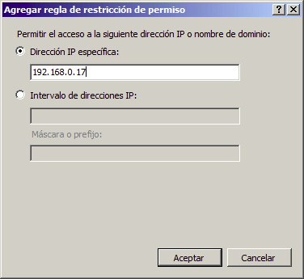
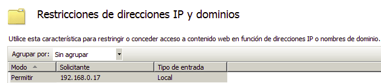
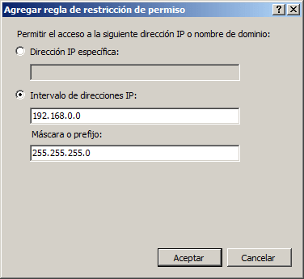
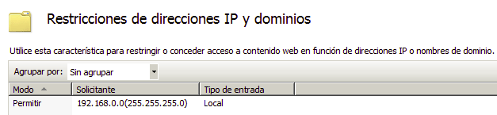
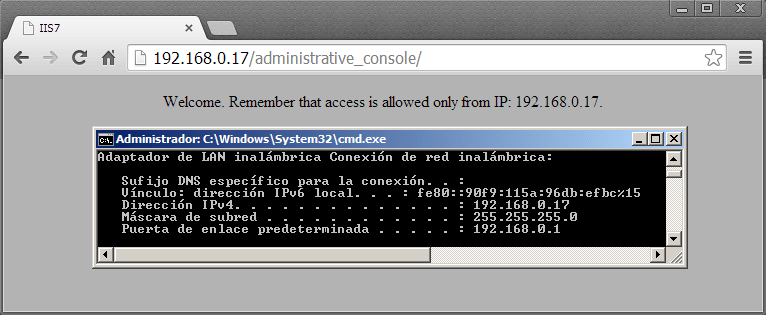
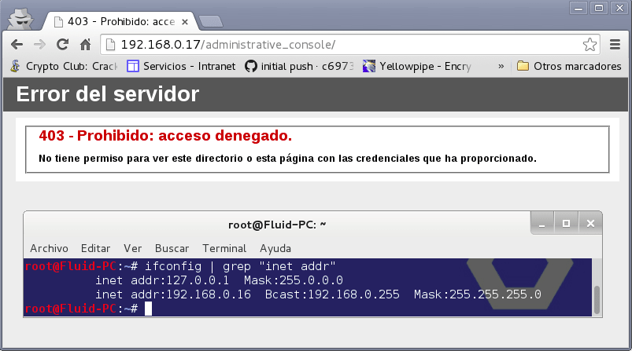

:slug: defends/iis/negar-acceso-consola-admin/
:category: iis
:description: Nuestros ethical hackers explican cómo evitar vulnerabilidades de seguridad mediante la configuración segura en IIS 7.5 al negar acceso a la consola de administración. Las configuraciones del servidor no deben ser visualizadas ni accedidas por usuarios no autorizados.
:keywords: IIS 7.5, Consola, Administración, Acceso, Configuración, Dirección IP
:defends: yes

= Negar Acceso a Consola Administrativa

== Necesidad

Negar acceso a consola administrativa +IIS 7.5+.

== Contexto

A continuación se describe las circunstancias
bajo las cuales la siguiente solución tiene sentido:

. Se tiene una consola administrativa expuesta
la cual se debe restringir por dirección o rango de direcciones +IP+.

. Se tiene implementado como servidor de aplicaciones
+Internet Information Services (IIS) 7.5+.

== Solución

+Internet Information Services+ o (+IIS+)
proporcionan un conjunto de servicios enfocados en un servidor web,
con el fin de obtener una plataforma segura,
fácil de administrar, modular y extensible
donde hospedar sitios web, servicios y aplicaciones de manera confiable <<r1, ^[1]^>>.
Aquí te presentamos una guía de configuración segura en +IIS 7.5+
enfocándonos en la configuración de la consola administrativa.

La consola administrativa permite realizar
muchas configuraciones relacionadas con el servidor.
Estas configuraciones no pueden ser visualizadas ni modificadas
por usuarios externos, debido a que representaría
una fuente potencial de vulnerabilidades para el sistema
por parte de usuarios maliciosos.
Su acceso, por lo tanto, debe ser restringido únicamente
a los administradores del servidor y usuarios autorizados.
En este artículo nos centraremos en describir el procedimiento necesario
para negar el acceso a la consola de administración.
Esto debe realizarse para todos los usuarios
excepto los autorizados a modificar la configuración del servidor.
Para ello debemos seguir los siguientes pasos:

. Abrir el Administrador de Internet Information Services (+IIS+).
+Inicio+ > +Buscar programas y archivos+: +inetmgr+.

. Dentro de los sitios buscar el sitio o carpeta
a la cual se le aplicará la configuración y dar clic en ella.

. Buscar y dar clic en el icono:
+Restricciones de direcciones IP y dominios+.

. Primero se debe negar el acceso por defecto,
en el menú derecho +Acciones+.
Luego abrir +Modificar configuración de característica+
y configurar de la siguiente manera.

. Para dar acceso a una dirección +IP+ específica,
por ejemplo: +192.168.0.17+, dentro del mismo menú.
Abrir +Agregar entrada de permiso+
y configurar de la siguiente manera:

.Adición dirección IP.

.Visualización de la nueva regla.

. Para dar acceso a un rango de direcciones +IP+ dentro del mismo menú,
abrir +Agregar entrada de permiso+ y configurar de la siguiente manera,
donde +192.168.0.0+ es la dirección de red y +255.255.255.0+ la mascara de red:

.Adición de IP y máscara de subred

.Actualización de la nueva regla.

. Para la regla aplicada en el paso +5+,
si el equipo con dirección IP 192.168.0.17
ingresa a la consola administrativa, se garantiza el acceso:

.Visualización de la consola de administración en el navegador

. Por el contrarío, si ingresa cualquier otro equipo
diferente al +192.168.0.17+, el acceso será negado:

.Resultados de la configuración visualizados en el navegador

De esta forma la consola de administración permanece protegida
para usuarios externos permitiendo el acceso
únicamente a los equipos autorizados.

== Referencias

. [[r1]] link:https://msdn.microsoft.com/es-es/library/hh831725(v=ws.11).aspx[Introducción al servidor web (IIS)].
. [[r2]] link:../../../rules/033/[REQ.033 Restringir acceso administrativo].
. [[r3]] link:https://docs.microsoft.com/en-us/iis/configuration/system.webServer/security/ipSecurity/[IPSecurity].
