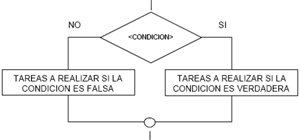

:slug: defends/java/establecer-opciones-seguras/
:category: java
:description: Nuestros ethical hackers explican cómo evitar vulnerabilidades de seguridad mediante la programación segura en Java al establecer opciones seguras en condicionales. Las opciones no consideradas en condicionales pueden generar vulnerabilidades de seguridad dentro de las aplicaciones web.
:keywords: Java, Seguridad, Buenas Prácticas, Opciones Seguras, Condicional, Default
:defends: yes

= Establecer Opciones Seguras en Condicionales

== Necesidad

Establecer opciones seguras por defecto en estructuras condicionales en +Java+

== Contexto

A continuación se describen las circunstancias
bajo las cuales la siguiente solución tiene sentido:

. Se está desarrollando aplicación en +Java(1.4.2)+ o superior.

== Solución

En programación, las +estructuras condicionales+ se utilizan
para lograr que un algoritmo analice los datos y tome ciertas decisiones.
Es decir, comparan una variable contra determinado valor o valores,
para que en base al resultado de esta comparación,
se siga un curso de acción dentro del programa.
Estas pueden ser +simples+, +dobles+, +múltiples+ y +case+.

*Simples:* En este tipo de estructuras
se limita la ejecución de un bloque de código
dependiendo el resultado de una condición.

image::simple.png[estructura condicional simple]

*Dobles:* Son aquellas que ofrecen dos posibles alternativas
para continuar la ejecución del código.
Una de ellas se ejecutará si la condición se cumple
y la otra alternativa se ejecutará si la condición no se cumple.

*Múltiples:* son tomas de decisión especializadas
que permiten comparar una variable contra distintos posibles resultados.
Esto se hace ejecutando para cada caso
una serie de instrucciones especificas.
Es decir, se plantean múltiples condiciones simultáneamente,
si se cumple la +condición 1+
se ejecutan las instrucciones específicas para dicha condición.
En caso contrario se comprueba la +condición 2+;
si es cierta se ejecutan sus respectivas instrucciones,
y así sucesivamente hasta evaluar todas las condiciones.

image::multiple.png[estructura condicional multiple]

*Case:* Al igual que la múltiple,
esta sentencia permite ejecutar una de entre varias acciones
en función del valor de una expresión.
En pocas palabras, es una alternativa
a las estructuras condicionales múltiples.

image::case.png[estructura condicional case]

En cada estructura condicional empleada en una aplicación +Java+,
se recomienda contemplar todos los posibles escenarios.

* Para sentencias +if+ debe usarse su correspondiente +else+ ^<<r1,[1]>>^.
* Para sentencias +switch+ debe usarse
su correspondiente default ^<<r2,[2]>>^.

. En el siguiente ejemplo, se empieza por validar
que el usuario haya ingresado al menos
un argumento al ejecutar la aplicación
y se almacena en la variable entero convertida en entero.
+
.Main.java
[source, java, linenums]
----
public class Main {
  public static void main(String[] args) {
    if (args.length >= 1) {
      int entrada = Integer.parseInt(args[0]);
----

. Se evalúa que instrucciones ejecutar según el valor de la variable entrada:
+
[source, java, linenums]
----
   switch (entrada) {
   case 1:
     System.out.println("Primera opción seleccionada");
   break;
   case 2:
     System.out.println("Segunda opción seleccionada");
   break;
----

. Se crea la opción segura por defecto para el +switch+, +default+.
+
[source, java, linenums]
----
   default:
     System.out.println("No se ha seleccionado una opción válida");
   break;
----

. Se crea la opción segura por defecto para el +if+, +else+.
+
[source, java, linenums]
----
    }
  }
  else {
    System.out.println("Debe ingresarse como argumento el número de la opción: 1 o 2");
  }
 }
}
----

. Se compila y ejecuta la aplicación con algunos casos de prueba.
+
[source, bash, linenums]
----
% java Main.java
% java Main
Debe ingresarse como argumento el número de la opción: 1 o 2
% java Main 1
Primera opción seleccionada
% java Main 2
Segunda opción seleccionada
% java Main -1
No se ha seleccionado una opción válida
% java Main 1000000
No se ha seleccionado una opción válida
----

. Se evidencia que la aplicación se comporta bien
al no ingresar argumento o ingresar opciones fuera de las definidas.

== Referencias

. [[r1]] link:https://docs.oracle.com/javase/tutorial/java/nutsandbolts/if.html[The if-then and if-then-else Statements]
. [[r2]] link:https://docs.oracle.com/javase/tutorial/java/nutsandbolts/switch.html[The switch Statement]
. [[r3]] REQ.0156: El código debe definir opciones por defecto seguras
(ej: default en switchs).
