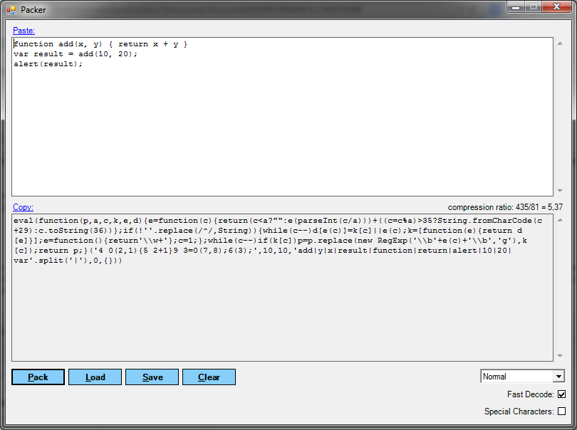

:slug: defends/javascript/ofuscar-codigo/
:category: javascript
:description: Nuestros ethical hackers explican cómo evitar vulnerabilidades de seguridad mediante la programación segura en JavaScript al ofuscar el código fuente de la aplicación. Ésto dificulta que un atacante pueda visualizar el código de la aplicación para identificar vulnerabilidades en el mismo.
:keywords: JavaScript, Seguridad, Ofuscar, Código, Buenas Prácticas, Producción.
:defends: yes

= Ofuscar Código JavaScript

== Necesidad

Se requiere ofuscar el código +JavaScript+
para evitar la legibilidad del código fuente.

== Contexto

A continuación se describen las circunstancias
bajo las cuales la siguiente solución tiene sentido:

. Se desea construir páginas web mediante el uso de +JavaScript+.
. Se tiene instalado un navegador web
(+Internet Explorer+, +Firefox+, +Chrome+, +Safari+, entre otros)

== Solución

. La ofuscación de código consiste en realizar cambios
que no afecten el funcionamiento del código fuente de la aplicación,
pero evita que este sea fácilmente visualizado
y comprendido por un atacante.
Esto solo debe ser hecho
con los archivos que vayan a ser publicados
en el entorno de producción
y no en etapas de desarrollo.

. Hay que tener en cuenta que todos los mecanismos de ofuscación
pueden ser reversados, por lo cual
no intente ocultar información confidencial dentro del código fuente.

. Para esta solución utilizaremos
el +software+ libre +Packer+ ^<<r1,[1]>>^ para ofuscar.
Existen múltiples versiones de la herramienta
pero en este caso utilizaremos la de +.NET+ que funciona en +Windows+.

. Ofuscaremos el siguiente código.
+
.add.js
[source, js, linenums]
----
function add(x, y) {
  return x + y }
var result = add(10, 20);
alert(result);
----

. En la ventana de la herramienta, pegamos el código que deseamos ofuscar,
seleccionamos las opciones deseadas, y por último hacemos clic en +Pack+.
+

. El código generado es el siguiente.
+
[source, js, linenums]
----
eval(function(p,a,c,k,e,d){
 e=function(c){return(c<a?"":e(parseInt(c/a)))+((c=c%a)>35?String.
 fromCharCode(c+29):c.toString(36))};
 if(!''.replace(/^/,String)){while(c--)d[e(c)]=k[c]||e(c);k=[function(e){
   return
   d[e]}];e=function(){return'\\w+'};c=1;};
   while(c--)if(k[c])p=p.replace(new RegExp(
     '\\b'+e(c)+'\\b','g'),k[c]);return p;}
   ('4 0(2,1){5 2+1}9
   3=0(7,8);6(3);',10,10,'add|y|x|result|function|return|alert|10|20|var'
     .split('|'),0,{}))
----

. como se puede ver, su comprensión es difícil
en comparación con el código original.

. Existen versiones de la herramienta +packer+
que pueden ser usadas desde la interfaz de línea de comando,
esto sirve para automatizar
el proceso de despliegue de archivos +JavaScript+.

. En conclusión, la ofuscación de código tiene varias ventajas,
sobre todo en cuanto a la seguridad,
ya que evita que un atacante
comprenda el funcionamiento del código
y por tanto, no logre alterarlo con malos propósitos.

. Otra razón para usar ofuscación
es la protección de la propiedad intelectual.
Puesto que muchas veces se quiere que terceras personas
no sepan la manera en que está programada determinada aplicación
y así evitar su reproducción
sin que sean reconocidos los respectivos derechos intelectuales.

. El único inconveniente que puede tener,
es que debido a que el código final es completamente ilegible
la mantenibilidad del código se hace un poco laboriosa
en caso de que el archivo original llegase a perderse
obligando a trabajar directamente sobre el comprimido.

== Referencias

. [[r1]] link:http://dean.edwards.name/download/#packer[Packer]
. [[r2]] link:https://es.wikipedia.org/wiki/Ofuscaci%C3%B3n[Ofuscación]
. [[r3]] link:../../../rules/159/[REQ.159 Código ofuscado]
