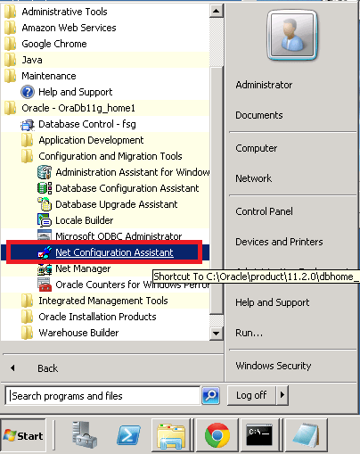
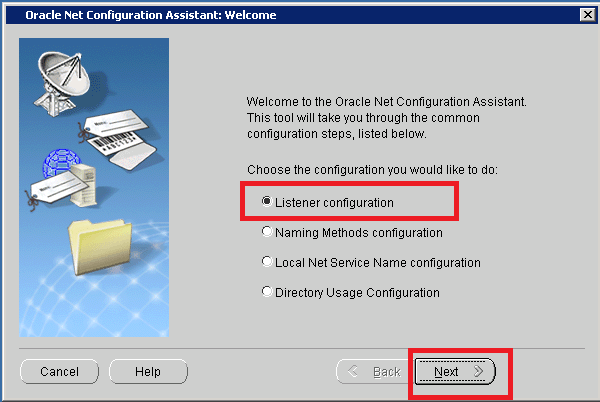
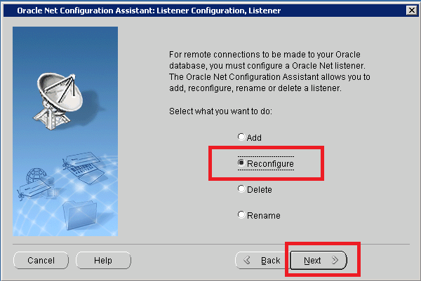
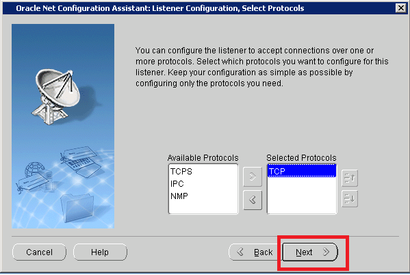
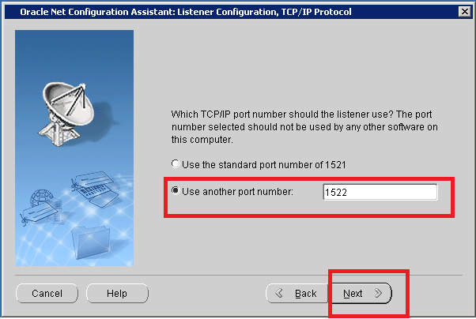

:slug: defends/oracle/cambiar-puerto-default/
:category: oracle
:description: Nuestros ethical hackers explican cómo evitar vulnerabilidades de seguridad mediante la configuración segura en Oracle 11g al cambiar el puerto predeterminado. Las configuraciones predeterminadas usualmente son conocidas y si se mantienen suponen una vulnerabilidad potencial para el sistema.
:keywords: Oracle 11g, Cambiar, Puerto, Determinado, Configuración, Seguridad.
:defends: yes

= Cambiar Puerto Predeterminado

== Necesidad

Cambiar puerto predeterminado en +Oracle 11g+.

== Contexto

A continuación se describe las circunstancias
bajo las cuales la siguiente solución tiene sentido:

. Se utiliza el servidor de bases de datos +Oracle+.
. Se desea cambiar el puerto predeterminado de +Oracle 11g+.

== Solución

La configuración predeterminada en el servidor +Oracle+
utiliza el puerto +TCP 1521+ para el servicio.
Las configuraciones por defecto suponen un riesgo de seguridad
y no se deben utilizar en las aplicaciones finales,
debido a que facilitan la labor de conocer
el funcionamiento interno del sistema.
Los puertos utilizados para ejecutar un servicio
también deben personalizarse
debido a que los puertos por defecto son bien conocidos
y son un blanco común para los atacantes.
Por esta razón se recomienda cambiar el puerto predeterminado
de la instalación de +Oracle+.

Los siguientes pasos explican como cambiar el puerto predeterminado
utilizando el +Net Configuration Assistant+:

. Haga clic en el menú +Inicio+, +Todos los Programas+,
+Oracle - OraDb11g_home1+, +Configuration and Migration Tools+,
+Net Configuration Assistant+.
El menú desplegado se muestra a continuación:
+
.Acceso al Net Configuration Assistant de Oracle 11g.

. Luego de abrir el +Net Configuration Assistant+
se iniciará el asistente para cambiar la configuración del +LISTENER+.
Luego se selecciona la opción +Listener configuration+
y se presiona el botón +Next+, como se ve en la figura +2+:
+
.Ventana de Listener de Oracle.

+
Para modificar la configuración,
debemos seleccionar la opción +Reconfigure+,
como se muestra en la figura +3+,
luego se presiona el botón +Next+:
+
.Configuración del Listener de Oracle.

. En la ventana siguiente
aparecerán los protocolos de comunicación disponibles.
Seleccionamos el protocolo +TCP+ y presionamos el botón +Next+.
+
.Ventana de selección de protocolo de comunicación.

. En el cuadro se selecciona +Use another port number+
para este caso se utilizará el puerto +1522+.
Luego se presiona el botón +Next+,
como se muestra en la figura +5+.
+
.Ventana de selección de puerto.

+
Es necesario aclarar que algunos puertos
utilizan protocolos de comunicación diferentes
al definido en el paso +3+,
o pueden estar ocupados por otros servicios.
Debido a esto es altamente recomendable revisar primero
el estado de los puertos antes de finalizar la configuración.

. Sabemos que la configuración ha finalizado exitosamente
cuando en la siguiente ventana aparece el mensaje
+Listener configuration complete!+, como se aprecia en la figura +6+:
+
.Configuración de puerto terminada exitosamente.

De esta forma se ha cambiado el puerto de escucha por defecto
del servidor +Oracle+ por uno personalizado.
Para mayor información sobre los puertos utilizados
por los productos de +Oracle+,
puedes consultar <<r3, ^[3]^>>.

== Referencias

. [[r1]] link:../../../rules/033/[REQ.033 Restringir acceso administrativo].
. [[r2]] link:https://docs.oracle.com/cd/B28359_01/install.111/b32002/app_port.htm#LADBI464[Puertos Oracle].
. [[r3]] link:http://dbaoracle4hire.blogspot.com.co/2012/02/listado-de-puertos-por-defecto-que.html[ Listado de puertos por defecto que utilizan los productos de Oracle ].
