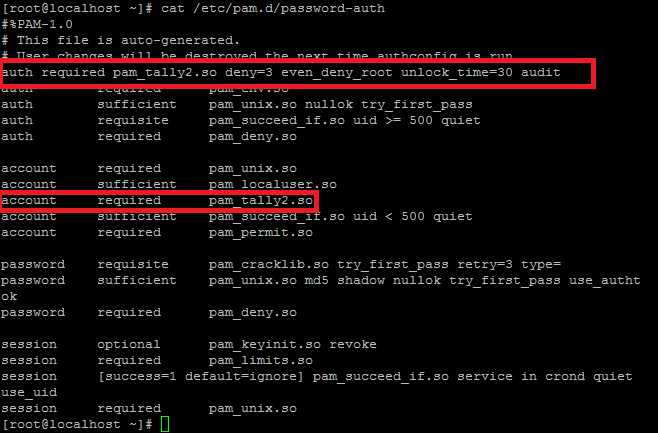

:slug: defends/redhat/proteger-fuerza-bruta/
:category: redhat
:description: Nuestros ethical hackers explican cómo evitar vulnerabilidades de seguridad mediante la configuración segura de Linux Red Hat al proteger las credenciales de acceso contra ataques de tipo fuerza bruta. Una práctica recomendable es utilizar contraseñas computacionalmente fuertes.
:keywords: Linux, Redhat, Seguridad, Autenticación, Fuerza bruta, Contraseñas.
:defends: yes

= Proteger Autenticación de Ataques de Fuerza Bruta

== Necesidad

Se necesita proteger la autenticación en consola
frente ataques de fuerza bruta.

== Contexto

A continuación se describen las circunstancias
bajo las cuales la siguiente solución tiene sentido:

. Se tiene una máquina +RHEL/CentOS/Fedora+.
. Se tienen permisos de administrador sobre la máquina.

== Solución

Un ataque de fuerza bruta es aquel
que consiste en intentar averiguar una contraseña
probando una gran cantidad de palabras
contenidas en archivos de texto conocidos
como diccionarios de claves.

Este tipo de ataque suele ser eficiente
ya que mucha gente suele utilizar,
como contraseñas, palabras y combinaciones de palabras fáciles de recordar.
Sea dicho de paso, usar ese tipo de contraseñas
no es una práctica recomendable.

La mejor manera de protegerse contra ese tipo de ataque
es emplear contraseñas fuertes, es decir,
usar letras en mayúsculas y minúsculas mezcladas con números
y con cualquier otro tipo de símbolos o carácter especial.

También se suele optar por establecer un número máximo de tentativas,
es decir, fijar un número de intentos de acceso permitidos
y en caso de superar ese valor,
se procede a bloquear la cuenta del usuario que está intentando acceder.
Aunque, la verdad, no es una práctica recomendada,
puesto que al bloquear una cuenta
se genera una denegación de servicios.

En esta solución se tendrá en cuenta una tercera opción;
bloquear por periodos cortos de tiempo
o aumentar el intervalo de tiempo entre intentos de acceso,
así, se evita que se pueda automatizar el intento de +login+
y en consecuencia, bloquea un posible ataque de fuerza bruta.

. Con el siguiente procedimiento aseguraremos la autenticación de +Linux+
contra ataques de fuerza bruta.
Este procedimiento contempla ataques al usuario +root+.

. Editamos el archivo +/etc/pam.d/password-auth+
y añadimos lo siguiente para que deshabilite la cuenta por 30 segundos.
+
.password.shell
[source, shell, linenums]
----
auth required pam_tally2.so deny=3 even_deny_root unlock_time=30 audit
account required pam_tally2.so
----

. El orden en que se insertan debe ser el descrito en la siguiente imagen.
Esto tendrá efectos en su funcionamiento.
+

. Reiniciamos el servicio +ssh+.
+
[source, shell, linenums]
----
service sshd restart
----

. Verificamos el +log+ de +tally+.
+
[source, shell, linenums]
----
cat /var/log/tallylog
----

. Revisamos el registro de claves erróneas.
+
[source, shell, linenums]
----
pam_tally2 -u Usuario1
----

. Reseteamos el registro de claves erróneas de ser requerido.
+
[source, shell, linenums]
----
pam_tally2 -u Usuario1 --reset
----

. *Nota:* El procedimiento bloquea la cuenta por 30 segundos,
si se sufre de un ataque de fuerza bruta sostenido,
el mismo ataque mantendrá la cuenta inhabilitada hasta que este cese
y pasen 30 segundos.
Las otras cuentas que se hallan creado se mantendrán activas.

== Referencias:

. [[r1]] link:https://www.tecmint.com/use-pam_tally2-to-lock-and-unlock-ssh-failed-login-attempts/[Use Pam_Tally2 to Lock and Unlock SSH Failed Login Attempts]
. [[r2]] link:https://www.owasp.org/index.php/Brute_force_attack[Brute force attack]
