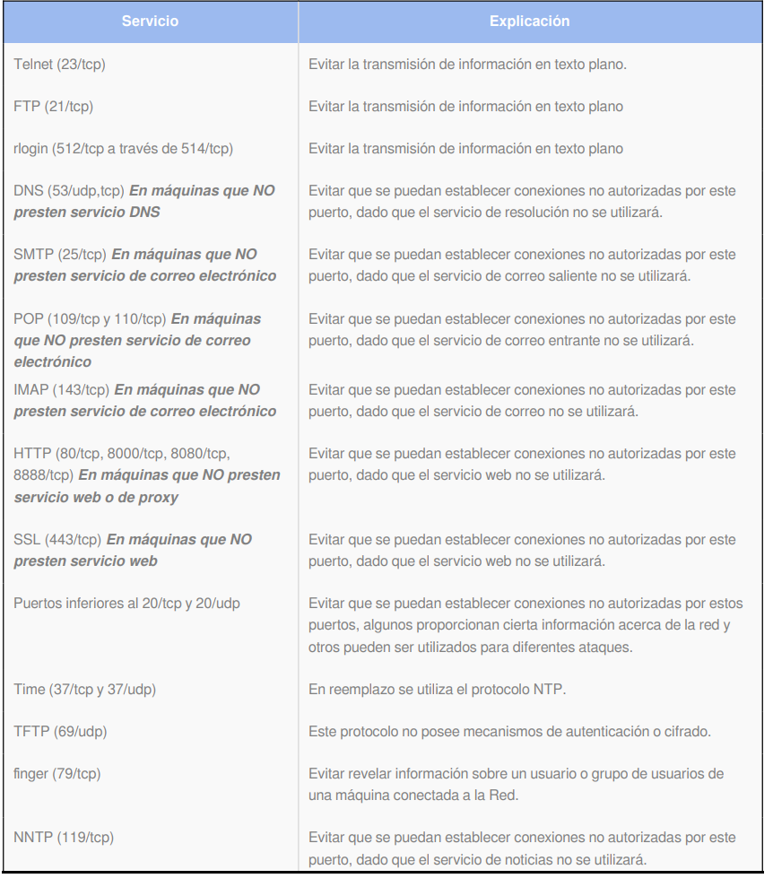

:slug: defends/windows/deshabilitar-puertos/
:category: windows
:description: Nuestros ethical hackers explican cómo evitar vulnerabilidades de seguridad mediante la configuración segura de Windows. En este instructivo, explicaremos paso a paso cómo deshabilitar puertos innecesarios en un sistema operativo Windows evitando que se filtre malware utilizando dichos puertos.
:keywords: Windows, Seguridad, Puertos, Deshabilitar, Buenas Prácticas, Innecesario.
:defends: yes

= Deshabilitar Puertos Innecesarios

== Necesidad

Se requiere realizar un aseguramiento de una máquina
con sistema operativo +Windows+.
Para esto, es necesario verificar
que no haya servicios innecesarios ni inseguros corriendo.

== Contexto

A continuación se describen las circunstancias
bajo las cuales la siguiente solución tiene sentido:

. Se tiene un equipo con sistema operativo +Windows+.
. La organización debe deshabilitar
las funciones innecesarias de un sistema^<<r1,[1]>>^.

== Solución

Un puerto es una interfaz física o lógica a través de la cual
se puede enviar y recibir diferentes tipos de datos.
En el caso particular de esta solución,
nos enfocaremos en a los puertos asociados
a una interfaz lógica o puertos lógicos.

Los puertos lógicos son unas zonas, o localizaciones,
de la memoria de un equipo que se asocian con un puerto físico
o con un canal de comunicación.
Además, los puertos lógicos
proporcionan un espacio para el almacenamiento temporal
de la información que se va a transferir
entre la localización de memoria y el canal de comunicación^<<r2,[2]>>^.

En otras palabras, los puertos lógicos son necesarios
para que las aplicaciones o programas
que funcionan en un equipo determinado,
puedan comunicarse con el exterior.
Esta comunicación la hacen virtualmente
a través de una conexión +TCP+ o +UDP+
y, a su vez, esta conexión puede ser de entrada o salida,
es decir, envían o reciben información.
Además, como dato general, un equipo tiene un total de +65535+ puertos.

Entonces, es fácil suponer que jamás se utilizarán
todos los puertos disponibles y, debido a eso,
es obligatorio bloquear todos los que sean innecesarios.
Por otra parte, deshabilitar los puertos innecesarios
sirve para evitar múltiples problemas de seguridad.

Para deshabilitar los puertos innecesarios
en un equipo con +Windows+ instalado se debe:^<<r3,[3]>>^

. Abrir el menú de inicio.

. Ir a +ejecutar/run+.

. Allí ingresar +cmd+ y presionar ejecutar.

. En la consola, ejecutar el comando +netstat -an+.
En la salida no deberían estar los siguientes servicios:
+

. Adicionalmente, se debe hacer una verificación
con la herramienta de servicios de +Windows+
haciendo clic en +Start+, +Administrative Tools+, +Services+.

. Allí se debe verificar que los siguientes servicios
se encuentren deshabilitados:

* +Human Interface Device Access+
* +Infrared Monitor+
* +Intersite Messaging+
* +Messenger+
* +Network DDE+
* +Network DDE DSDM+
* +Network News Transfer Protocol+ (+NNTP+)
* +Print Server for Macintosh+
* +Simple TCP/IP Services+
* +Trivial FTP Daemon+
* +WinHTTP Web Proxy Auto-Discovery Service+
* +Wireless Configuration+

== Referencias

. [[r1]] link:../../../rules/267/[REQ.267 Deshabilitar funciones innecesarias]
. [[r2]] link:https://es.wikipedia.org/wiki/Puerto_(inform%C3%A1tica)[Puerto (informática)].
. [[r3]] link:https://support.microsoft.com/es-co/help/813878/how-to-block-specific-network-protocols-and-ports-by-using-ipsec[Deshabilitar protocolos y puertos].
