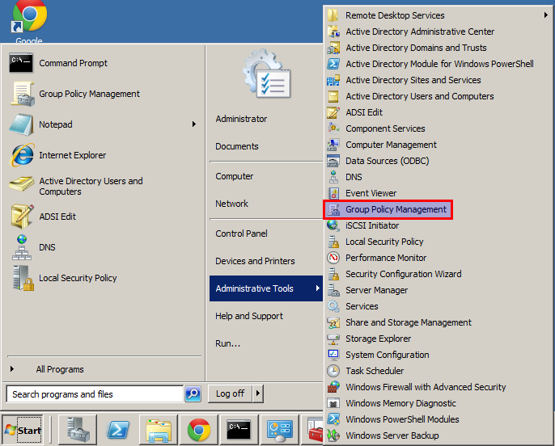
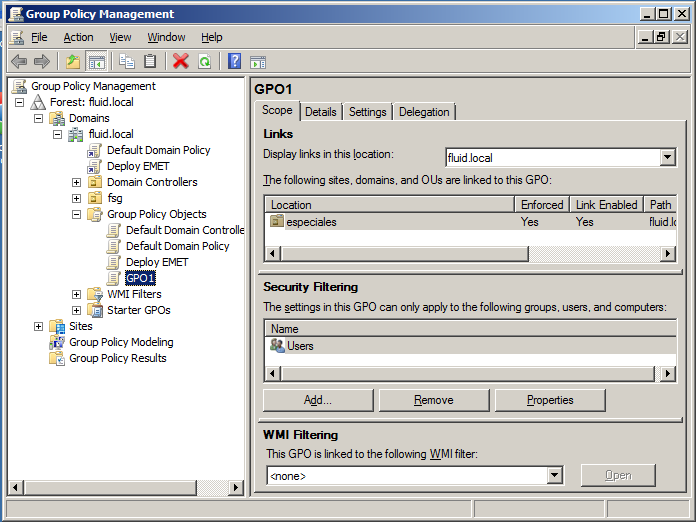
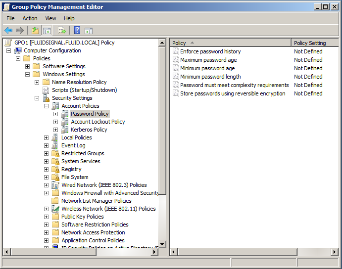

:slug: defends/windows/modificar-dominio/
:category: windows
:description: Nuestros ethical hackers explican cómo configurar paso a paso y de manera segura las directivas de dominio de forma centralizada utilizando la herramienta Group Policy Management Console en un servidor que utiliza el sistema operativo Windows Server 2008 R2.
:keywords: Active Directory, Windows, GPO, GPMC, Servidor, Directivas.
:defends: yes

= Modificar Configuración de Directivas de Dominio

== Necesidad

Modificar configuración de directivas de dominio
por medio de +Active Directory+.

== Contexto

A continuación se describen las circunstancias
bajo las cuales la siguiente solución tiene sentido:

. Se tiene instalado un controlador de dominio
bajo el sistema operativo +Windows Server 2008 R2+.
. Se tiene acceso como administrador de dominio.
. Se requiere aplicar configuraciones
para un conjunto de máquinas pertenecientes al dominio.
. Se cuenta un +GPO+ (+Group Policy Object+) existente.

== Solución

La configuración de directivas de seguridad
debe utilizarse como parte una implementación de seguridad global
para ayudar a los controladores de dominio seguro, servidores,
equipos cliente y otros recursos de la organización.

Las directivas de configuración de seguridad
son reglas que puede configurar en un equipo o varios equipos,
con el fin de proteger los recursos de un equipo o red.

. Para aplicar configuraciones de forma centralizada en un dominio,
en vez de la herramienta +Local Policy Editor+
puede utilizar +Group Policy Management Console+.
Generalmente, las rutas utilizadas para configuraciones de modo local
se mantienen al ser aplicadas a nivel de dominio,
por lo cual puede seguir las mismas instrucciones
cambiando sólo lo explicado a continuación.

. Para hacer uso de +Group Policy Management Console+
ejecute el comando +gpmc.msc+
en el menú desplegado mediante +Start+.
Una forma equivalente es mediante
+Start \Administrative Tools\Group Policy Management+
(Administración de directivas de grupo).
+

. Allí es posible ver en el panel izquierdo
los dominios que están siendo administrados.
+

. Para cambiar la configuración de algunas de las políticas,
basta con desplegar el bosque de dominios,
desplegar el dominio sujeto a cambio
y hacer clic secundario y seleccionar +Edit+ en el +GPO+
que se desea modificar.
Con esto se abrirá el +Group Policy Management Editor+.

. Para ejemplificar, si se desea modificar las políticas de contraseña,
se debe ir a la ruta.
+
.ruta.shell
[source, shell, linenums]
----
Computer Configuration\Policies\Windows Settings\Security Settings\Account Policies\Password Policy
----
+

. Haciendo doble clic sobre cada directiva
podrá cambiar su valor,
exactamente igual que se hace con las directivas locales.

. Se recomienda hacer respaldos de las directivas aplicadas
en el directorio activo de forma constante,
especialmente si se van a realizar cambios sobre éstas.
Para ello es posible hacer uso de la herramienta +LDIFDE+ ^<<r1,[1]>>^.
Esta herramienta también puede ser usada
para replicar directivas a través de diferentes dominios.

== Referencias

. [[r1]] link:https://docs.microsoft.com/en-us/previous-versions/windows/it-pro/windows-server-2000/bb727091(v=technet.10)[Step-by-Step Guide to Bulk Import and Export to Active Directory]
. [[r2]] link:https://msdn.microsoft.com/en-us/library/aa374162(v=vs.85).aspx[Group Policy Objects]
. [[r3]] link:https://msdn.microsoft.com/en-us/library/aa814316(v=vs.85).aspx[Group Policy Management Console]
. [[r4]] link:../../../rules/176/[REQ.176 Restringir objetos del sistema]
