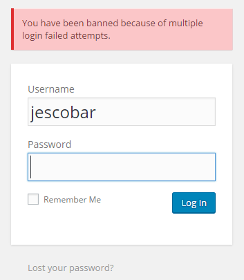

:slug: defends/wordpress/evitar-fuerza-bruta/
:category: wordpress
:description: Nuestros ethical hackers explican cómo evitar vulnerabilidades de seguridad mediante la programación segura en WordPress al evitar los ataques de diccionario o fuerza bruta. Los ataques de fuerza bruta pueden resultar en un robo de credenciales si la aplicación no está debidamente configurada.
:keywords: WordPress, Seguridad, Protección, Ataque, Diccionario, Fuerza Bruta.
:defends: yes

= Evitar Ataques de Diccionario o Fuerza Bruta

== Necesidad

Evitar ataques de diccionario o fuerza bruta
en el formulario de inicio de sesión de +WordPress+.

== Contexto

A continuación se describen las circunstancias
bajo las cuales la siguiente solución tiene sentido:

. Se tiene instalado un sitio web con +WordPress+.

. Es posible realizar ataques de diccionario
o fuerza bruta con usuarios válidos en el sitio.

== Solución

Para administrar de forma adecuada un sitio web,
es importante cerciorarse de prevenir ataques que puedan vulnerarlo.
Para ello, es necesario tomar medidas de seguridad
contra los tipos de ataque más conocidos.
Esto debido a que son los métodos que un atacante intentará realizar
antes de intentar métodos de ataque personalizados.

Los ataques de fuerza bruta son medios comunes
y relativamente sencillos para vulnerar aplicaciones.
Por ello es importante protegerlas debidamente.
En un ataque de fuerza bruta o un ataque de diccionario,
el atacante intentará ingresar combinaciones de credenciales
desde un diccionario con palabras comunes.
Para esto normalmente se utiliza un software personalizado
o una herramienta automática que ingrese palabras de forma sucesiva
hasta encontrar una combinación válida.
De esta forma se produce un robo de credenciales.
A pesar de ser una forma de ataque poco eficiente
debido al tiempo necesario para encontrar una pareja de credenciales válidas,
supone un riesgo si alguna de las credenciales
no cuenta con suficiente seguridad o contiene palabras de diccionario.

Afortunadamente, existen muchas formas de prevenir este tipo de ataques.
En este artículo mostraremos cómo evitar
ataques de tipo fuerza bruta o diccionario en +WordPress+.
Esta solución evita que un atacante adivine claves para usuarios válidos,
bloqueando temporalmente la cuenta de usuario
si se presentan múltiples intentos fallidos de autenticación.
Para ello debemos seguir la siguiente serie de pasos:

. Descargar el complemento +WPSecureOps Brute Force Protect+.
Este complemento puede encontrarse
en la página oficial de +WordPress+ <<r1, ^[1]^>>.

. Para instalarlo ir al menú +Plugins+,
luego seleccionar la opción +Add New+, y finalmente +Upload Plugin+.

. Una vez instalado procederemos a comprobar su funcionamiento.
Para verificar se puede ingresar repetidas veces credenciales erróneas
para un usuario y se obtendrá un mensaje de error similar al siguiente:
+
.Protección contra ataques de fuerza bruta

. Como se puede apreciar, una vez instalado el nuevo +plugin+,
si un usuario realiza muchos intentos de autenticación fallidos,
éste será bloqueado temporalmente del sistema.

== Referencias

. [[r1]] link:https://wordpress.org/plugins/wpsecureops-bruteforce-protect/[WPSecureOps Brute Force Protect].

. [[r2]] link:../../../rules/237/[REQ.237 Establecer acciones de usuario seguras].
