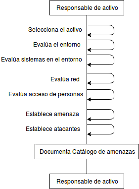

:slug: hardens/criterio/requisito-seguridad-009/ 
:category: criterio
:description: En el presente documento se detallan los requerimientos de seguridad relacionados a los activos de información de la empresa. Se deben identificar los posibles atacantes capaces de vulnerar los activos, esto influye a la hora de considerar los controles de seguridad y la probabilidad del riesgo.
:keywords: Requerimiento, Seguridad, Activos de información, Atacantes, Control, Riesgo.
:hardens: yes

= REQ.009 Identificar posibles atacantes

== Nombre Completo

Los posibles atacantes del sistema deben estar identificados

== Descripción

Una parte fundamental del modelado de amenazas 
es una caracterización de los diferentes grupos de actores 
que podrían ser capaces de atacar el sistema. 
Estos grupos pueden influir 
en la probabilidad de ocurrencia de los riesgos 
y en la disposición de los controles aplicables. 

== Implementación

Un atacante se define como una entidad 
capaz de poner en peligro o vulnerar 
a los activos de información de la organización.
Los posibles atacantes pueden ser elementos
de índole externa o interna,
sin embargo, un atacante no necesariamente 
vulnera a los activos de forma intencionada.
Por ejemplo, pueden existir casos 
en los que un empleado, de forma involuntaria,
represente una amenaza para un activo de información,
ya sea por falta de experiencia, 
falta de entrenamiento, 
o simplemente a causa de un error humano.
De la misma forma, es necesario tener en cuenta también
escenarios en donde el atacante,
vulnera a los activos de forma intencionada.

Los atacantes de un sistema son los actores responsables 
de la existencia de la amenaza. 
Un ejemplo de posibles atacantes se muestra a continuación:

* Atacante = Naturaleza, Amenaza = Terremoto.
* Atacante = Hacker, Amenaza = Exploit de metaexploit.
* Atacante = Empleado, Amenaza = Falta de entrenamiento en el manejo del activo.

Un mismo actor puede actuar como atacante 
en diferentes tipos de amenaza, 
el objetivo es conocer el comportamiento del atacante 
ante cada una de ellas.

La identificación de atacantes 
se realiza como parte del modelo de amenazas 
o el establecimiento del catálogo de amenazas. 
La idea a la hora de establecer a los atacantes,
es identificar a los activos de información vulnerables,
cuya probabilidad de ocurrencia e impacto sean más críticos
y tomar medidas de seguridad para mitigar los riesgos de amenaza
ante diferentes actores, en diferentes tipos de escenarios.

== Diagrama

== Soluciones

* ISO 27005 - Gestión de riesgos para un SGSI con ISO 27005.
* Consultoría - Aprender teoría básica de riesgos.

== Casos de abuso

Un usuario empleado o anónimo 
ejecuta acciones las cuales van en contravía 
de la seguridad de cualquier activo de la organización. 
Debido a la situación descrita anteriormente, 
la amenaza no se había detectado 
debido a la falta de identificación de todos los actores. 

== Atributos

* Capa: Capa de Recursos.
* Activo: Activos de Información.
* Alcance: Adherencia.
* Fase: Análisis.
* Tipo de Control: Procedimiento.

== Referencias

. https://www.iso.org/isoiec-27001-information-security.html[Serie de normas ISO/IEC 27000.]
. https://www.owasp.org/index.php/Modelado_de_Amenazas[Modelado de amenazas.]
