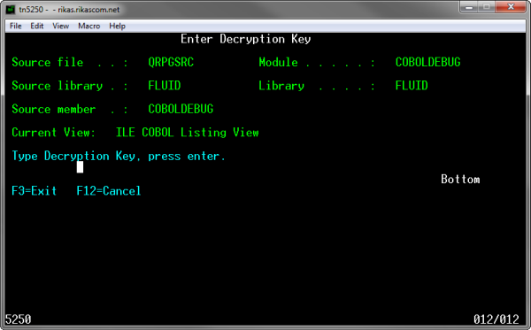
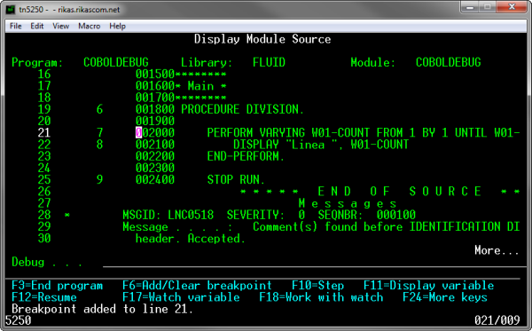

:slug: kb/cobol/cifrar-codigo-fuente/
:eth: no
:category: cobol
:description: TODO
:keywords: TODO
:kb: yes

= Cifrar Código Fuente

== Necesidad

Cifrar código fuente para depurar programas en COBOL y RPG.

== Contexto

A continuación se describe las circunstancias 
bajo las cuales la siguiente solución tiene sentido:

. Se está desarrollando una aplicación en COBOL o RPG.

. La aplicación requiere depurarse 
en entornos de producción 
sin exponer el código fuente.

. El código fuente no debe ser accesible 
en ambientes de producción (ej: compilación, ofuscación).[1]

== Solución

Para el ejemplo se usará un programa sencillo hecho en COBOL:

. Se define la primer división _IDENTIFICATION DIVISION_ 
de todo programa en COBOL:
+
[source,cobol,linenums]
----
IDENTIFICATION DIVISION.
******************
* Identification *
******************
PROGRAM-ID. COBOLDEBUG.
----
+
En este caso mediante la instrucción _PROGRAM-ID_, 
se denomina al programa bajo el nombre de COBOLDEBUG.

. La siguiente división a definir es la de _DATA DIVISION_.
En esta división se declaran 
nombres de campos, registros, variables, etc. 
Es decir, se especifica cada tipo de dato utlizado por el programa [2].
+
[source,cobol,linenums]
----
********
* Data *
********
DATA DIVISION.
WORKING-STORAGE SECTION.
01 W01-COUNT PIC 9(02).
----
+
Como se observa en el código anterior, 
la sección WORKING-STORAGE de DATA DIVISION 
contiene la variable W01-COUNT, 
cuya utilidad en este caso es almacenar el valor 
de la línea que se imprimirá en pantalla:

. En la división PROCEDURE DIVISION, 
se definen todos los procesos necesarios 
para que el programa funcione.
Es decir, se especifia el algoritmo del programa [3].
Para este caso, recorremos de uno en uno la variable W01-COUNT 
empezando en 1 y terminando en 9:
+
[source,cobol,linenums]
----
********
* Main *
********
PROCEDURE DIVISION.
MAIN.
PERFORM VARYING W01-COUNT FROM 1 BY 1 UNTIL W01-COUNT > 9
DISPLAY "Linea " W01-COUNT
END-PERFORM.
STOP RUN.
----

. La salida del anterior programa es similar a la siguiente:
+
[source,cobol,linenums]
----
Linea 01
Linea 02
...
Linea 08
Linea 09
----

. Ahora se requiere depurar el programa en entornos de producción, 
si se compila normalmente con la opción DBGVIEW(*LIST), 
una copia del código fuente es adjuntada con el programa, 
lo que le permitiría a un atacante 
obtener el código fuente original de las aplicaciones compiladas. 
Para evitar que la copia exacta del código se adjunte con el programa 
se debe usar la opción DBGENCKEY [4], 
la cual permite que se adjunte una copia del código fuente 
cifrada con una clave proporcionada por el usuario. 
En el momento de depuración, 
dicha clave es requerida para descifrar el código fuente, 
si la clave no coincide no es posible recuperar dicho código.

. A través del comando CRTBNDCBL se compila y se crea el programa COBOL 
(CRTBNDRPG para programas en RPG), 
el argumento para DBGVIEW debe ser *LIST 
y para DBGENCKEY es la contraseña (De máximo 16 caracteres) 
con la cual el código fuente será cifrado:
+
[source,cobol,linenums]
----
CRTBNDCBL
PGM(FLUID/COBOLDEBUG)
SRCFILE(FLUID/QRPGSRC)
SRCMBR(COBOLDEBUG)
DBGVIEW(*LIST)
DBGENCKEY('$ecr3t-K3y')
----

. Para depurar el programa se ejecuta el siguiente comando:
+
[source,cobol,linenums]
----
STRDBG COBOLDEBUG
----

. En este momento la aplicación solicita la clave 
para descifrar el código fuente:
+

. Si la clave es correcta 
podremos ver el código fuente 
y depurar normalmente el programa:
+

== Referencias

. REQ.0154: El código fuente debe estar ofuscado en ambiente de producción.
. http://www.escobol.com/modules.php?name=Sections&op=printpage&artid=13[Data Division.]
. http://www.escobol.com/modules.php?name=Sections&op=printpage&artid=14[Procedure Division.]
. https://www.ibm.com/support/knowledgecenter/ssw_ibm_i_71/rbam6/encdbgview.htm[Encrypting the debug listing view.]