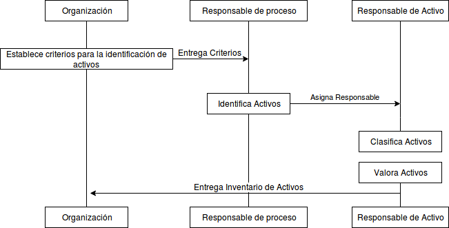

:slug: kb/criterio/requisito-seguridad-001/ 
:eth: no
:category: criterio
:kb: yes

= REQ.001: Los activos de información del sistema deben estar identificados

== Descripción

La organización debe identificar los activos de información 
con el objetivo de clasificarlos 
permitiendo de este modo protegerlos de posibles riesgos 
y establecer controles de acuerdo a su valor.

== Implementación

. Es recomendable establecer un alcance 
para la realización de la actividad de identificación de activos, 
idealmente esta identificación se enmarca en el alcance 
de un Sistema de Gestión de Seguridad de la Información (SGSI).

. Cuando la organización no cuente con un SGSI, 
es posible establecer el alcance de la actividad 
identificando inicialmente los activos que correspondan 
a los procesos más importantes para la organización 
y progresivamente ir aumentando este alcance a todos los demás procesos.

. La identificación de activos puede contener la siguiente información:

* Código de activo.

* Nombre del activo.

* Descripción del activo.

* Grupo de activos al que pertenece 
(si se ha establecido algún parámetro de agrupación, 
lo cual es recomendado.)

* Nombre del proceso al que corresponde.

* Criticidad del proceso al que corresponde.

* Dueño, responsable o propietario del activo (link:../requisito-seguridad-002/[REQ. 002]).

* Clasificación del activo en cuanto a la confidencialidad, 
disponibilidad e integridad del mismo.

* Valor del activo teniendo en cuenta su clasificación (link:../requisito-seguridad-003/[REQ. 003]).

. Es recomendable que la identificación de los activos 
la realice el responsable de cada proceso de la organización, 
de forma que pueda realizar una adecuada clasificación de los mismos, 
tal y como se muestra en el siguiente diagrama: 

== Soluciones

* Consultoría - Establecer el Inventario de Activos de Información.
* Consultoría- Determinar la granuralidad de activo de información.
* Consultoría - Determinar el Propietario de un Activo de Información​.
* Consultoría - Responder a cuestionario inventario activos de información​.
* ISO 27005 - Gestión de riesgos para un SGSI con ISO 27005.
* ISO 27003 - ​Guía ISO 27003.

== Casos de abuso

Un usuario empleado o anónimo ejecuta acciones 
en contravía de la seguridad de cualquier activo de la organización, 
el incidente no puede ser valorado 
pues se desconoce el impacto de los activos afectados. 
En consecuencia la solución del incidente 
puede ser tardía e impactar en mayor medida a la organización.

== Atributos

. Capa: Capa de Recursos
. Activo: Activos de Información
. Alcance: Adherencia
. Fase: Análisis
. Tipo de Control: Procedimiento

== Referencias

. https://www.iso.org/isoiec-27001-information-security.html[Serie de normas ISO/IEC 27000]