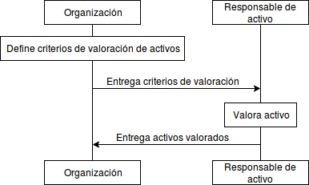

:slug: kb/criterio/requisito-seguridad-003/ 
:eth: no
:category: criterio
:kb: yes

= REQ.003 Cada activo de información debe estar valorado en términos monetarios

== Descripción

La organización debe valorar en términos monetarios 
los activos de información previamente identificados 
teniendo en cuenta el valor que representa para el negocio. 
Esto permitirá discernir la importancia del activo 
así como el costo de la pérdida del activo 
y determinar controles costo-eficientes.

== Implementación

La asignación de valor de los activos de información 
es un tema complejo debido a que son bienes intangibles.
Los activos de información intangibles incluyen, 
pero no se limitan a:

* Conocimiento.
* Relaciones.
* Secretos comerciales.
* Licencias.
* Patentes.
* Experiencia.
* Conocimientos técnicos.
* Imagen corporativa.
* Marca.
* Reputación comercial.
* Confianza de los clientes.
* Ventaja competitiva.
* Ética.
* Productividad.

Inicialmente en procesos de gestión de activos inmaduros, 
la organización puede optar por una valoración cualitativa 
teniendo en cuenta los criterios de clasificación definidos, 
sin embargo, en la medida en que la organización 
perfecciona los procesos lo más recomendable 
es optar por una definición económica 
del valor de sus activos de información.

Para definir el valor del activo la organización 
se pueden tener en cuenta los siguientes criterios:

* El valor de la información en el mercado.

* El valor de reposición por pérdida.

* El valor del impacto producido por la pérdida.

* El valor de conservación de la información.

Teniendo en cuenta estas variables 
la organización puede definir una fórmula 
para establecer el valor económico de sus activos.

== Diagrama

== Soluciones

* Consultoría - Determinar el valor de la información.

* Consultoría - Establecer Inventario de Activos de Información.

* ISO 27005 - Gestión de riesgos para un SGSI con ISO 27005.

* Consultoría - Determinar Propietario de un Activo de Información​.

* Consultoría - Responder a cuestionario inventario activos de información​.

* ISO 27003 - ​Guía ISO 27003

== Casos de abuso

Un usuario empleado o anónimo ejecuta acciones 
las cuales van en contravía de la seguridad 
de cualquier activo de la organización. 
Dada la situación anterior no es posible determinar 
el valor de los controles 
que se deben implementar para la protección
de los activos de información 
de forma que sean costo-eficientes.

== Atributos

* Capa: Capa de Recursos.

* Activo: Activos de Información.

* Alcance: Adherencia.

* Fase: Análisis.

* Tipo de Control: Procedimiento.

== Referencias

. https://app.knowledgeowl.com/kb/article-preview/id/54e3799f7cb82979702e0753/aid/5733cba932131c4f22e402a8[Serie de normas ISO/IEC 27000]
