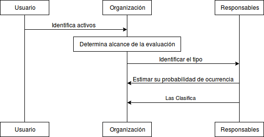

:slug: kb/criterio/requisito-seguridad-005/ 
:eth: no
:category: criterio
:kb: yes

= REQ.005 Los sistemas que interactúen con un activo de información deben tener identificadas las posibles vulnerabilidades que sobre ellos apliquen y que sean conocidas

== Descripción

La organización debe realizar de forma constante y regular
una identificación de las vulnerabilidades 
asociadas a sus activos de información.
Esto último con el fin de evaluar los riesgos que representan 
y poder generar los controles apropiados para cada caso.

Una vulnerabilidad de seguridad se define
como la posibilidad o potencialidad 
de que se materialice una amenaza 
sobre un activo de información de la organización.

== Implementación

. Identificación de vulnerabilidades: 
Las vulnerabilidades asociadas a los activos de información 
pueden surgir ya sea a través de defectos 
o debilidades de seguridad, 
de diseño, de implementación 
o de controles mal concebidos o implementados. 
Éstas vulnerabilidades por definición 
pueden ser explotadas generando así una brecha de seguridad, 
que puede comprometer la integridad de los activos y de la empresa en sí.

. Para definir si un activo de información es vulnerable,
es necesario contar con un catálogo actualizado de amenazas (link:../requisito-seguridad-004/[REQ.004]) 
y una lista de activos de la organización (link:../requisito-seguridad-001/[REQ.001]).
Una vez se cuente con ambos, 
se realiza una evaluación de la posibilidad de materialización
de las amenazas presentes en el catálogo 
para cada uno de los activos identificados.
Esto permite definir controles de seguridad
los cuales tienen por objetivo mitigar la posibilidad
de que una amenaza se presente o reducir el impacto
sobre los activos de información 
en caso de presentarse dicha amenaza. 

. El objetivo del presente requerimiento de seguridad 
es identificar y generar un listado de vulnerabilidades 
(defectos o vulnerabilidades) 
que pueden permitir la materialización 
de amenazas potenciales y diferenciadas.

== Diagrama

== Soluciones

* ISO 27005 - Gestión de riesgos para un SGSI con ISO 27005.
* Consultoría - Aprender teoría básica de riesgos.

== Casos de abuso

Un usuario empleado o anónimo ejecuta acciones 
las cuales van en contravía de la seguridad 
de cualquier activo de la organización. 
Debido a la situación anteriormente descrita 
los controles definidos para su protección 
no son efectivos puesto que la vulnerabilidad que representa 
no fue previamente identificada.

== Atributos

* Capa: Capa de Recursos.
* Activo: Activos de Información.
* Alcance: Adherencia.
* Fase: Análisis.
* Tipo de Control: Procedimiento.

== Referencias

. https://www.iso.org/isoiec-27001-information-security.html[Serie de normas ISO/IEC 27000]