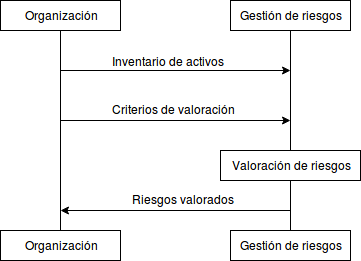

:slug: kb/criterio/requisito-seguridad-008/ 
:eth: no
:category: criterio
:kb: yes

= REQ.008 Riesgos medidos por probabilidad e impacto

== Nombre Completo

Cada riesgo de seguridad de información, debe estar medido en función de su probabilidad e impacto

== Descripción

El valor de un riesgo debe tener en cuenta 
el impacto ocasionado en una posible materialización 
y la probabilidad realista de ocurrencia del mismo.

== Implementación

. Para determinar la valoración de un riesgo 
es necesario tener en cuenta 
la variable de impacto, debido a que es indispensable conocer 
cuáles son las consecuencias 
de la materialización de un riesgo para la organización. 
Adicionalmente la variable probabilidad determina 
qué tan frecuente el riesgo puede materializarse. 
Al combinar las dos variables podemos determinar 
el valor real de un riesgo.

. En muchas ocasiones encontramos riesgos 
que se materializan frecuentemente 
pero los impactos causados son mínimos. 
Al tener en cuenta únicamente la variable probabilidad de ocurrencia 
es  posible apresurarse a definir controles 
que son demasiado costosos 
en comparación con los daños causados, 
o por el contrario, al concentrarse únicamente en el impacto 
y no estudiar adecuadamente el riesgo y la frecuencia de ocurrencia, 
implementar controles para evitar amenazas
con una probabilidad mínima de ocurrencia.
Esto puede terminar causando pérdidas para la organización, 
por lo cual es importante determinar 
un criterio de valoración que le permita a la organización 
equilibrar las variables según su necesidad.

. La determinación de la valoración 
se realiza generalmente a través de un diagrama de calor 
donde se nivelan dos variables: riesgos altos y bajos. 
Cuando la organización tiene un apetito de riesgo alto, 
ésto se muestra en el diagrama de calor 
como una zona mayor para los riesgos bajos. 
Por otra parte, cuando la organización 
tiene un apetito de riesgo bajo, 
determina en el diagrama de calor 
una zona mayor para los riesgos altos. 

== Diagrama

== Soluciones

* ISO 27005 - Gestión de riesgos para un SGSI con ISO 27005.
* Consultoría - Aprender teoría básica de riesgos.

== Casos de abuso

Un usuario empleado o anónimo 
ejecuta acciones las cuales 
van en contravía de la seguridad 
de cualquier activo de la organización. 
Debido a la situación descrita anteriormente, 
el control establecido no fue eficiente 
debido a una falla en la valoración de riesgo 
al no tener en cuenta las variables de impacto 
y su probabilidad de ocurrencia. 

== Atributos

* Capa: Capa de Recursos.
* Activo: Activos de Información.
* Alcance: Adherencia.
* Fase: Análisis.
* Tipo de Control: Procedimiento.

== Referencias

. https://www.iso.org/isoiec-27001-information-security.html[Serie de normas ISO/IEC 27000]
