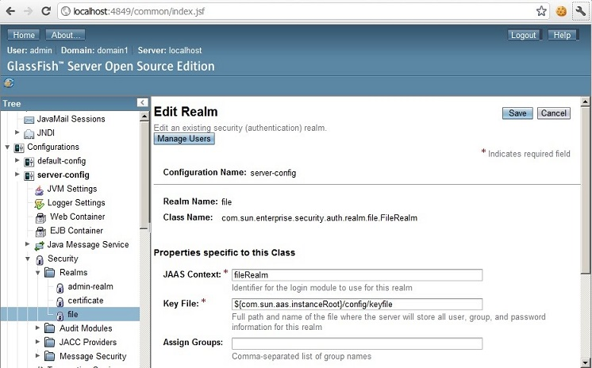

:slug: kb/glassfish/definir-rol-seguridad-glassfish/
:eth: no
:category: glassfish
:kb: yes

= Definir Roles de Seguridad

== Necesidad

Definir usuarios y roles en GlassFish.

== Contexto

A continuación se describen las circunstancias bajo las cuales la siguiente 
solución tiene sentido:

. Se utiliza el servidor de aplicaciones GlassFish.
. Se desea configurar usuarios y roles en el Realm de GlassFish.

== 	Solución

. Iniciamos sesión en la consola de administrador de GlassFish:

. Expandimos el nodo de Security -> Realms -> File.
+

. Seleccionamos la opción de Manage Users, y luego New user:
+
image::opcion.png[manage users]

. Creamos un usuario nuevo.

== Referencias

. REQ.0171: El sistema debe restringir el acceso a objetos del sistema que 
tengan contenido sensible. Solo permitirá acceso a usuarios autorizados.