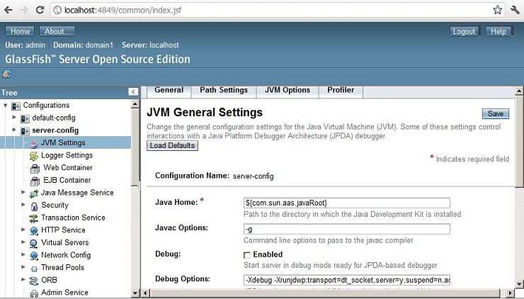

:slug: kb/glassfish/deshabilitar-modo-depuracion/
:category: glassfish
:description: Nuestros ethical hackers explican cómo evitar vulnerabilidades de seguridad mediante la configuración segura en Glassfish al deshabilitar el modo depuración. Los mensajes de depuración pueden contener información que ayude a un atacante a conocer el sistema e identificar vulnerabilidades. 
:keywords: Glassfish, Seguridad, Deshabilitar, Modo, Depuración, GPL.
:kb: yes

= Deshabilitar Modo Depuración

== Necesidad

Deshabilitar modo depuración en +GlassFish+.

== Contexto

A continuación se describen las circunstancias 
bajo las cuales la siguiente solución tiene sentido:

. Se utiliza el servidor de aplicaciones +GlassFish+.
. Se desea cambiar la configuración del modo depuración.

== Solución

+GlassFish+ es un servidor de aplicaciones de +software+ libre 
desarrollado por +Sun Microsystems+. 
Este servidor implementa las tecnologías definidas 
en la plataforma +Java EE+.
Además, permite ejecutar aplicaciones que siguen dicha especificación. 
Es gratuito, de código libre y se distribuye bajo un licenciamiento dual 
a través de la licencia +CDDL+ y la +GNU GPL+ ^<<r1,[1]>>^.

Por otra parte, la depuración es el proceso de identificar 
y corregir errores de programación. 
Si bien, esto no es un problema, 
puesto que es absolutamente necesario 
para poder ir mejorando cada vez una aplicación, 
tener habilitada la depuración en ambientes de producción 
puede traer los siguientes riesgos de seguridad:

El problema más obvio está relacionado con la exposición de datos privados. 
Con la depuración habilitada, cualquier persona que acceda a la aplicación 
tendrá acceso a todos los datos que fueron cargados anteriormente 
para procesar la aplicación.

Otro problema, es el riesgo implícito 
en la introducción de nuevos problemas a la aplicación 
al momento de solucionar problemas previamente reportados, 
puesto que un cambio, sin darnos cuenta, 
puede alterar de manera considerable 
el funcionamiento de la aplicación.

En conclusión, la depuración en si tiene muchas ventajas 
y facilita enormemente la identificación 
y posterior solución de errores, 
pero en un entorno de producción, lo mejor,
es mantener deshabilitada la depuración 
y así evitar exponer información sensible 
que pueda ser usada en contra de la organización.

En está solución se explicará 
como mantener desactivada la opción de depuración 
en un servidor de aplicaciones +glassfish+.

. Para desactivarla, hay que ingresar a la consola de administración web.

. Por defecto, si el servidor está funcionando en óptimas condiciones, 
la consola de administración funciona sobre el puerto +4848+.

. Una vez se ingresa a la consola de administración,
se hace clic en +Configuration -> JVM Settings+.

. Hay que desactivar la casilla +Debug+, como se muestra en la imagen.

== Referencias

. [[r1]] link:https://es.wikipedia.org/wiki/GlassFish[GlassFish]
. [[r2]] link:https://es.wikipedia.org/wiki/Depuraci%C3%B3n_de_programas[Depuración de programas]
. [[r3]] link:https://javaee.github.io/glassfish/doc/5.0/security-guide.pdf[GlassFish Server Open Source Edition: Security Guide] 
. [[r4]] REQ.0072: Los eventos con severidad de depuración 
no deben estar habilitados en producción.