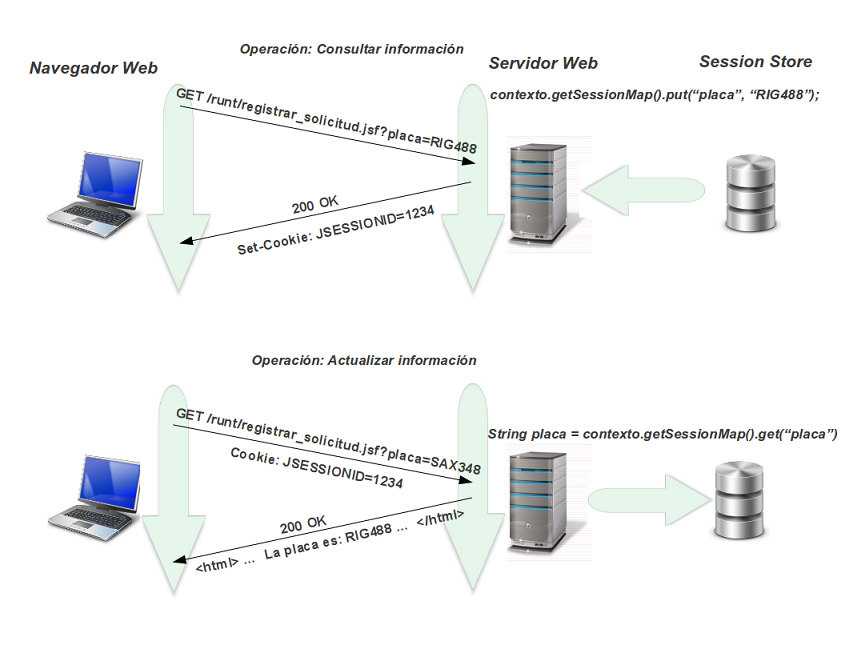

:slug: kb/java/almacenar-estado-sesion-jsf/
:eth: no
:category: java
:kb: yes

= Almacenar Estado de Sesión en Capa Web de Aplicación

== Necesidad

Almacenar estado de sesión en la capa web con JSF

== Contexto

A continuación se describen las circunstancias bajo las cuales la siguiente 
solución tiene sentido:

. Se dispone de una aplicación web construida acorde al estándar empresarial de 
Java.
. Se dispone de un servidor de aplicaciones que soporta el estándar empresarial 
de Java.
. Se está utilizando el framework JavaServer Faces versión 1.0 en adelante.

== Solución

. Para obtener una referencia de la sesión, se establece previamente una 
referencia al objeto ExternalContext de la siguiente forma:
+
[source, java, linenums]
----
import javax.faces.context.ExternalContext;
import javax.faces.context.FacesContext;
...
ExternalContext contexto =  FacesContext.getCurrentInstance().getExternalContext();
----

. Se ingresa información en la sesión, mediante el siguiente código:
+
[source, java, linenums]
----
contexto.getSessionMap().put("par1", par1);
----

. Posteriormente, esta misma información puede ser recuperada mediante:
+
[source, java, linenums]
----
String par1 =contexto.getSessionMap().get("par1");
----

. Para el escenario en el cual no se requiere sobrescribir el valor que tiene 
asignado una variable que contiene un Managed Bean, debido a que inicialmente se 
realiza una operación de consulta y posteriormente se va a realizar una 
operación de actualización, se sugiere utilizar variables de sesión como lo 
ilustra la siguiente gráfica:

== Referencias

. http://www.javadocexamples.com/javax/faces/context/ExternalContext/getSessionMap().html[Demos and Usage]
. REQ.0021: Si el sistema debe transferir información entre páginas, debe 
realizarse a través de objetos de sesión.