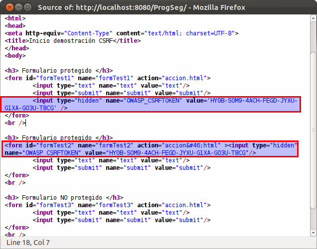

:slug: kb/java/prevenir-csrf-taglibs/
:eth: no
:category: java
:description: TODO
:keywords: TODO
:kb: yes

= Prevenir Cross Site Request Forgery Usando Taglibs

== Necesidad

Prevenir ataques CSRF usando taglibs de CSRFGuard (Java EE)

== Contexto

A continuación se describen las circunstancias bajo las cuales la siguiente 
solución tiene sentido:

. Se está desarrollando una aplicación JEE.
. Se tiene instalado un contenedor de servlets.
. Se desea utilizar la nueva versión (v3), aún inestable de la herramienta 
CSRFGuard.
. Se cuenta con la herramienta CSRFGuard v3 [1] instalada y configurada
. Se entiende el ataque CSRF.

== Solución

. Se describirá a continuación como emplear la biblioteca CSRFGuard v3[1] para 
proteger el recurso accion.html de peticiones no generadas desde formularios de 
la aplicación, los cuales se encuentran en index.jsp.

. Primero definimos aspectos generales de la página como lo es el lenguaje, el 
tipo de contenido y la forma de codificación. Acto seguido se incluye el taglib 
de CSRFGuard, usando como prefijo csrf para utilizarse de forma abreviada en 
líneas siguientes.
+
[source, html, linenums]
----
<%@ page language="java" contentType="text/html; charset=UTF-8" pageEncoding="UTF-8"%>
<%@ taglib uri="http://www.owasp.org/index.php/Category:OWASP_CSRFGuard_Project/Owasp.CsrfGuard.tld"
   prefix="csrf" %>
<html>
----

. En el primer formulario se incluye un campo oculto cuyo nombre y valor serán 
generados dinámicamente por la biblioteca.
+
[source, html, linenums]
----
<h3> Formulario protegido </h3>
<form id="formTest1" name="formTest1" action="accion.html">
  <input type="text" name="text" value="text"/>
  <input type="submit" name="submit" value="submit"/>
  <input type="hidden" name="<csrf:token-name/>"
    value='<csrf:token-value uri="accion.html"/>' />
</form>
 
----

. El segundo formulario se define usando el taglib csrf:form, el cual 
automáticamente se encarga de agregar un campo oculto análogo al del primer 
formulario.
+
[source, html, linenums]
----
<h3> Formulario protegido </h3>
<csrf:form id="formTest2" name="formTest2" action="accion.html">
  <input type="text" name="text" value="text"/>
  <input type="submit" name="submit" value="submit"/>
</csrf:form>
 
----

. Ambos formularios intentarán hacer una petición GET a accion.html enviando el 
campo oculto que permitirá comprobar la validez de la solicitud.

. Finalmente se cierran los tags aún abiertos
+
[source, html, linenums]
----
 </body>
</html>
----

. Examinando el código fuente generado para los formularios, se puede apreciar 
el valor de los campos ocultos:

== Referencias

. https://www.owasp.org/index.php/Category:OWASP_CSRFGuard_Project[CSRFGuard Project]
. REQ.0169 La aplicación debe garantizar que las peticiones que ejecuten 
transacciones no sigan un patrón discernible.