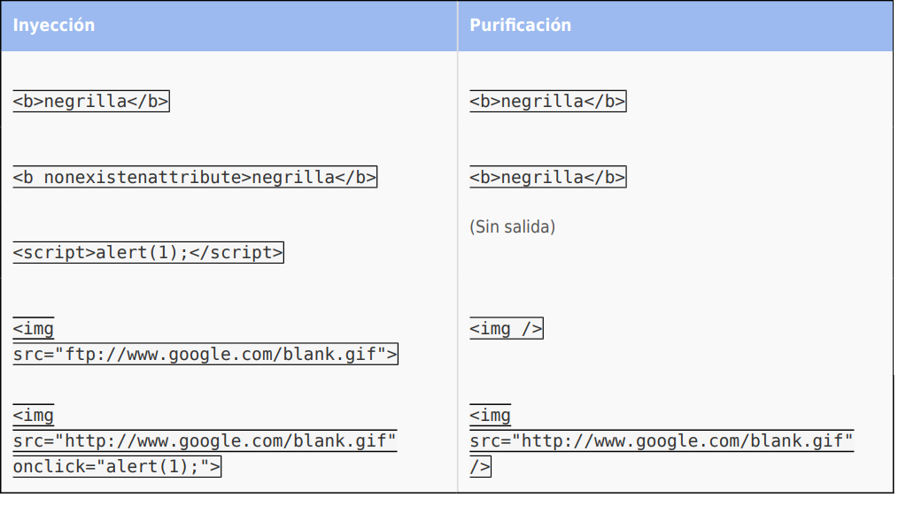

:slug: kb/java/purificar-html/
:eth: no
:category: java
:kb: yes

= Purificar HTML

== Necesidad

Purificar HTML en Java usando Jsoup

== Contexto

A continuación se describen las circunstancias bajo las cuales la siguiente 
solución tiene sentido:

. Se está desarrollando una aplicación en Java usando servlets

. El código debe estar codificado según el lenguaje correspondiente (ej: HTML, 
JS, "escaping") [1]

== Solución

. Para purificar el código HTML y evitar inyecciones de código malicioso se 
deben usar bibliotecas especializadas, este es el caso de Jsoup [2], un 
analizador de HTML que entre sus características encontramos la capacidad de 
limpiar código HTML definiendo una lista blanca de atributos.

. En la siguiente aplicación se hará uso de la biblioteca, la cual purificará 
el código cuando encuentre etiquetas o valores que no se encuentren en la lista 
blanca.

. Comenzamos desarrollando la aplicación importando las clases necesarias para 
la correcta ejecución del servlet
+
[source, java, linenums]
----
import java.io.*;
import java.util.*;
import javax.servlet.*;
import javax.servlet.http.*;
----

. Importamos las clases de la biblioteca jsoup y del paquete safety
+
[source, java, linenums]
----
import org.jsoup.*;
import org.jsoup.safety.*;
----

. Definimos el nombre de la clase y el método doGet
+
[source, java, linenums]
----
public class Purify extends HttpServlet {
  public void doGet(HttpServletRequest request, HttpServletResponse response)
    throws IOException, ServletException {
----

. Obtenemos el writer para escribir la respuesta al cliente y el contenido del 
atributo content
+
[source, java, linenums]
----
PrintWriter out = response.getWriter();
String unsafe = request.getParameter("content");
----

. Definimos la lista blanca, la cual permite el uso de etiquetas básicas
+
[source, java, linenums]
----
Whitelist basicWithImages = Whitelist.basic()
----

. Extendemos la lista blanca agregando la etiqueta img
+
[source, java, linenums]
----
.addTags(new String[] { "img" })
----

. A dicha etiqueta agregamos atributos permitidos
+
[source, java, linenums]
----
.addAttributes("img", new String[] { "align", "alt", "height", "src", "title", "width" })
----

. Finalmente, para el atributo src, agregamos los protocolos permitidos
+
[source, java, linenums]
----
.addProtocols("img", "src", new String[] { "http", "https" });
----

. Llamamos al método clean de la clase Jsoup pasándole como parámetro el contenido
inseguro y la lista blanca, el contenido seguro es asignado al atributo safe.
+
[source, java, linenums]
----
String safe = Jsoup.clean(unsafe, basicWithImages);
----

. Establecemos el tipo de contenido como HTML e imprimimos el resultado de la 
purificación
+
[source, java, linenums]
----
response.setContentType("text/html");
out.println(safe); }}
----

. Las listas blancas que trae la herramienta por defecto son
+
[source, conf, linenums]
----
*Whitelist.simpleText()* 
"b", "em", "i", "strong", "u"
----
+
[source, conf, linenums]
----
*Whitelist.basic()* 
"a", "b", "blockquote", "br", "cite", "code", "dd", "dl", 
"dt", "em", "i", "li", "ol", "p", "pre", "q", "small", 
"strike", "strong", "sub", "sup", "u", "ul"
----
+
[source, conf, linenums]
----
*Whitelist.basicWithImages()* 
basic()."img"
----
+
[source, conf, linenums]
----
*Whitelist.relaxed()* 
"a", "b", "blockquote", "br", "caption", "cite", "code", "col", "colgroup", 
"dd", "div", "dl", "dt", "em", "h1", "h2", "h3", "h4", "h5", "h6", "i", "img",  
"li", "ol", "p", "pre", "q", "small", "strike", "strong", "sub", "sup", 
"table", "tbody", "td", "tfoot", "th", "thead", "tr", "u", "ul"
----

. A continuación observe algunas pruebas de inyección y su resultado luego de 
la purificación

== Referencias

. REQ.0155 La salida de información del sistema debe estar codificada en el 
lenguaje correspondiente (escaping)
. https://jsoup.org/[JSOUP]