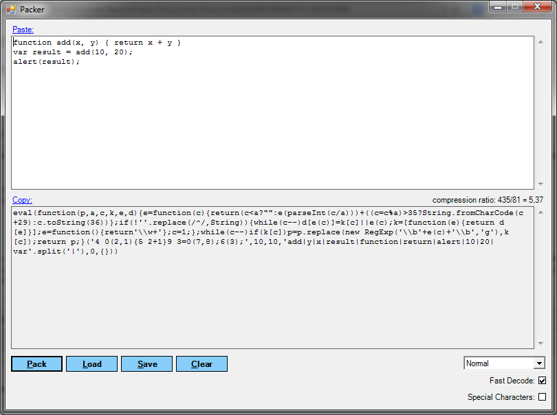

:slug: kb/javascript/ofuscar-codigo-javascript/
:eth: no
:category: javascript
:kb: yes

= Ofuscar Código JavaScript

== Necesidad

Se requiere ofuscar el código JavaScript para evitar la legibilidad del código 
fuente.

== Contexto

A continuación se describen las circunstancias bajo las cuales la siguiente 
solución tiene sentido:

. Construir páginas web mediante el uso de JavaScript.
. Tener instalado un navegador web (Internet Explorer, Firefox, Chrome, Safari, 
entre otros)

== Solución

. Esta práctica consiste en realizar cambios que no afecten el funcionamiento 
del código fuente de la aplicación, pero evitan que el código sea fácilmente 
visualizado y comprendido por un atacante. Esto solo debe ser hecho con los 
archivos que vayan a ser publicados en el entorno de producción y no en etapas 
de desarrollo.

. Tenga en cuenta que todos los mecanismos de ofuscación pueden ser reversados, 
por lo cual no intente ocultar información confidencial dentro del código 
fuente.

. Utilizamos el software libre Packer [1], para ofuscar, existen múltiples 
versiones en este caso utilizaremos la de .NET que funciona en Windows. 
Ofuscaremos el siguiente código:
+
[source, js, linenums]
----
function add(x, y) { 
  return x + y }
var result = add(10, 20);
alert(result);
----

. En la ventana de la herramienta, pegamos el código que deseamos ofuscar, 
seleccionamos las opciones deseadas, y por último hacemos clic en Pack.
+

. El código generado es el siguiente, como se puede ver su comprensión es 
difícil en comparación con el código original:
+
[source, js, linenums]
----
eval(function(p,a,c,k,e,d){
 e=function(c){return(c<a?"":e(parseInt(c/a)))+((c=c%a)>35?String.
 fromCharCode(c+29):c.toString(36))};
 if(!''.replace(/^/,String)){while(c--)d[e(c)]=k[c]||e(c);k=[function(e){
   return
   d[e]}];e=function(){return'\\w+'};c=1;};
   while(c--)if(k[c])p=p.replace(new RegExp(
     '\\b'+e(c)+'\\b','g'),k[c]);return p;}
   ('4 0(2,1){5 2+1}9
   3=0(7,8);6(3);',10,10,'add|y|x|result|function|return|alert|10|20|var'
     .split('|'),0,{}))
----

. Existen versiones de la herramienta packer que pueden ser usadas desde la 
interfaz de línea de comando, esto sirve para automatizar el proceso de 
despliegue de archivos JavaScript.

== Referencias

. http://dean.edwards.name/download/#packer[Parker]
. REQ.0062: El código fuente debe estar ofuscado en ambiente de producción.