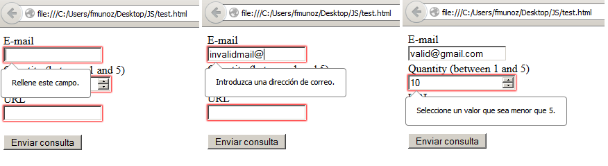

:slug: kb/javascript/validar-formulario-html/
:eth: no
:category: javascript
:kb: yes

= Validar Formularios HTML

== Necesidad

Validación de formularios HTML

== Contexto

A continuación se describen las circunstancias bajo las cuales la siguiente 
solución tiene sentido:

. Se desea utilizar validación de campos de un formulario HTML.
. Las versiones de los navegadores utilizados son iguales o superiores a 
Firefox 10, Chrome 10 o Internet Explorer 10.

== Solución

. Creamos un formulario, con algunos campos que se utilizarán para validación:
+
[source, html, linenums]
----
<form action="" autocomplete="off">
  E-mail <input type="email" name="email" required="true">  
  Quantity (between 1 and 5) 
  <input type="number" name="quantity" min="1" max="5" required="true">
  URL <input type="url" name="homepage" required="true">  
  <input type="submit">
</form>
----

. Como se puede ver en este formulario, utilizamos campos de tipo especial, por 
ejemplo, email, number, url, los cuales son validados por el navegador de 
manera automática.

. El atributo required permite que se le obligue al usuario llenar el campo 
antes de enviar el formulario.

. Podemos observar al intentar enviar el formulario los errores que aparecerán 
si intentamos utilizar información inválida:
+

. En el caso que el navegador utilizado no sea reciente, no se realizará 
ninguna validación de los campos de los formularios

. Toda validación que se haga desde el cliente debe ser acompañada por 
validación del lado del servidor.

== Referencias

. REQ.0168: El sistema debe descartar toda la información potencialmente 
insegura que sea recibida por entradas de datos.