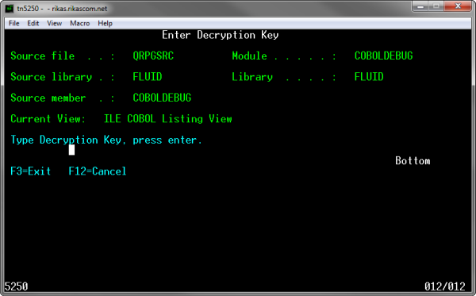
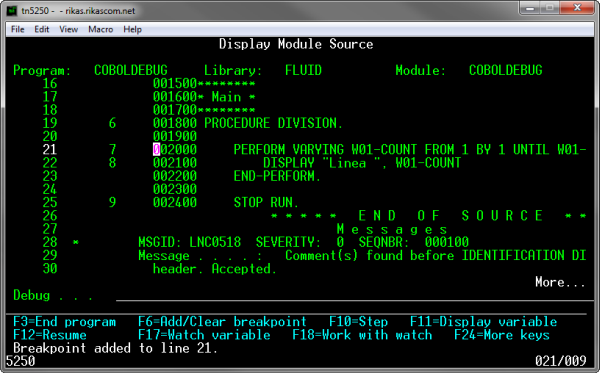

:slug: kb/lenguajes/cobol/cifrar-codigo-fuente
:eth: no
:category: cobol
:kb: yes

= Cifrar Código Fuente

== Necesidad

Cifrar código fuente para depurar programas en COBOL y RPG

== Contexto

A continuación se describe las circunstancias bajo las cuales la siguiente
solución tiene sentido:

. Se está desarrollando una aplicación en COBOL o RPG.
. La aplicación requiere depurarse en entornos de producción sin exponer el
código fuente.
. El código fuente no debe ser accesible en ambientes de producción (ej:
compilación, ofuscación).[1]

== Solución

. Para el ejemplo se usará un programa sencillo hecho en COBOL:
* Definimos la división de identificación:
[source,cobol,linenums]
-----------------------
       IDENTIFICATION DIVISION.
      ******************
      * Identification *
      ******************
       PROGRAM-ID. COBOLDEBUG.
-----------------------
* La división de datos contiene la variable W01-COUNT, cuya utilidad es
almacenar el valor de la línea que se imprimirá en pantalla:
[source,cobol,linenums]
--------------------------
      ********
      * Data *
      ********
       DATA DIVISION.

       WORKING-STORAGE SECTION.
       01 W01-COUNT PIC 9(02).
--------------------------
[start=2]
. En la división principal, recorremos de uno en uno la variable W01-COUNT
empezando en 1 y terminando en 9:
[source,cobol,linenums]
--------------------------
      ********
      * Main *
      ********
       PROCEDURE DIVISION.
       MAIN.

           PERFORM VARYING W01-COUNT FROM 1 BY 1 UNTIL W01-COUNT > 9
               DISPLAY "Linea " W01-COUNT
           END-PERFORM.

           STOP RUN.
--------------------------
* La salida del anterior programa es similar a la siguiente:
[source,cobol,linenums]
--------------------------
Linea 01
Linea 02
...
Linea 08
Linea 09
--------------------------
[start=3]
. Ahora se requiere depurar el programa en entornos de producción, si se compila
normalmente con la opción DBGVIEW(*LIST), una copia del código fuente es
adjuntada con el programa, lo que le permitiría a un atacante obtener el código
fuente original de las aplicaciones compiladas. Para evitar que la copia exacta
del código se adjunte con el programa se debe usar la opción DBGENCKEY [2], la
cual permite que se adjunte una copia del código fuente cifrada con una clave
proporcionada por el usuario, en el momento de depuración, dicha clave es
requerida para descifrar el código fuente, si la clave no coincide no es posible
recuperar el código fuente.
. Compilamos y creamos el programa COBOL a través del comando CRTBNDCBL
(CRTBNDRPG para programas en RPG), el argumento para DBGVIEW debe ser *LIST, y
el argumento para DBGENCKEY es la contraseña (De máximo 16 caracteres) con la
cual el código fuente será cifrado:
[source,cobol,linenums]
--------------------------
CRTBNDCBL
PGM(FLUID/COBOLDEBUG)
SRCFILE(FLUID/QRPGSRC)
SRCMBR(COBOLDEBUG)
DBGVIEW(*LIST)
DBGENCKEY('$ecr3t-K3y')
--------------------------
[start=4]
. Para depurar el programa ejecutamos el siguiente comando:
[source,cobol,linenums]
--------------------------
STRDBG COBOLDEBUG
--------------------------
* En este momento la aplicación solicita la clave para descifrar el código
fuente:

* Si la clave es correcta podremos ver el código fuente y depurar normalmente el
programa:

== Referencias

. REQ.0154: El código fuente debe estar ofuscado en ambiente de producción.
. https://goo.gl/xCQd4F[Encrypting the debug listing view]
