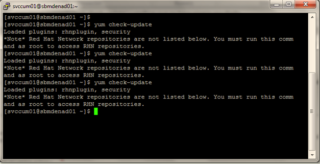

:slug: kb/redhat/actualizar-software/
:eth: no
:category: redhat
:kb: yes

= Actualizar Software en RedHat

== Necesidad

Actualización Software en RedHat

== Contexto

A continuación se describen las circunstancias bajo las cuales la siguiente 
solución tiene sentido:

. Para dar cumplimiento a la línea base de seguridad del Sistema Operativo 
Linux RH se requiere
. Se tiene un servidor con sistema operativo Linux Red Hat V.5.7
. El servidor debe tener acceso a Internet.
. Se tienen credenciales de súper usuario en el servidor

==  Solución

. Red Hat Network le permite automatizar la mayoría de los procesos de 
actualización. Determina cuáles paquetes RPM son necesarios para el sistema, 
los descarga desde repositorios seguros, verifica la firma del RPM para 
asegurarse de que no han sido dañados y los actualiza. 
La instalación del paquete puede ocurrir de inmediato o puede ser planificada 
durante un cierto período de tiempo.

. Red Hat Network requiere un Perfil del sistema para cada 
máquina que desea actualizar. 
El Perfil del Sistema contiene la información del hardware 
y software del sistema. 
Esta información se mantiene como confidencial y no se 
entrega a nadie más. 
Sólo se utiliza para determinar cuales actualizaciones de errata son 
aplicables a cada sistema. 
Sin esta información, Red Hat Network no puede determinar si 
su sistema necesita actualizaciones. 
Cuando una errata de seguridad (o cualquier tipo de errata) es publicada, Red 
Hat Network le enviará un correo electrónico.
Este correo tendrá una descripción de la errata así como también cuáles de 
sus sistemas son afectados. 
Para aplicar la actualización, puede utilizar el Agente de actualización de Red 
Hat o planificar para que el paquete sea actualizado a través del sitio web 
http://rhn.redhat.com descargados en él.

. Cuando se lanzan los informes de errata, estos son publicados en el sitio web 
de Erratas de Red Hat en http://www.redhat.com/security/. 
Desde esta página, seleccione el producto y la versión de su sistema y luego 
seleccione security en la parte superior de la página para sólo desplegar los 
Security Advisories de Red Hat Enterprise Linux. 
Si la sinopsis de alguna de las recomendaciones describe un paquete usado en 
su sistema, pulse en la sinopsis para ver más detalles.

. La página de detalles describe las violaciones de seguridad y cualquier 
instrucción especial que se deba llevar a cabo adicionalmente para actualizar 
el paquete y reparar el hueco de seguridad.

. Para descargar el paquete actualizado, pulse en el enlace para iniciar una 
sesión a Red Hat Network, luego pulse el nombre del paquete y guárdelo 
en el disco duro. 
Se recomienda que cree un nuevo directorio tal como /tmp/updates y guarde todos 
los paquetes descargados en el.

. Ejecutar el siguiente comando y verificar que no haya ningún resultado
+
[source, bash]
yum check-update
 

== Referencias

. REQ.0258: Los componentes provistos por terceros deben corresponder a 
versiones estables, probadas y actualizadas.
. https://www.cyberciti.biz/faq/rhel-centos-fedora-linux-yum-command-howto/
