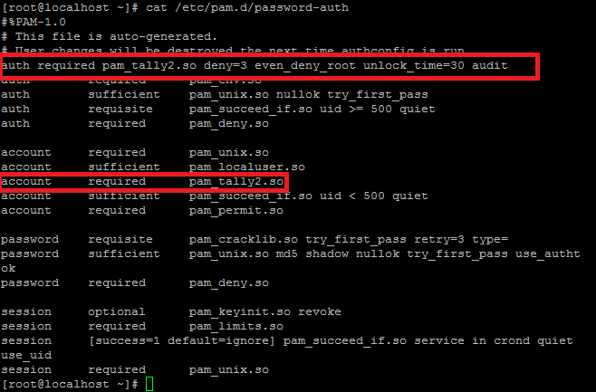

:slug: kb/redhat/proteger-autenticacion-fuerza-bruta/
:eth: no
:category: redhat
:kb: yes

= Proteger Autenticación de Ataques de Fuerza Bruta

== Necesidad

Se necesita proteger la autenticación en consola frente ataques de fuerza bruta

== Contexto

A continuación se describen las circunstancias bajo las cuales la siguiente 
solución tiene sentido:

. Se tiene una máquina RHEL/CentOS/Fedora.
. Se tienen permisos de administrador sobre la máquina.

== Solución

Con el siguiente procedimiento aseguraremos la autenticación de Linux a 
ataques de fuerza bruta, este procedimiento contempla ataques al usuario root.

. Editamos el archivo /etc/pam.d/password-auth y añadimos lo siguiente para que 
deshabilite la cuenta por 30 segundos
+
[source, conf, linenums]
----
auth required pam_tally2.so deny=3 even_deny_root unlock_time=30 audit 
account required pam_tally2.so
----

. El orden en que se insertan debe ser el descrito en la imagen siguiente, esto 
tendrá efectos en su funcionamiento:
+

. Reiniciamos el servicio ssh
+
[source, bash, linenums]
----
% service sshd restart
----

. Verificamos el log de tally
+
[source, bash, linenums]
----
% cat /var/log/tallylog
----

. Revisamos el registro de claves erróneas
+
[source, bash, linenums]
----
% pam_tally2 -u Usuario1
----

. Reseteamos el registro de claves erróneas de ser requerido
+
[source, bash, linenums]
----
% pam_tally2 -u Usuario1 --reset
----

. Nota: El procedimiento bloquea la cuenta por 30 segundos, si se sufre de un 
ataque de fuerza bruta sostenido, el mismo ataque mantendrá la cuenta 
inhabilitada hasta que este cese y pasen 30 segundos. Las otras cuentas que se 
hallan creado se mantendrán activas.

== Referencias:

. https://www.tecmint.com/use-pam_tally2-to-lock-and-unlock-ssh-failed-login-attempts/