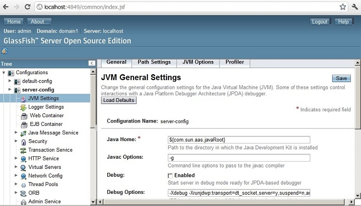

:slug: kb/servidor-aplicacion/glassfish/deshabilitar-modo-depuracion
:eth: no
:category: glassfish
:kb: yes

= Deshabilitar Modo Depuración

== Necesidad

Deshabilitar modo depuración en GlassFish

== Contexto

A continuación se describen las circunstancias bajo las cuales la siguiente 
solución tiene sentido:

. Se utiliza el servidor de aplicaciones GlassFish
. Se desea cambiar la configuración del modo depuración.

== Solución

. Si el servidor de aplicaciones será usado en un entorno de producción, es 
recomendable mantener desactivada la opción de depuración.
. Para desactivarla, entramos a la consola de administración web, hacemos clic 
en Configuration -> JVM Settings.
. Desactivamos la casilla Debug.

== Referencias

. REQ.0072: Los eventos con severidad de depuración no deben estar habilitados en producción.