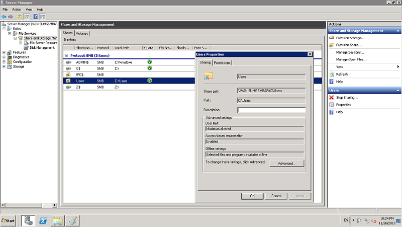
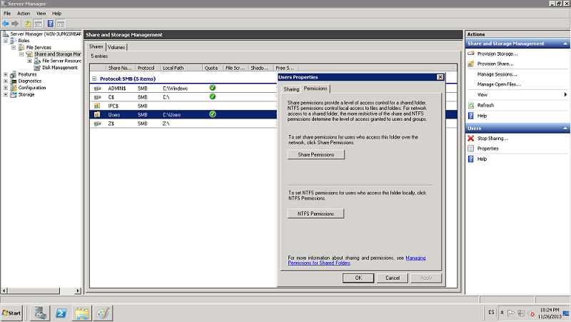
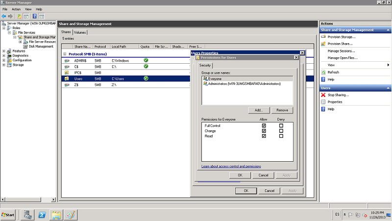
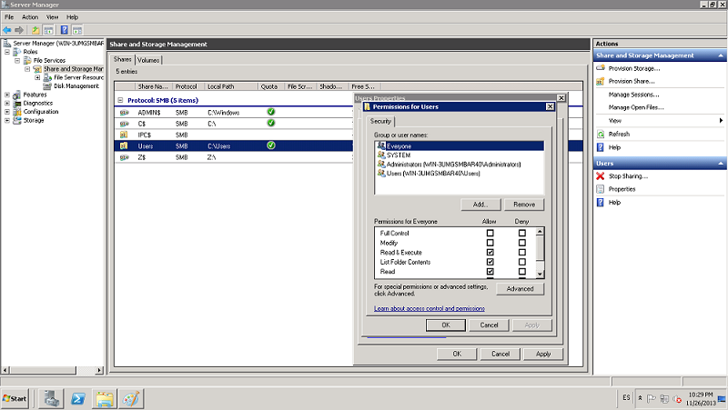

:slug: kb/sistemas-operativos/windows/brindar-permiso-acceso-recursos
:eth: no
:category: windows
:kb: yes

= Brindar Permisos de Acceso Sobre Recursos

== Necesidad

Dar los permisos de acceso sobre los recursos de forma centralizada.

== Contexto

A continuación se describen las circunstancias bajo las cuales la siguiente 
solución tiene sentido:

. Se tiene una máquina con sistema operativo Windows Server 2008.

== Solución

. Se ingresa a Server Manager y se hace clic en File Services y Share and 
Storage Manager. Luego se da doble clic sobre el recurso compartido como se ve 
en la imagen.

[start=2]
. Allí damos clic sobre las pestaña Permissions

[start=3]
. Aquí debemos definir y diferenciar los tipos de permisos para los
recursos:
. Permisos SMB: El control de acceso basado en SMB de un recurso compartido se
determina a través de dos conjuntos de permisos: Permisos NTFS y permisos de 
recurso compartido. Normalmente, los permisos de recurso compartido sólo se 
usan para el control de acceso en equipos que no usan el sistema de archivos 
NTFS.
. Los permisos NTFS y los permisos de recurso compartido son independientes en 
el sentido de que ninguno afecta al otro, y el más restrictivo de los dos será 
el que se aplique al recurso compartido.
. Si usa Administración de almacenamiento y recursos compartidos, puede 
especificar permisos compartidos para los recursos compartidos basados en SMB 
de las siguientes formas:
. Nuevos recursos compartidos. En el Asistente aprovisionar carpetas 
compartidas, si selecciona SMB como protocolo de uso compartido, puede 
especificar los siguientes permisos de acceso basados en SMB en la página 
Permisos SMB:
. Todos los usuarios y grupos sólo tienen acceso de lectura. El permiso 
resultante será el permiso Lectura para el grupo Todos.
. Los administradores tienen Control total; todos los otros usuarios y grupos 
sólo tienen acceso de Lectura. El grupo Administradores tendrá el permiso 
Control total, mientras que al grupo Todos se le concederá el permiso Lectura.
. Los administradores tienen Control total; todos los demás usuarios y grupos 
sólo tienen acceso de lectura y de escritura. El grupo Administradores tendrá 
el permiso Control total, mientras que al grupo Todos se le concederá tanto el
permiso Lectura como el permiso Escritura.
. Los usuarios y grupos tienen permisos de los recursos compartidos 
personalizados. Para usar esta opción, debe especificar todos los grupos y 
usuarios que vayan a tener acceso compartido, así como los permisos específicos 
de recursos compartidos (Control total, Cambiar, Lectura) que se concederán o 
denegarán a cada uno de ellos.
. Recursos compartidos existentes. Puede cambiar los permisos de recurso 
compartido de una carpeta o volumen compartidos que aparecen enumerados en 
Protocolo: SMB en la ficha Recursos compartidos. Para modificar los permisos de
recurso compartido, seleccione la carpeta o volumen; en el panel Actions, haga 
clic en Properties y, en la ficha Permissions, haga clic en Share Permissions.

[start=13]
. Puede configurar los permisos NTFS locales para una carpeta o volumen 
compartido mediante Administración de almacenamiento y recursos compartidos, de 
las formas que se indican a continuación:
. Nuevos recursos compartidos. En el Asistente para aprovisionar carpetas 
compartidas, antes de seleccionar un protocolo de uso compartido de red, puede 
modificar los permisos NTFS para la carpeta o volumen que va a compartir. Estos
permisos NTFS se aplicarán tanto de forma local como al obtener acceso al 
recurso a través de la red. Para modificar los permisos NTFS, en la página 
Permisos NTFS, seleccione Sí, cambiar los permisos NTFS y, a continuación, haga 
clic en Editar permisos.
. Recursos compartidos existentes. Puede modificar los permisos NTFS de una de 
las carpetas o volúmenes compartidos de los que aparecen en la ficha Recursos 
compartidos. Para modificar los permisos NTFS, seleccione la carpeta o volumen; 
en el panel Actions, haga clic en Properties y, en la ficha Permissions, haga 
clic en NTFS Permissions.

== Referencias

. REQ.0031: El sistema no debe permitir a un actor del sistema, aumentar los 
privilegios para él mismo.
. https://technet.microsoft.com/es-es/library/cc770962.aspx[Administrar permisos sobre los recursos]
