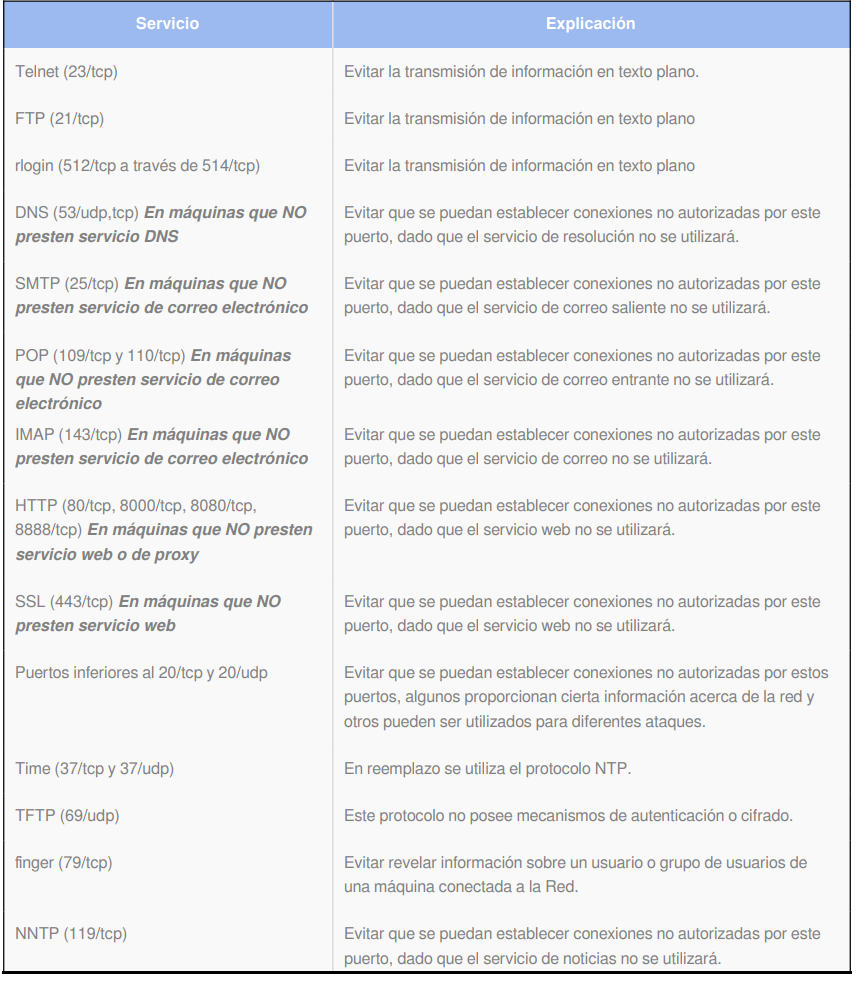

:slug: kb/sistemas-operativos/windows/deshabilitar-puerto-innecesario
:eth: no
:category: windows
:kb: yes

= Deshabilitar Puertos Innecesarios

== Necesidad

Se requiere realizar un aseguramiento de una máquina con sistema operativo 
Windows. Para esto, es necesario verificar que no hayan servicios innecesarios 
o inseguros corriendo

== Contexto

A continuación se describen las circunstancias bajo las cuales la siguiente 
solución tiene sentido:

. Se tiene un equipo con sistema operativo Windows

== Solución

. Abrir el menú de inicio, e ir a ejecutar/run.
. Allí ingresar cmd y presionar ejecutar.
. En la consola, ejecutar el comando netstat -an, y en la salida no deberán 
estar los siguientes servicios:
+

. Adicionalmente se debe hacer una verificación por la herramienta de servicios 
de Windows, haciendo click en Start, Administrative Tools, Services.
. Allí se debe verificar que los siguientes servicios se encuentren 
deshabilitados: 
* Human Interface Device Access
* Infrared Monitor
* Intersite Messaging
* Messenger
* Network DDE
* Network DDE DSDM
* Network News Transfer Protocol (NNTP)
* Print Server for Macintosh
* Simple TCP/IP Services
* Trivial FTP Daemon
* WinHTTP Web Proxy Auto-Discovery Service
* Wireless Configuration

== Referencias

. https://support.microsoft.com/es-co/help/813878/how-to-block-specific-network-protocols-and-ports-by-using-ipsec[Deshabilitar protocolos y puertos]