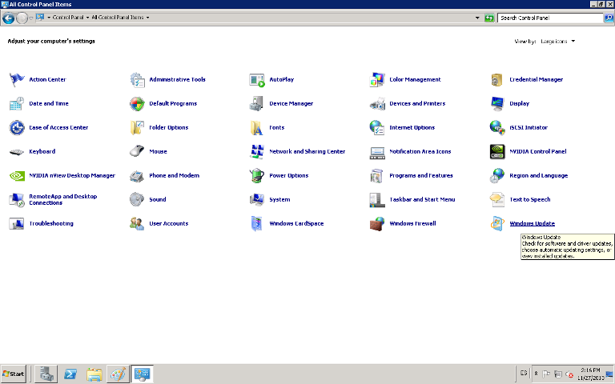
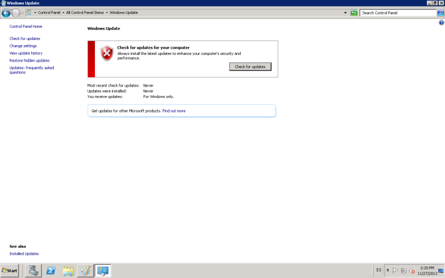
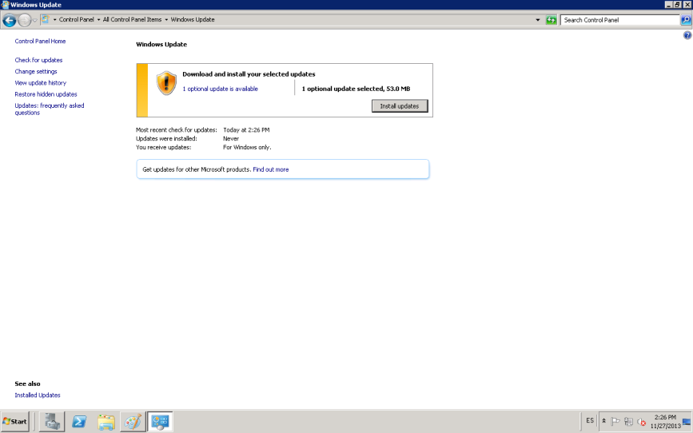
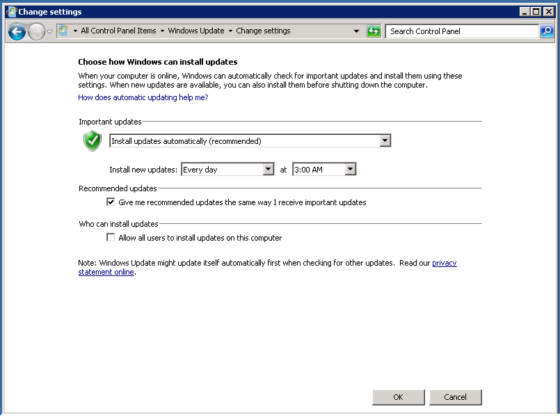

:slug: kb/windows/configurar-actualizacion-automatica
:eth: no
:category: windows
:kb: yes

= Configurar Actualizaciones Automaticas

== Necesidad

Actualización y versiones estables en Windows Server 2008

== Contexto

A continuación se describen las circunstancias bajo las cuales la siguiente 
solución tiene sentido:

. Se tiene una máquina bajo el sistema operativo Windows Server 2008
. Se desea mantener actualizado el sistema a las últimas versiones estables 
disponibles.

== Solución

. Se ingresa al control panel y se hace doble clic en el icono de Windows 
Update.
+

. Se da clic sobre la opción Check for updates 
+

. Se muestran las actualizaciones disponibles y se selecciona Install updates, 
así se actualiza por primera vez el sistema:
+

. Si el sistema tiene configurado UAC, es probable que solicite Usuario y 
Contraseña, solo se puede continuar si el usuario utilizado tiene los 
privilegios para cambiar esta configuración.
. Para activar actualizaciones automáticas se usa la opción Change settings y 
allí se selecciona Install updates automatically (recommended), la hora 
configurada es 3:00 a.m cada día. y es adecuada si se espera poco trabajo en la 
máquina a esta hora. Finalmente se hace clic en OK:
+

. Nota: Se deben realizar pruebas de las actualizaciones a implementar, previo 
a la instalación en los ambientes de producción.

== Referencias

. REQ.0258: Los componentes provistos por terceros deben corresponder a version
es estables, probadas y actualizadas.
. https://support.microsoft.com/en-us/help/3067639/how-to-get-an-update-through-windows-update[Actualizar Windows]