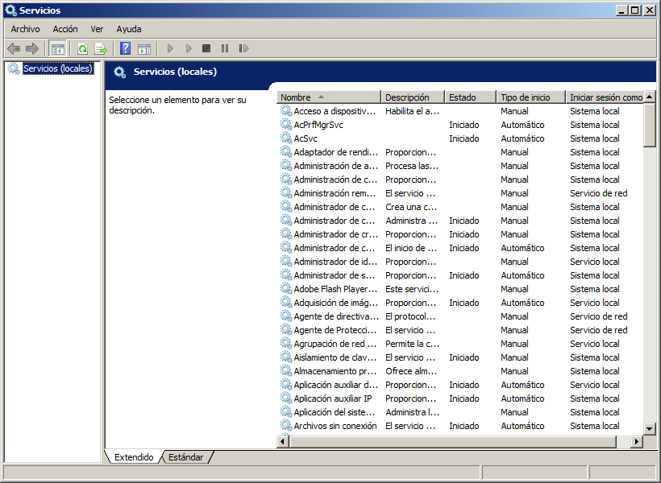
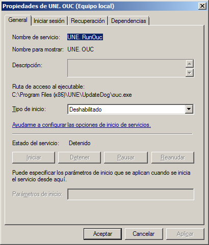
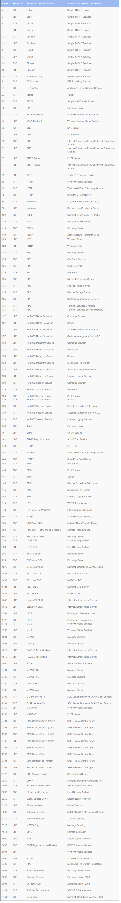
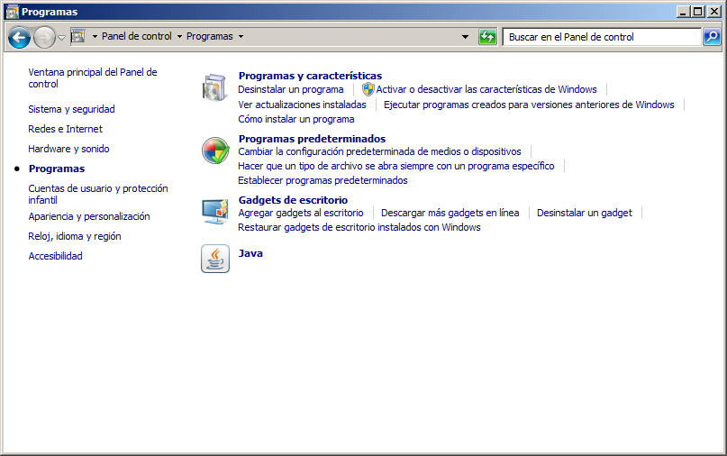
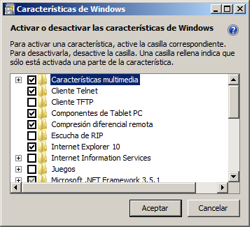

:slug: kb/windows/deshabilitar-servicio-inseguro/
:eth: no
:category: windows
:kb: yes

= Deshabilitar Servicios Inseguros

== Necesidad

Deshabilitar servicios inseguros en Windows 7

== Contexto

A continuación se describen las circunstancias bajo las cuales la siguiente 
solución tiene sentido:

. Se tiene instalado el sistema operativo Windows 7.
. Opcionalmente se desea propagar la configuración a equipos pertenecientes a 
un dominio Windows.

== Solución

. Para deshabilitar servicios a través del directorio activo, se deben seguir 
los siguientes pasos:

. Click en Start, Run. Allí ingresar gpmc.msc y dar click en OK.

. Allí ir al dominio al cual se le desea aplicar la configuración y dar click 
en Group Policy Objects.

. En el panel del lado derecho, dar click derecho y seleccionar New.

. Asignar un nombre y en Source Starter GPO seleccionar (none).

. Dar click derecho en la política creada y seleccionar Edit.

. Navegar hacia la ruta Computer 
configuration\Policies\Windows Settings\Security Settings\System Services.

. Allí seleccionar los servicios que se quiere habilitar o deshabilitar

. También es posible modificar la configuración para máquinas localmente de la 
siguiente forma.

. Para desactivar los servicios que se consideren inseguros, un usuario con rol 
de administrador debe acceder a Panel de Control 
\Herramientas Administrativas\Servicios. Luego de autenticarse si es del caso, 
observará una ventana como la siguiente:
+

. Para deshabilitar un servicio, haga clic secundario y pulse Propiedades. En 
la opción tipo de inicio, seleccione Deshabilitado y pulse Aceptar
+

. Al momento de deshabilitar un servicio, asegúrese de que realmente no sea 
necesario según el rol que el equipo vaya a cumplir dentro de la 
infraestructura.

. Ciertos servicios con alta probabilidad de no ser necesarios en Windows 7 se 
listan a continuación [1]:
* IP Helper
* Offline Files
* Network Access Protection Agent
* Parental Controls
* Smart Card
* Smart Card Removal Policy
* Windows Media Center Receiver Service
* Windows Media Center Scheduler Service
* Windows Media Player Network Sharing Service
* Fax
* HomeGroup Listener
* HomeGroup Provider
* Tablet PC Input Service

. A continuación se muestran los servicios tradicionales de Windows en general 
que son más aptos a ser deshabilitados adaptados de la solución referenciada en 
[2].
+

. El listado mostrado para su sistema dependerá de los servicios que se hayan 
previamente instalado. Por ejemplo el conjunto de servicios denominado Simple 
TCP/IP Services, dependerá de la configuración en Panel de Control\Programas 
+

. Y, además, también dependerá de características\Activar o desactivar las 
características de Windows:
+

. Es recomendable deshabilitar todos los servicios que no sean necesarios para 
el sistema. Puede encontrar más información de la relación entre número de 
puerto y nombre del servicio en [3].

== Referencias

. https://www.techrepublic.com/blog/10-things/10-plus-windows-7-services-you-may-not-need/[Services you may not need]
. https://fluid.la/web/es/kb/sistemas-operativos/windows/deshabilitar-puerto-innecesario/[Deshabilitar puertos innecesarios]
. https://support.microsoft.com/es-es/help/832017/service-overview-and-network-port-requirements-for-windows[Network port requirements for Windows]
. REQ.0261: La organización debería deshabilitar las funciones inseguras de un 
servicio.
. REQ.0262: La organización debería deshabilitar las funciones innecesarias de
un servicio.