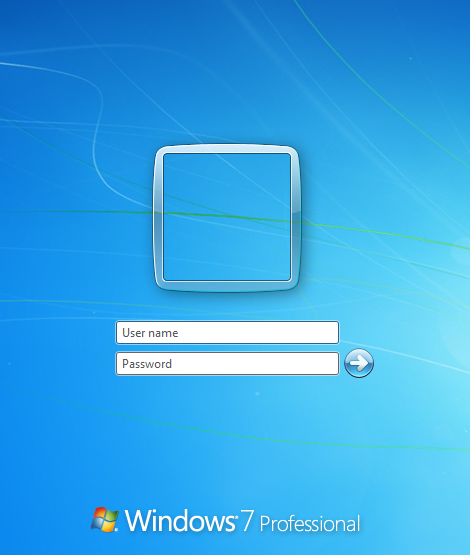
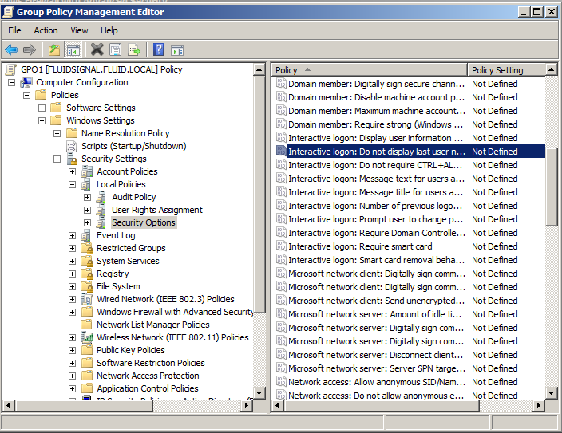
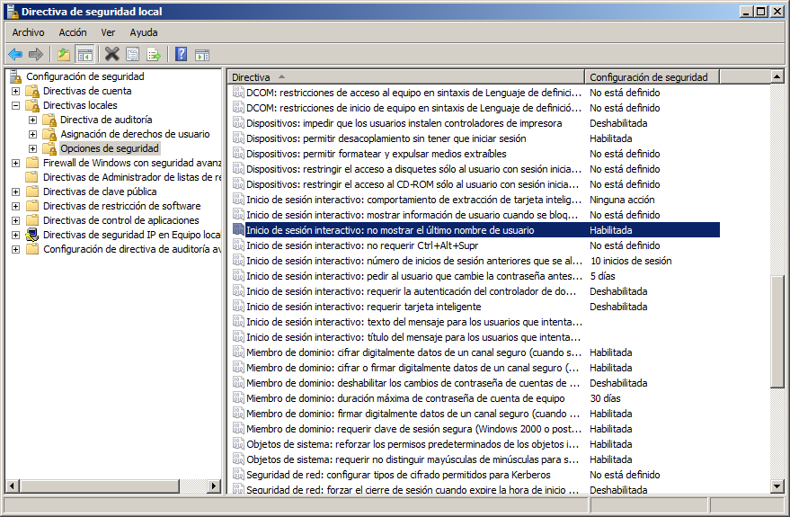
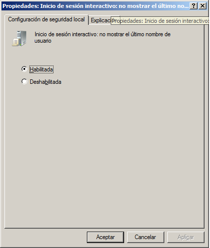
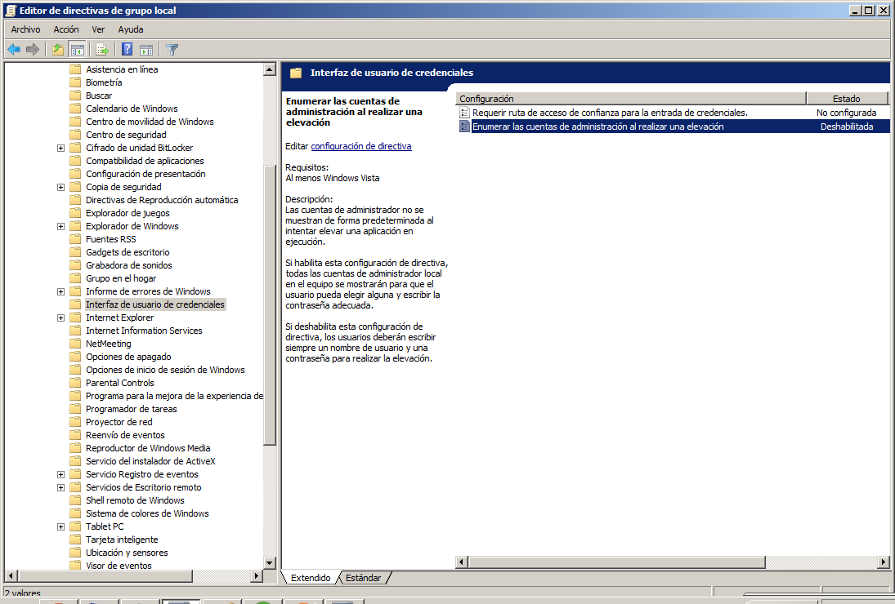
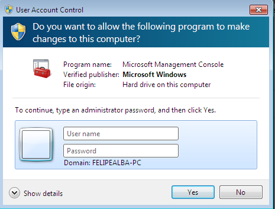

:slug: kb/windows/evitar-enumeracion-usuarios/
:category: windows
:description: Nuestros ethical hackers explican cómo evitar vulnerabilidades de seguridad mediante la configuración segura de Windows. En este instructivo, explicaremos paso a paso cómo evitar mostrar los nombres de usuarios existentes a usuarios no autenticados en windows 7.
:keywords: Windows, Seguridad, Autenticación, Usuarios, Windows 7, Buenas prácticas.
:kb: yes

= Evitar Enumeración de Usuarios

== Necesidad

No mostrar nombres de usuarios existentes 
requiriendo usuario y contraseña 
durante el proceso de autenticación en +Windows 7+.

== Contexto

A continuación se describen las circunstancias 
bajo las cuales la siguiente solución tiene sentido:

. Se tiene una máquina bajo el sistema operativo +Windows 7+.
. Opcionalmente se desea propagar la configuración 
a equipos pertenecientes a un dominio +Windows+.

== Solución

Esta solución pretende evitar que un atacante conozca 
el listado de usuarios existentes 
para planear un ataque de fuerza bruta o de diccionario.

. Ingresar al sistema y verificar que se solicite 
como mínimo nombre de usuario y contraseña.
+

. Para aplicar esta configuración a un dominio 
por medio de +Directorio Activo+, 
se debe configurar la siguiente ruta usando la solución 
https://fluidattacks.com/web/es/kb/windows/configuracion-directivas-dominio[Modificar configuración de directivas de dominio]
+
.ruta.shell
[source, shell, linenums]
----
Computer configuration/Windows Settings/Security Settings/LocalPolicies/SecurityOptions
----

. La ruta seguida puede apreciarse en la siguiente imagen:
+

. Para configurar la política de modo local, 
se abre el +Local Group Policy Editor+. 
Para esto, el usuario debe dar clic en +Inicio+, +ejecutar+ 
y después digitar +gpedit.msc+. 
Luego, se debe seguir la ruta mencionada anteriormente. 
Observará que la misma ruta en el formulario difiere ligeramente 
que la de los pasos para la configuración de equipos 
pertenecientes a un dominio de +Windows+.
+

. Habilite la propiedad de Inicio de sesión interactivo 
+No mostrar el último nombre de usuario+.
+

. Para verificar que la longitud de clave sea superior a cero 
(lo cual significa que sólo se necesitaría el nombre de usuario 
para un usuario que no haya establecido una contraseña) 
la ruta a seguir será:
+
[source, shell, linenums]
----
Configuración del equipo/Configuración de Windows/Configuración de Seguridad
  /Directivas de cuentas/Directivas de contraseñas
----
 
. Configurar mediante las opciones presentadas 
que la longitud de la contraseña sea diferente de cero 
y acorde a las políticas internas de la organización.

. Se debe verificar también que la opción de enumerar cuentas de administrador 
esté deshabilitada para evitar mostrar las cuentas de administrador existentes. 
Para esto siga la ruta:
+
[source, shell, linenums]
----
 Configuración del equipo/Plantillas administrativa/Componentes de Windows
    /Interfaz de usuario de credenciales
----
+ 

. De esta forma, cuando se requiera acceder a los recursos privilegiados 
no se informará el nombre de usuario del administrador:

== Referencias

. [[r1]] link:https://blog.rapid7.com/2017/06/15/about-user-enumeration/[About User Enumeration]
. [[r2]] link:http://velozityweb.com/blog/all/enumeracion-de-usuarios-y-sistemas/#sthash.Rjwut7vV.dpbs[Enumeración de usuarios y sistemas]
. [[r3]] REQ.0225: El sistema debe solicitar a cualquier actor 
que intenta autenticarse, como mínimo un nombre de usuario y una contraseña.
. [[r4]] REQ.0172: El sistema no debe almacenar información sensible 
en archivos temporales o en memoria caché.