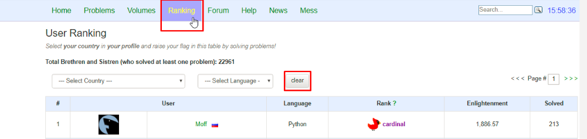
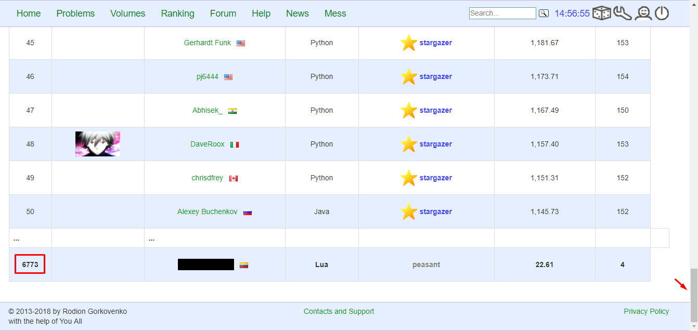
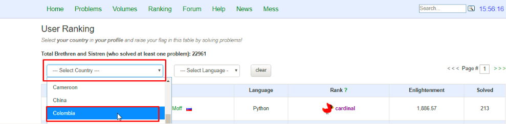
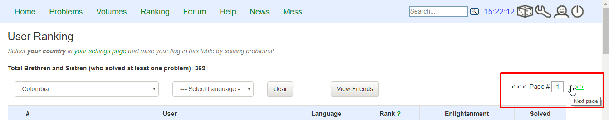
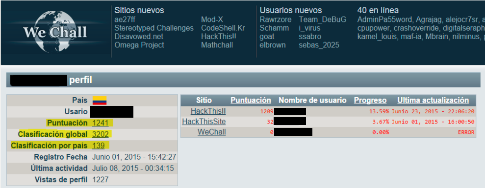

:slug: careers/technical-challenges/
:category: careers
:description: The main goal of the following page is to inform potential talents and people interested in working with us about our selection process. The technical challenges stage intends to assess the competences of the candidate through programming and hacking exercises.
:keywords: Fluid Attacks, Careers, Selection, Process, Technical Challenges, Training.
//:toc: yes
:translate: empleos/retos-tecnicos/

= Technical Challenges

This stage is parallel to the other stages of the process and
therefore, the more progress you make on it now,
the greater the probability is
of being evaluated before the other participants
once the other stages finish.

It can also be considered as a kind of lifesaver in the process,
because you may not have graduated yet,
have no previous work experience,
or get a low score on your knowledge test,
but if you able to successfully finish this stage,
you will show that you have the most valuable competence of all:
The ability to learn new things on the fly and
apply them to solve real problems.
This, along with human warmth and strong [button]#link:../../values[values]#,
have more weight than everything else.

== 1. Philosophy

In this stage, we want you to evidence your technical skills
through practical exercises and problems
similar to the ones you will face in +Fluid Attacks+,
with which you will be able to solve in an effective manner,
our clients’ security issues.
It also shows that you will be a valuable addition
who can enrich the knowledge of the current members of our team.

The technical challenges are divided into
+systems-hacking+, +ctf-hacking+ and programming challenges.
With the former, you demonstrate your technical skill and cunning
to surpass security controls in environments designed for pentesting.
With the second one, you demonstrate your adaptation and creativity skills
when it comes to solving problems and achieving goals in unknown environments
with the latter, you show that you are able
to quickly understand a program, a language,
and thus it will be easier for you to audit source code
and find vulnerabilities.

The philosophy is to encourage learning
from the active problem solving and
discourage passive learning.

The repositories contain solutions to computational challenges
built in the previous context.
By uploading solutions to the repositories,
we look forward to:

. Promote the solution of unresolved challenges.

. If the challenge is solved,
encourage a new solution in a different way
(another programming language, another programming paradigm
or another radically different algorithm,
semantically different or of another order).

. If the challenge is solved,
make evident the similarity of the new solution to the old one (plagiarism).

. Bring to life the solutions financed by +Fluid Attacks+.

. Allow third parties to view the deliverables of our team.

The collateral effects of this decision allow +Fluid Attacks+ to:

. Use the +GitLab+ infrastructure to analyze
the quality and speed of the development of everyone in the process.

. From early stages,
familiarize potential talents with the tools
(+Git+, +AsciiDoc+, +Python+, +Gherkin+, etc) and
concepts (automation, unit tests, continuous integration, +linting+, etc.) that
they will use in their daily work in +Fluid Attacks+.

. Make the results visible to the community and
the team (peer pressure).

== 2. Objectives

. Solve +5+ programming challenges.

. Solve +5+ +ctf-hacking+ challenges.

. Solve +5+ +systems-hacking+ challenges.

== 3. Terms

. The training is self-directed and
independent (on your own without instruction or assistance from others).

== 4. Criteria

Challenge solutions,
regardless if they are programming, +ctf-hacking+ or +systems-hacking+
must always meet the following [button]#link:../../style/#font[style]# guideline.

Programming solutions must additionally comply with the following:

. A solution in the same language you chose (in the challenge folder)
must not exist already.

. They must not have an external indexed solution
(links + OTHERS.lst + of the challenge) for the language chosen by you.

. The programming language chosen must be accepted by [button]#link:http://www.codeabbey.com/[Codeabbey]#

. The *compilation* (optional for interpreted languages)
and *linting* (mandatory for all languages) commands used and
their output must be included in the *prelude*
at the beginning of the code.
+
.milogin.rs
[source, rust, linenums]
----

/*
$ cargo clippy #linting
$ rustup run nightly #compilation
Compiling milogin v0.1.0 (file:///../skhorn)
Finished dev [unoptimized + debuginfo] target(s) in 0.22 secs
$ rustc milogin.rs
$
*/

My solution's first line.
----

. The execution commands used and
their output must be included in the *postlude*
at the end of the code.
+
[source, rust, linenums]
----
My solution's last line.

/*
$ ./skhorn
over obese obese normal obese obese obese obese ...
*/
----

. If the solution takes a set of input data,
such input must not be hardcoded into the solution.
Meaning that the solution must read from a +DATA.lst+ file
located in the challenge directory.
If such file does not exist, you must include it in your commit

+ctf-hacking+ and +systems-hacking+ solutions must comply with the following:

. They must not have a solution in +Gherkin+ (+*.Feature+)
in the repository (challenge folder).

. They must not have an external indexed solution
(links +OTHERS.lst+ of the challenge).

. They must be challenges that
require a technical level (not mathematical nor riddle)
from [button]#link:http://www.wechall.net/[WeChall]#
or its related sites.

. The solution must have passed,
without any errors or +warnings+,
through a +linter+ of the corresponding language
in its most rigorous configuration.

Aditionally, +ctf-hacking+ solutions
must comply with the following:

. They must follow the template link:https://gitlab.com/autonomicmind/training/blob/master/templates/hacking-challenges.feature[hacking-challenges.feature]

Aditionally, +systems-hacking+ solutions
must comply with the following:

. They must follow the template link:https://gitlab.com/fluidattacks/writeups/blob/master/templates/hacking-systems.feature[hacking-systems.feature]

. They must be challenges that Require
exploiting intentionally vulnerable systems (+ToE+) listed in:
.. [button]#link:https://www.owasp.org/index.php/OWASP_Vulnerable_Web_Applications_Directory_Project#Off-Line_apps[OWASP Off-Line apps]#
.. [button]#link:https://www.owasp.org/index.php/OWASP_Vulnerable_Web_Applications_Directory_Project#Virtual_Machines_or_ISOs[OWASP VMs / ISOs]#
.. [button]#link:https://www.owasp.org/index.php/OWASP_Vulnerable_Web_Applications_Directory_Project#On-Line_apps[OWASP On-Line apps]#
.. [button]#link:https://www.vulnhub.com/[Vulnhub]#
.  The Gherkin format to be used must strictly meet the [button]#link:../../../en/blog/gherkin-steroids/[the following]#
. All source code in solutions must follow the parameters described in
[button]#link:../../style/#font[this guide]#

== 5. Score

As you go on solving programming or +ctf-hacking+ challenges,
you must report your +total score+, +ranking+ and
+score+ obtained for the specific challenged solved,
which will allow us to follow your progress in this stage.
All this information must be included in the +commit message+
following the format described in the link:#envio[submission requirements]

Here's how to get your scores and ranking for each platform.

=== 5.1 Programming

. World Ranking

.. In +codeabbey+, go to the “Ranking” tab:

.. Scroll to the bottom of the page and
there you will find your position in the world ranking:

. Country Ranking

.. While in the “Ranking” rab,
select the country:

.. The page doesn’t directly show your position
so you will have to manually count.
To make this easier,
you should take into account that each page shows +50+ users.

You must continue to the next page
until you find your username on the ranking board

=== 5.2 CTF-Hacking

== 6. Submission

Solutions are sent through a +Merge Request+ (+MR+)
to the +master+ branch of the repositories:

. +writeups+ for +systems-hacking+ challenges
. +training+ for +ctf-hacking+ and programming challenges

Before sending an +MR+
please verify that you meet the following criteria:

. You should only work on a branch
whose name is exactly your username in +Gitlab+.

. All files related to a challenge’s solution
must respect the [button]#link:#structure[following structure]#

. If the solutions requires additional files,
they must be included in the corresponding challenge directory.

. Each challenge solution must be submitted
with +10+ link:#external[external solutions] (+10+ +URLs+ in an +OTHERS.lst+ file).

. The solution and all files associated to it
must be all sent in +1+ +commit+.

. The +commit+ for each solution must be sent in only +1+ +MR+.

. The +MR+ must only be sent
once your branch has successfully finished integrating (green).

. If the +MR+ is rejected it must not be reopened.
The errors must be fixed and the solution sent in a new +MR+.

. The +commit+ message to send the solution
must follow one of the templates
according to the type of the solution:

.. link:https://gitlab.com/autonomicmind/training/blob/master/templates/commit-msg-challenges.txt[Programming and ctf-hacking challenges]
.. link:https://gitlab.com/fluidattacks/writeups/blob/master/templates/commit-msg-systems.txt[systems-hacking vulnerabilities].

== 7. External

The rules for the links (+URLs+)
to external solutions (+OTHERS.lst+) are the following:

. They must be direct links (+HTTP 200+) without redirection (+HTTP 301/302+).

. They don’t need to be solutions for the same challenge you solved.

. They must be +hacking+ links if you solved a +hacking+ challenge.

.. The +OTHERS.lst+ must be new links.
in other words, external solutions to challenges
to which we have no previous external solutions.

.. If you send a +systems-hacking+ solution,
the external solutions must be +systems-hacking+ solutions.

.. If you send a +ctf-hacking+ solution,
the external solutions must be +ctf-hacking+ and +systems-hacking+ solutions.

. They must be programming solutions
if you solved a programming challenge.

.. You must not add external solutions
for a language that already has an external solution.

.. Within the +OTHERS+ of a programming solution
the +URLs+ must be ordered alphabetically by extension.

. If it is in +github+ the +URL+ must be to its +raw+ version
(link:https://raw.githubusercontent.com/[]).

== 8. Examples

Here are the links to the different types of +MR+:

* +MR+ pending of approval in +writeups+: [button]#link:https://gitlab.com/fluidattacks/writeups/merge_requests?scope=all&utf8=%E2%9C%93&state=opened[click here]#.
* Rejected +MR+ in +writeups+: [button]#link:https://gitlab.com/fluidattacks/writeups/merge_requests?scope=all&utf8=%E2%9C%93&state=closed[click here]#.
* +MR+ pending of approval in +training+: [button]#link:https://gitlab.com/autonomicmind/training/merge_requests?scope=all&utf8=%E2%9C%93&state=opened[click here]#.
* Rejected +MR+ in +training+: [button]#link:https://gitlab.com/autonomicmind/training/merge_requests?scope=all&utf8=%E2%9C%93&state=closed[click here]#.

Examples of +MR+ accepted in the past:

* Exemplary +systems-hacking+ +MR+: [button]#link:https://gitlab.com/fluidattacks/writeups/merge_requests/3/diffs[1]#,
[button]#link:https://gitlab.com/fluidattacks/writeups/merge_requests/10/diffs[2]#

* Exemplary +ctf-hacking+ +MR+: [button]#link:https://gitlab.com/autonomicmind/training/merge_requests/1873/diffs[1]#,
[button]#link:https://gitlab.com/autonomicmind/training/merge_requests/1864/diffs[2]#,
[button]#https://gitlab.com/autonomicmind/training/merge_requests/1852/diffs[3]#

* Exemplary Programming +MR+: [button]#link:https://gitlab.com/autonomicmind/training/merge_requests/1875/diffs[1]#,
[button]#link:https://gitlab.com/autonomicmind/training/merge_requests/882/diffs[2]#,
[button]#link:https://gitlab.com/autonomicmind/training/merge_requests/872/diffs[3]#

[NOTE]
These exemplary links do not necessarily follow all the above rules
as the rules evolve and
therefore, at the time the examples were made,
they could have been different.
The examples never have priority over the rules,
however, they are listed for learning purposes.

== 9. Recommendations

. In order to fulfill the previously stated objectives,
we suggest looking for challenges that
don’t have a solution in the +OTHERS+ file nor
in the repository and
solving the challenge in its respective platform.

. When solving programming challenges,
we suggest using a language that is not widely used.

. Submit your solution immediately after you solve the challenge.
Do not accumulate solutions on your computer without sending them,
because this way,
you will never receive feedback
in order to know what you are doing wrong and
could result unnecessary repetition.

== 10. Repositories

All submissions must be sent the the following repositories:

* [button]#link:https://gitlab.com/fluidattacks/writeups[writeups for systems-hacking]#
* [button]#link:https://gitlab.com/autonomicmind/training/[training for ctf-hacking and Programming]#

It is ideal that you become familiar with the versioning and
the structure that we detail below.

=== 10.1 Structure

Challenge solutions are stored in the following folders
depending on the repository you are currently in:

[role="tb-col"]
[frame="topbot"]
|====
^.^s| Repo ^.^| training ^.^| writeups

^.^s| Folder ^.^| challenges ^.^| system

^.^s| Description
| Folder to store programming and +ctf-hacking+ challenges.
| Folder to store vulnerable +systems-hacking+ challenges.

^.^s| Structure
a| * <site> (directory)
** <challenge-id> (directory)
*** <login-gitlab.ext> (solution file)
a| * <name-of-the-vulnerable-machine> (directory)
** <cwe-code>-<exploit-name> (directory)
*** <login-gitlab.feature> (solution file)

^.^s| Example
a| * link:https://gitlab.com/autonomicmind/training/tree/master/challenges/codeabbey/[codeabbey]
** link:https://gitlab.com/autonomicmind/training/tree/master/challenges/codeabbey/135/[135]
*** link:https://gitlab.com/autonomicmind/training/blob/master/challenges/codeabbey/135/skhorn.rs[skhorn.rs]

a| * link:https://gitlab.com/fluidattacks/writeups/tree/master/systems/dvwa[dvwa]
*** link:https://gitlab.com/fluidattacks/writeups/tree/master/systems/dvwa/657-csp-bypass-medium[657-csp-bypass-medium]
**** link:https://gitlab.com/fluidattacks/writeups/blob/master/systems/dvwa/657-csp-bypass-medium/kedavamaru.feature[kedavamaru.feature]
|====

The naming of all files and folders,
with the exception of link:#102-archivos[special files],
must not exceed +35+ characters,
written in lowercase,
without any special characters and
In case a space is needed use a *-* (dash) to replace it.

=== 10.2 Files

Some of the folders described in the structure contain special files:

** *LINK.lst:* Contains the challenge URL.
(link:https://gitlab.com/autonomicmind/training/blob/master/challenges/codeabbey/001/LINK.lst[example]).
This file must only have one line with the challenge link and
it must give a +HTTP 200+ response when visiting it (No redirection).

** *DATA.lst:* Contains the test cases
with which the challenge was validated.
This file should only contain test cases that are
immediately processable by any solution file.

** *OTHERS.lst:* It contains the links to the external solutions
found on the Internet for said challenge
which must not be read or used
as a reference to solve the challenge.
This file allows an automatic script to perform a similarity analysis
with the challenges sent by the candidates.
They must comply with what is specified [button]#link:#external[here]#

** *SPEC.txt* (in +systems-hacking+ and programming)
and *spec.yml* (in +WeChall+ challenges):
Contains the specifications of challenges site or
the vulnerable machine you are working on,
like number of challenges or vulnerabilities, +URL+ and difficulty.
You can see an example link:https://gitlab.com/autonomicmind/training/blob/master/systems/bwapp/SPEC.txt[here]

== 11. Stage steps

To successfully finish this stage, you must:

. Register on +GitLab+ using your personal email and
a username of your liking.
Your username must not exceed *12* characters in length and
only contain lowercase letters and numbers.

. Join our link:https://join.slack.com/t/autonomicmind/shared_invite/enQtMzU0MDc3NzQwNzI2LTQ1NTZmMDFhZjJmZDQ0ZGRmN2M5MGQ3N2JhYjg0ZTI4OWFkZGJmMjdkYzBjYmU2ZDM1NGI0MmM4OGQxOWVlNDc[Slack channel],
where you can interact with +Fluid Attacks+ personnel and
other candidates who are currently in the same stage
to solve doubts or issues.

. Request developer permissions to the +writeups+ repository through +Slack+
Introducing yourself to everyone
In the *#general* channel with the following message:
+
[quote]
____________________________________________________________________
I have read and understood all documentation pertaining to technical challenges,
I agree to all of the terms and
therefore request access to the +git+ +writeups+ repository
With my +GitLab+ username [username].
____________________________________________________________________

. Complete +five (5)+ +systems-hacking+ challenges
in the +writeups+ repository

. Request developer permissions  to the +training+ repository through +Slack+
In the *#general* channel with the following message:
+
[quote]
____________________________________________________________________
I have completed +five (5)+ +systems-hacking+ challenges
in the +writeups+ repo
therefore request access to the +git+ +training+ repository
With my +GitLab+ username [username].
____________________________________________________________________

. Complete one +ctf-hacking+ challenge, then one programming challenge...
And repeat this until you reach +five (5)+
completed challenges of each type

.. Each programming challenge completed
must be +one (1)+ score point (blessing for codeabbey)
higher than the previous one.

== 12. End

The challenge stage ends under any of the following conditions:

. You have met all link:#objectives[objectives] and
Sent an +email+ with the links to your solutions in the +master+ branch.
. If there is no activity (+push+ to the +git+ repos) in +14+ calendar days.
. If you reach the maximum of +10+ failed +MR+,
this means the +MR+ was rejected and
not merged due to its failure to meet the requirements.
. If you explicitly manifest your desire to end the process in an +email+.
. If you present someone else’s complete or
partial solutions as your own (plagiarism).
. If you solve a challenge with the help of others.

In all cases, the email address for these steps is: careers@autonomicmind.co

If you were removed from the process due to any of these circumstances,
except for the last two,
You may apply again at any time
and start over the process by clicking
[button]#link:../../../../forms/aplicacion[here]#

== 13. Builds

It is possible to run local integrations
in order to identify any errors before doing +push+ or
sending a +merge requests+ to the repositories.
To do so,
you must execute the following commands:

* *For +GNU/Linux+ Operating Systems:*

.Install curl
[source, bash, linenums]
----
sudo apt-get update
sudo apt-get install curl
----

.Install Nix
[source, bash, linenums]
----
curl https://nixos.org/nix/install | sh
----

.Set your credentials
[source, bash, linenums]
----
export DOCKER_USER=gitlab-user
export DOCKER_PASS=gitlab-pass
----

.Compile and test
[source, bash, linenums]
----
./build.nix
----

.If the integration was successful,do a +commit+ and add the changes to your local branch.
[source, bash, linenums]
----
git add .
git commit
git push origin rama-personal
----

* *In Operating Systems different from +Linux+ (+Windows+, +Mac+, etc):*
Continuous integration will never be available for +OS+ different from +Linux+.
Additionally in your everyday life at +Fluid Attacks+
you will need to familiarize with +Linux+ and its weapons.
Hence we strongly recommend you to install it on your computer,
or at least, to work with a +Linux+ virtual machine.

We recommend installing virtualization software
(link:https://my.vmware.com/en/web/vmware/free#desktop_end_user_computing/vmware_workstation_player/14_0[VMware],
link:https://www.virtualbox.org/wiki/Downloads[Virtualbox]) and
creating a virtual machine
based on a +Linux+ distribution (e.g. link:https://www.ubuntu.com/download/desktop[Ubuntu],
or another one of your liking).
Then, follow the same procedure described above for +Linux+.

== 14. Questions

* Before you send us a question,
please read this document carefully once more and
our link:../faq/[Frequently Asked Questions].

* You can tell us your doubts and
questions in our *#general*
link:https://join.slack.com/t/autonomicmind/shared_invite/enQtMjg4ODI4NjM3MjY3LWUxMTNmMjk3MDdkMDAzYWY0ZjQ3MzNlYjUzZjM3NTM3MDVmYTliN2YyNGViZGUyNzUxOTAzNTdmZDQ5NWNjNGI[Slack channel].

== 15. Property

* The proprietary rights of all content
in the repositories are defined in the files:

** link:https://gitlab.com/fluidattacks/writeups/blob/master/COPYRIGHT.txt[writeups COPYRIGHT].
** link:https://gitlab.com/autonomicmind/training/blob/master/COPYRIGHT.txt[training COPYRIGHT].

* The license and privileges that users of the repositories have
are defined in the files:

** link:https://gitlab.com/fluidattacks/writeups/blob/master/LICENSE.txt[writeups LICENSE].
** link:https://gitlab.com/autonomicmind/training/blob/master/LICENSE.txt[training LICENSE].

* Carrying out a +merge request+ implies the transfer of copyrights.
Therefore, all information contained herein may be used
by +Fluid Attacks+ for any commercial purpose,
always preserving the moral rights of their authors.

== 16. Plagirism

Having the solutions available at everyones disposal
poses an opportunity for plagiarism,
How do we show the solutions to the world and avoid plagiarism?
Plagiarism is not a technical problem,
It is a moral problem of presenting someone else’s work
as your own.

To avoid plagiarism we seek visibility and
an explicit declaration of the authorship of each algorithm
in a centralized place.
This provides clear evidence of the attribution of authorship and
allows for public scrutiny in case of plagiarism.

In other words, the current model avoids plagiarism
through total transparency.

+Fluid Attacks+ actively applies algorithmic similarity detection techniques
on all solutions submitted.
In particular using:

* link:https://theory.stanford.edu/~aiken/moss/[MOSS]
* link:https://en.wikipedia.org/wiki/Plagiarism_detection[Plagiarism Detection Theory]
* link:https://www.plagaware.com/[PlagAware]
* link:https://www.safe-corp.com/products_codematch.htm[Code Match]
