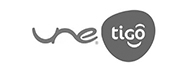

:slug: clients/
:description: Ethical Hacking services for applications, performed by experts. We are hackers that develop our own tools and aim to find all of the vulnerabilities and report them as soon as possible. Our clients back our experience.
:keywords: ethical hacking, applications, vulnerabilities
:clients: yes

= Clients

FLUID has been lending Information Security services
in the colombian market for over 18 years.
Up next, we list some of the current clients of our company.

image:../clients/bancolombia-logo.png[Bancolombia]

image:../clients/bancamia-logo.png[Bancamia]

image:../clients/banistmo-logo.png[Banistmo]
image:../clients/asb-logo.png[ASB]

image:../clients/xm-logo.png[XM]

image:../clients/corona-logo.png[Corona]

