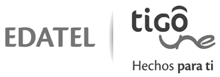

:slug: customers/communications/
:category: customers
:description: FLUID is a company focused on information security, ethical hacking, penetration testing and vulnerabilities detection in applications with over 18 years of experience in the colombian market. In this page we present our contributions to the communications sector.
:keywords: FLUID, Information, Communication, Security, Pentesting, Customers.
:translate: clientes/comunicaciones/

= Communications

{description}

[role="Comunicaciones tb-alt"]
[cols=2, frame="none"]
|====

^.^a|

a|== Claro

Subsidiary television operator and mobile telephony company,
subsidiary of Claro in Colombia.
It is owned by the Mexican group América Móvil.
Currently under the "Claro Colombia" brand,
Comcel joins Telmex Colombia S.A to make way for the América Móvil brand;
offering mobile telephony and fixed telephony services,
as well as television and mobile and fixed internet.

a|== Edatel

Public Services Company incorporated as a corporation
whose main corporate purpose is the organization,
administration and provision of telecommunications services,
Information Technology and all complementary activities.

^.^a|

^.^a|

a|== Internexa

Colombian company dedicated to the carrier business and the energy sector.
It has +48,866+ km of fiber optic network in Latin America.
It serves operators that provide long distance,
added value, internet, mobile communications and cable television services.

a|== Tigo UNE

Colombian company that provides integrated telecommunications services,
with shareholding in the Millicom Group and the EPM Group.
Hand in hand with its subsidiary companies,
including Colombia Móvil, Edatel and Orbitel,
UNE covers more than +70%+ of the urban population
and is present in +767+ municipalities
of the +32+ departments of the national territory.

^.^a|image:logo-tigo.png[alt="Logo Tigo",link="https://www.tigo.com.co/"]

|====
