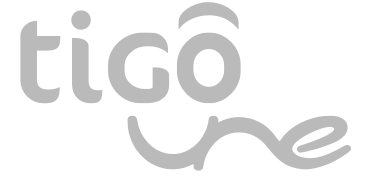

:slug: customers/communications/
:category: customers
:description: FLUID is a company focused on information security, ethical hacking, penetration testing and vulnerabilities detection in applications with over 18 years of experience in the colombian market. In this page we present our contributions to the communications sector.
:keywords: FLUID, Information, Communication, Security, Pentesting, Customers.
:translate: clientes/comunicaciones/

= Communications

{description}

[role="Comunicaciones tb-alt"]
[cols=2, frame="none"]
|====

^.^a|

a|== Tigo UNE

Colombian company that provides integrated telecommunications services,
with shareholding in the Millicom Group and the EPM Group.
Hand in hand with its subsidiary companies,
including Colombia Móvil, Edatel and Orbitel,
UNE covers more than +70%+ of the urban population
and is present in +767+ municipalities
of the +32+ departments of the national territory.
|====
