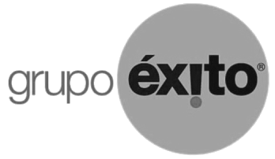
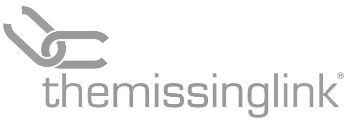

:slug: customers/consumer/
:category: customers
:description: FLUID is a company focused on information security, ethical hacking, penetration testing and vulnerabilities detection in applications with over 18 years of experience in the colombian market. In this page we present our contributions to the consumer sector.
:keywords: FLUID, Consumer, Information, Security, Pentesting, Ethical Hacking.
:translate: clientes/comercial/

= Consumer

[frame="none", cols="^.^,^.^"]
|=======
| |image:logo-semana.png[alt="Logo Semana",link="http://www.semana.com/"]
2+|
|=======
