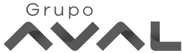

:slug: customers/financial/
:category: customers
:description: FLUID is a company focused on information security, ethical hacking, penetration testing and vulnerabilities detection in applications with over 18 years of experience in the colombian market. In this page we present our contributions to the financial sector.
:keywords: FLUID, Information, Financial, Security, Ethical Hacking, Pentesting.
:translate: clientes/financiero/

= Financial

{description}

[role="tb-alt"]
[cols=2, frame="none"]
|====

^.^a|

a|== ACH Colombia
Organization created by enterprises of the financial sector
that allows the exchange of financial transactions and information
between the companies that comprise it

a|== AVAL Group

Grupo Aval Acciones y Valores S.A.
It is a Colombian holding dedicated to a great variety
of mainly financial activities.
It is the largest financial group in Colombia
with control of +4+ successful banks
and one of the largest groups in Central America
controlling the BAC Credomatic Group,
also having the largest administrator of pension and severance funds in Colombia.

^.^a|

^.^a|image:logo-bancolombia.png[alt="Logo Bancolombia"]

a|== Bancolombia
Colombian financial organization, belonging to the Sura Group,
it is the largest private bank in Colombia (due to the size of its assets)
and one of the largest in America.

a|== Banco del Pacífico
Part of the International Banking Center integrated in the city of Panama,
with institutions from more than +30+ countries.
The Center has a broad financial structure
and a major importance for the economic life of the country,
which is a guarantee of its permanence and stability.

^.^a|image:logo-pacifico.png[alt="Logo Banco del Pacifico"]

^.^a|image:logo-banistmo.png[alt="Logo Banistmo"]

a|== Banistmo
Panamanian organization that has the support of Grupo Bancolombia,
a financial institution with +140+ years in the market,
with presence in +10+ countries,
more than +40+ thousand employees,
+9+ million customers and +3821+ ATMs.

a|== BBVA
Banco Bilbao Vizcaya Argentaria Colombia S.A.
It is one of the first banks in the eurozone for profitability and efficiency;
It is the first financial institution in Mexico
and also has a strong position in Spain,
with leading franchises in South America.

^.^a|image:logo-bbva.png[alt="Logo BBVA"]

^.^a|image:logo-colpatria.png[alt="Logo Colpatria"]

a|== Colpatria
Colpatria is a Colombian business group,
with businesses in banking, insurance, construction and mining among others.
Participating since 2012 in the Canadian bank Scotiabank as a partner,
acquiring +51%+ of their shares.
Since 2014, the French insurance company AXA,
which is the largest insurer in the world,
acquired +51%+ of the general insurance and life unit.

a|== Deceval

Centralized Deposit of Securities of Colombia -DECEVAL SA-,
is an institution in charge of the custody, administration,
compensation and liquidation of securities
in deposit of securities of credit content, participation,
merchandise representatives and financial instruments
that are registered in the National Registry of Securities and Issuers,
whether they are issued, negotiated or registered locally or abroad.

^.^a|

^.^a|

a|== Protección

Public limited company, financial services company
and administrator of pension and severance funds.
A unit of the Colombian holding Grupo de Inversiones Suramericana,
it is the second largest administrator
of pension and severance funds in the country
with close to +1.6+ million affiliates.
The company manages three funds for unemployment insurance,
voluntary pensions and mandatory pensions.

a|== Sura

The SURA Business Group is a Latin American company
in the Miscellaneous Financial Services sector,
part of the Dow Jones Sustainability Index,
which recognizes companies that stand out worldwide
for their good practices in economic, environmental and social matters.

^.^a|image:logo-sura.png[alt="Logo Sura"]

|====
