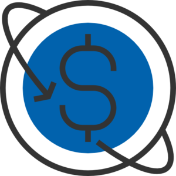
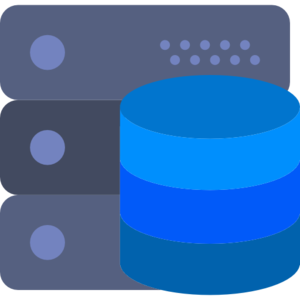
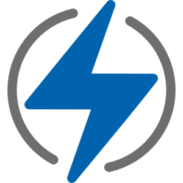
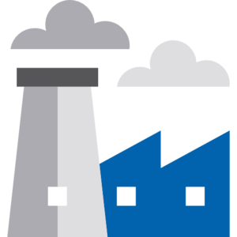
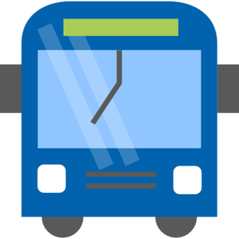

:slug: customers/
:description: Fluid Attacks is a company focused on information security, ethical hacking, penetration testing and vulnerabilities detection in applications with over 18 years of experience in the Colombian market. In this page we present our contributions to the sectors we work with.
:keywords: Fluid Attacks, Information, Solutions, Sectors, Security, Ethical Hacking.
:translate: clientes/
:caption:

= Customers

[role="tb-alt"]
[cols=2, frame="none"]
|====
a|== link:financial/[Financial]

+Fluid Attacks+ customers in the financial sector
comprise some of the most important banks in Latin America,
besides companies in charge of the collection of social savings,
among others.
Some of our customers are +Bancolombia+, +BBVA+,
+Davivienda+, +Sura+, +Protección+, +Colpatria+.
a|.Icon made by link:https://creativemarket.com/eucalyp[Eucalyp] from link:https://www.flaticon.com/[Flaticon]

a|.Icon made by link:https://smashicons.com/[Smashicons] from link:https://www.flaticon.com/[Flaticon]

a|== link:communications/[Communications]

+Fluid Attacks+ has offered solutions to some of the main providers
of communication services in Colombia, such as +Claro+,
+Tigo UNE+, +ETB+, +Edatel+, among others.

a|== link:consumer/[Consumer]

We have worked with many companies which aim to please the customer
from different areas, be them retail activities, +E-Commerce+,
textile industry, or technology solutions.
Some of these customers are +Grupo Éxito+, +Grupo Uribe+, +Rappi+, +Semana+,
and the australian company +The Missing Link+.
a|.Icon made by mynamepong from link:https://www.flaticon.com/[Flaticon]

a|.Icon made by link:https://smashicons.com/[Smashicons] from link:https://www.flaticon.com/[Flaticon]

a|== link:technology/[Technology]

+Fluid Attacks+ has contributed to companies that offer software,
infrastructure and other technology solutions to their customers,
in a wide range of applications.
Some of our customers in this area are +PSL+, +S4N+, +Arus+, +Ceiba+,
the american companies +Cre8tive+, +KometSales+ and +VM2020+,
and the spanish company +Indra+.

a|== link:utilities/[Utilities]

We have also executed projects in companies that specialize
in the energy sector, wether it is generation, distribution and selling, like
+Celsia+, or planning, designing and managing the transactional systems,
like +XM+.
a|.Icon made by Good Ware from link:https://www.flaticon.com/[Flaticon]

a|.Icon made by link:https://www.freepik.com/[Freepik] from link:https://www.flaticon.com/[Flaticon]

a|== link:industrial/[Industrial]

We have also assisted several manufacturers and participants
of the industrial sector in their software security
and infrastructure security needs.
Some of these customers are +Grupo Argos+, +Manuelita+, +Corona+, +Cadena+ and
+Odinsa+.

a|== link:transportation/[Transportation]

+Fluid Attacks+ has worked with transportation giants like +Avianca+
and +F2X+ to ensure that their applications and web platforms
offer the best security to their users.
a|.Icon made by link:https://www.freepik.com/[Freepik] from link:https://www.flaticon.com/[Flaticon]

|====
