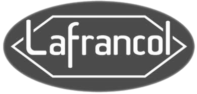

:slug: customers/industrial/
:category: customers
:description: FLUID is a company focused on information security, ethical hacking, penetration testing and vulnerabilities detection in applications with over 18 years of experience in the colombian market. In this page we present our contributions to the industrial sector.
:keywords: FLUID, Security, Industrial, Information, Ethical Hacking, Pentesting.
:translate: clientes/industrial/

= Industrial

{description}

[role="tb-alt"]
[cols=2, frame="none"]
|====

^.^a|

a|== Cadena

Organization that provides its clients with reliable solutions
to simplify their critical processes through technology,
increasing their efficiency, sustainability and profitability.
They have knowledge of the key processes of the client's business,
integrate their own and third-party capabilities.

a|== Corona

Colombian multinational with +135+ years of business history.
It consists of six strategic business units dedicated to the manufacture
and marketing of products for home and construction.
It has +19+ manufacturing plants in Colombia,
+3+ in the United States, +3+ in Central America,
+3+ in Mexico and one in Brazil.
It exports its products to several markets around the world,
including the United States, Canada, Mexico, Brazil, Chile, Venezuela,
Central America, the Caribbean, Italy, Spain and the United Kingdom.

^.^a|image:logo-corona.png[alt="Logo Corona",link="https://www.corona.co"]

^.^a|

a|== Cre8tive

Company with experience in the manufacture and sale of furniture
with software dedicated to furniture manufacturing and furniture retail sales.
It has integration with an accounting system, today QuickBooks,
and can be integrated with others
so that there is integrity with transactions and automatic publication.

a|== Argos Group

Matrix of the Business Group of sustainable investments in infrastructure.
Its legal nature corresponds to a corporation,
registered in the Colombian Stock Exchange,
as well as its subsidiaries Argos (cement),
Celsia (energy) and Odinsa (road and airport concessions).

^.^a|

^.^a|

a|== LAFRANCOL

Manufacturers and distributors at a national and international level,
pharmaceutical products and functional foods for human consumption
with the highest levels of quality.
They have the recognition of the effectiveness and safety of their compounds
before the medical team and the health society,
+LAFRANCOL+ has been growing steadily for almost +100+ years
reaching a leading position in the national pharmaceutical industry,
both for its sales volume and for its quality image.

a|== Manuelita

Diversified agroindustrial organization, multilatina of Colombian origin,
consolidated as a diversified agroindustrial organization,
whose strategy is based on a sustainable business model.
It produces products of an agro-industrial nature,
made from renewable sources, through the sustainable use of natural resources,
with a positive impact on the well-being of neighboring communities.

^.^a|image:logo-manuelita.png[alt="Logo Manuelita",link="http://www.manuelita.com/perfil-corporativo"]

^.^a|

a|== Odinsa

Subsidiary of Grupo Argos,
is a Colombian company dedicated to the structuring, promotion,
management and development of road and airport infrastructure projects,
with presence in Colombia, Ecuador, Aruba and the Dominican Republic,
which has become a vehicle for regional connectivity
and a source of development.

|====
