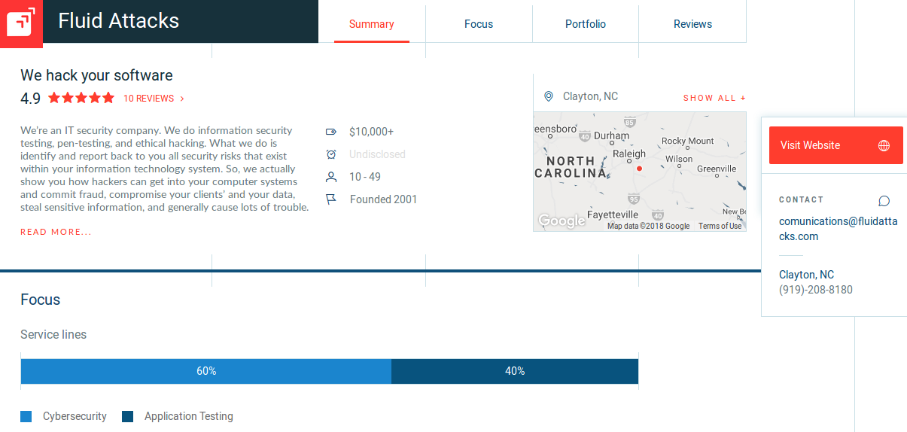

:slug: customers/reviews/
:category: customers
:description: Fluid Attacks is a company focused on information security, ethical hacking, penetration testing and vulnerabilities detection in applications with over 18 years of experience in the Colombian market. In this page we present our customer reviews related to our services and products.
:keywords: Fluid Attacks, Customers, Reviews, Services, Products, Evaluation.
:translate: clientes/testimonios/

= Reviews

+Fluid Attacks+ does everything in its power
to make sure your business has the resources it needs
to protect its digital assets and to run smoothly
without having to worry about the possibility of a breach in security.
With our experience in cybersecurity,
we know how to prevent your valuable information
from getting into the wrong hands.
To give our word more significance,
we are happy to report that we have recently been
recognized by Clutch as one of the link:https://clutch.co/it-services/cybersecurity[Top Cybersecurity Consulting Companies!].

link:https://clutch.co/[Clutch] is as an emerging +B2B+ ratings
and reviews platform based in Washington, DC.
It is renowned for its ability to facilitate the networking process
between companies in different industries
so that they can more efficiently find partners
to work with on their next business,
marketing, technology, design and related digital services projects.
Their goal is to provide the most accurate information
coupled with verified client reviews on each agency profile
to other businesses in search of partners
with the most appropriate qualifications
that will help them arrive at their desired results.

Our work is to stimulate more personal relationships
with our valued clients,
making ourselves available at any time to communicate.
We reciprocate by showing you any part of our process you want to see,
so that you may know exactly how we are helping
keep your company safe and secure.
For this reason, several of our clients have shown their appreciation
for the services we provided them by talking with Clutch’s
analysts to submit their verified reviews on +Clutch+:

++++

++++

Each company that works with Clutch
maintains a profile with reviews from past clients,
along with information and other data all gathered by Clutch’s team.
The attractiveness of a firm is enhanced
with the accumulation of client reviews,
high ratings, awards, and leaderboard mentions.
Thanks to the wonderful reviews left by past clients,
+Fluid Attacks+ has attained a highly attractive +4.9+ out of +5+ stars!

We truly look forward to initiating more client relationships
and safeguarding the bright futures of their companies.
For more great reviews about us,
take a look at our link:https://clutch.co/profile/fluid-attacks[+Fluid Attacks+ profile] on Clutch!
