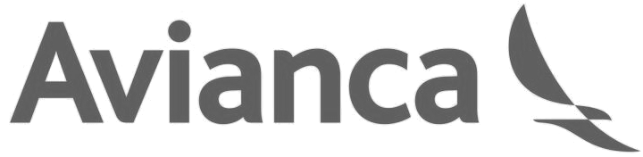

:slug: customers/transportation/
:category: customers
:description: FLUID is a company focused on information security, ethical hacking, penetration testing and vulnerabilities detection in applications with over 18 years of experience in the colombian market. In this page we present our contributions to the transportation sector.
:keywords: FLUID, Information, Security, Transportation, Ethical Hacking, Pentesting.
:translate: clientes/transporte/

= Transportation

[role="transportation tb-alt"]
[cols=2, frame="none"]
|====
a|

a|== Avianca

Commercial brand that represents the Latin American airlines
integrated in Avianca Holdings S.A.
Specialized in the transport of passengers and cargo,
direct service in more than 100 destinations
in 26 countries of America and Europe
aboard a modern fleet of 172 aircraft
of short, medium and long range.

|====
